<h1>Table of Contents<span class="tocSkip"></span></h1>
<div class="toc"><ul class="toc-item"><li><span><a href="#Census-Income-Data-Set" data-toc-modified-id="Census-Income-Data-Set-1"><span class="toc-item-num">1&nbsp;&nbsp;</span>Census Income Data Set</a></span><ul class="toc-item"><li><span><a href="#Introduction" data-toc-modified-id="Introduction-1.1"><span class="toc-item-num">1.1&nbsp;&nbsp;</span>Introduction</a></span></li><li><span><a href="#Data-Description" data-toc-modified-id="Data-Description-1.2"><span class="toc-item-num">1.2&nbsp;&nbsp;</span>Data Description</a></span></li><li><span><a href="#Categorical-Attributes" data-toc-modified-id="Categorical-Attributes-1.3"><span class="toc-item-num">1.3&nbsp;&nbsp;</span>Categorical Attributes</a></span></li><li><span><a href="#Continuous-Attributes" data-toc-modified-id="Continuous-Attributes-1.4"><span class="toc-item-num">1.4&nbsp;&nbsp;</span>Continuous Attributes</a></span></li></ul></li><li><span><a href="#Setup" data-toc-modified-id="Setup-2"><span class="toc-item-num">2&nbsp;&nbsp;</span>Setup</a></span><ul class="toc-item"><li><span><a href="#Load-Libraries" data-toc-modified-id="Load-Libraries-2.1"><span class="toc-item-num">2.1&nbsp;&nbsp;</span>Load Libraries</a></span></li><li><span><a href="#Suppress-Warnings" data-toc-modified-id="Suppress-Warnings-2.2"><span class="toc-item-num">2.2&nbsp;&nbsp;</span>Suppress Warnings</a></span></li><li><span><a href="#Set-Seed" data-toc-modified-id="Set-Seed-2.3"><span class="toc-item-num">2.3&nbsp;&nbsp;</span>Set Seed</a></span></li><li><span><a href="#Display-Options" data-toc-modified-id="Display-Options-2.4"><span class="toc-item-num">2.4&nbsp;&nbsp;</span>Display Options</a></span></li><li><span><a href="#Path-Manager" data-toc-modified-id="Path-Manager-2.5"><span class="toc-item-num">2.5&nbsp;&nbsp;</span>Path Manager</a></span></li><li><span><a href="#Define-Custom-Functions" data-toc-modified-id="Define-Custom-Functions-2.6"><span class="toc-item-num">2.6&nbsp;&nbsp;</span>Define Custom Functions</a></span></li><li><span><a href="#Load-Data" data-toc-modified-id="Load-Data-2.7"><span class="toc-item-num">2.7&nbsp;&nbsp;</span>Load Data</a></span></li><li><span><a href="#Check-Data-Structure" data-toc-modified-id="Check-Data-Structure-2.8"><span class="toc-item-num">2.8&nbsp;&nbsp;</span>Check Data Structure</a></span></li></ul></li><li><span><a href="#Missing-Data" data-toc-modified-id="Missing-Data-3"><span class="toc-item-num">3&nbsp;&nbsp;</span>Missing Data</a></span><ul class="toc-item"><li><span><a href="#Missing-Data-List" data-toc-modified-id="Missing-Data-List-3.1"><span class="toc-item-num">3.1&nbsp;&nbsp;</span>Missing Data List</a></span></li></ul></li><li><span><a href="#Assess-Predictors" data-toc-modified-id="Assess-Predictors-4"><span class="toc-item-num">4&nbsp;&nbsp;</span>Assess Predictors</a></span><ul class="toc-item"><li><span><a href="#Workclass" data-toc-modified-id="Workclass-4.1"><span class="toc-item-num">4.1&nbsp;&nbsp;</span>Workclass</a></span></li><li><span><a href="#Education" data-toc-modified-id="Education-4.2"><span class="toc-item-num">4.2&nbsp;&nbsp;</span>Education</a></span></li><li><span><a href="#Marital-status" data-toc-modified-id="Marital-status-4.3"><span class="toc-item-num">4.3&nbsp;&nbsp;</span>Marital-status</a></span></li><li><span><a href="#Occupation" data-toc-modified-id="Occupation-4.4"><span class="toc-item-num">4.4&nbsp;&nbsp;</span>Occupation</a></span></li><li><span><a href="#Relationship" data-toc-modified-id="Relationship-4.5"><span class="toc-item-num">4.5&nbsp;&nbsp;</span>Relationship</a></span></li><li><span><a href="#Race" data-toc-modified-id="Race-4.6"><span class="toc-item-num">4.6&nbsp;&nbsp;</span>Race</a></span></li><li><span><a href="#Gender" data-toc-modified-id="Gender-4.7"><span class="toc-item-num">4.7&nbsp;&nbsp;</span>Gender</a></span></li><li><span><a href="#Native-Country" data-toc-modified-id="Native-Country-4.8"><span class="toc-item-num">4.8&nbsp;&nbsp;</span>Native-Country</a></span></li><li><span><a href="#Capital-Gain/Capital-Loss" data-toc-modified-id="Capital-Gain/Capital-Loss-4.9"><span class="toc-item-num">4.9&nbsp;&nbsp;</span>Capital-Gain/Capital-Loss</a></span></li><li><span><a href="#Age" data-toc-modified-id="Age-4.10"><span class="toc-item-num">4.10&nbsp;&nbsp;</span>Age</a></span></li><li><span><a href="#Hours-per-week" data-toc-modified-id="Hours-per-week-4.11"><span class="toc-item-num">4.11&nbsp;&nbsp;</span>Hours-per-week</a></span></li><li><span><a href="#Capital_diff" data-toc-modified-id="Capital_diff-4.12"><span class="toc-item-num">4.12&nbsp;&nbsp;</span>Capital_diff</a></span></li><li><span><a href="#Scaling-continuous-variables" data-toc-modified-id="Scaling-continuous-variables-4.13"><span class="toc-item-num">4.13&nbsp;&nbsp;</span>Scaling continuous variables</a></span></li><li><span><a href="#fnlwgt" data-toc-modified-id="fnlwgt-4.14"><span class="toc-item-num">4.14&nbsp;&nbsp;</span>fnlwgt</a></span></li></ul></li><li><span><a href="#Final-Data-Tweaks" data-toc-modified-id="Final-Data-Tweaks-5"><span class="toc-item-num">5&nbsp;&nbsp;</span>Final Data Tweaks</a></span><ul class="toc-item"><li><span><a href="#Dummy-Coding" data-toc-modified-id="Dummy-Coding-5.1"><span class="toc-item-num">5.1&nbsp;&nbsp;</span>Dummy Coding</a></span></li><li><span><a href="#Check-For-Duplicate-Columns" data-toc-modified-id="Check-For-Duplicate-Columns-5.2"><span class="toc-item-num">5.2&nbsp;&nbsp;</span>Check For Duplicate Columns</a></span></li></ul></li><li><span><a href="#Machine-Learning-Model" data-toc-modified-id="Machine-Learning-Model-6"><span class="toc-item-num">6&nbsp;&nbsp;</span>Machine Learning Model</a></span><ul class="toc-item"><li><span><a href="#Define-Predictors-And-Response-Variable" data-toc-modified-id="Define-Predictors-And-Response-Variable-6.1"><span class="toc-item-num">6.1&nbsp;&nbsp;</span>Define Predictors And Response Variable</a></span></li><li><span><a href="#Define-Training,-Validation,-And-Testing-Sets" data-toc-modified-id="Define-Training,-Validation,-And-Testing-Sets-6.2"><span class="toc-item-num">6.2&nbsp;&nbsp;</span>Define Training, Validation, And Testing Sets</a></span></li><li><span><a href="#Testing-Different-Classifiers" data-toc-modified-id="Testing-Different-Classifiers-6.3"><span class="toc-item-num">6.3&nbsp;&nbsp;</span>Testing Different Classifiers</a></span></li><li><span><a href="#Stacked-Model" data-toc-modified-id="Stacked-Model-6.4"><span class="toc-item-num">6.4&nbsp;&nbsp;</span>Stacked Model</a></span></li><li><span><a href="#XGBoost-Base-Model" data-toc-modified-id="XGBoost-Base-Model-6.5"><span class="toc-item-num">6.5&nbsp;&nbsp;</span>XGBoost Base Model</a></span></li><li><span><a href="#XGBoost-Grid-Search" data-toc-modified-id="XGBoost-Grid-Search-6.6"><span class="toc-item-num">6.6&nbsp;&nbsp;</span>XGBoost Grid Search</a></span></li></ul></li><li><span><a href="#Model-Evaluation" data-toc-modified-id="Model-Evaluation-7"><span class="toc-item-num">7&nbsp;&nbsp;</span>Model Evaluation</a></span><ul class="toc-item"><li><span><a href="#Validation-Curve" data-toc-modified-id="Validation-Curve-7.1"><span class="toc-item-num">7.1&nbsp;&nbsp;</span>Validation Curve</a></span></li><li><span><a href="#Learning-Curve" data-toc-modified-id="Learning-Curve-7.2"><span class="toc-item-num">7.2&nbsp;&nbsp;</span>Learning Curve</a></span></li></ul></li><li><span><a href="#Metrics-And-Classification-Evaluation" data-toc-modified-id="Metrics-And-Classification-Evaluation-8"><span class="toc-item-num">8&nbsp;&nbsp;</span>Metrics And Classification Evaluation</a></span><ul class="toc-item"><li><span><a href="#Confusion-Matrix" data-toc-modified-id="Confusion-Matrix-8.1"><span class="toc-item-num">8.1&nbsp;&nbsp;</span>Confusion Matrix</a></span></li><li><span><a href="#Accuracy" data-toc-modified-id="Accuracy-8.2"><span class="toc-item-num">8.2&nbsp;&nbsp;</span>Accuracy</a></span><ul class="toc-item"><li><span><a href="#Manual-Calculation" data-toc-modified-id="Manual-Calculation-8.2.1"><span class="toc-item-num">8.2.1&nbsp;&nbsp;</span>Manual Calculation</a></span></li><li><span><a href="#ScikitLearn-Calculation" data-toc-modified-id="ScikitLearn-Calculation-8.2.2"><span class="toc-item-num">8.2.2&nbsp;&nbsp;</span>ScikitLearn Calculation</a></span></li></ul></li><li><span><a href="#Recall/Sensitivity-(True-Positive-Rate)" data-toc-modified-id="Recall/Sensitivity-(True-Positive-Rate)-8.3"><span class="toc-item-num">8.3&nbsp;&nbsp;</span>Recall/Sensitivity (True Positive Rate)</a></span><ul class="toc-item"><li><span><a href="#Manual-Calculation" data-toc-modified-id="Manual-Calculation-8.3.1"><span class="toc-item-num">8.3.1&nbsp;&nbsp;</span>Manual Calculation</a></span></li><li><span><a href="#ScikitLearn-Calculation" data-toc-modified-id="ScikitLearn-Calculation-8.3.2"><span class="toc-item-num">8.3.2&nbsp;&nbsp;</span>ScikitLearn Calculation</a></span></li></ul></li><li><span><a href="#Precision" data-toc-modified-id="Precision-8.4"><span class="toc-item-num">8.4&nbsp;&nbsp;</span>Precision</a></span><ul class="toc-item"><li><span><a href="#Manual-Calculation" data-toc-modified-id="Manual-Calculation-8.4.1"><span class="toc-item-num">8.4.1&nbsp;&nbsp;</span>Manual Calculation</a></span></li><li><span><a href="#ScikitLearn-Calculation" data-toc-modified-id="ScikitLearn-Calculation-8.4.2"><span class="toc-item-num">8.4.2&nbsp;&nbsp;</span>ScikitLearn Calculation</a></span></li></ul></li><li><span><a href="#F1-(Harmonic-Mean)" data-toc-modified-id="F1-(Harmonic-Mean)-8.5"><span class="toc-item-num">8.5&nbsp;&nbsp;</span>F1 (Harmonic Mean)</a></span><ul class="toc-item"><li><span><a href="#Manual-Calculation" data-toc-modified-id="Manual-Calculation-8.5.1"><span class="toc-item-num">8.5.1&nbsp;&nbsp;</span>Manual Calculation</a></span></li><li><span><a href="#ScikitLearn-Calculation" data-toc-modified-id="ScikitLearn-Calculation-8.5.2"><span class="toc-item-num">8.5.2&nbsp;&nbsp;</span>ScikitLearn Calculation</a></span></li></ul></li><li><span><a href="#Classification-Report" data-toc-modified-id="Classification-Report-8.6"><span class="toc-item-num">8.6&nbsp;&nbsp;</span>Classification Report</a></span></li><li><span><a href="#ROC" data-toc-modified-id="ROC-8.7"><span class="toc-item-num">8.7&nbsp;&nbsp;</span>ROC</a></span></li><li><span><a href="#Precision-Recall-Curve" data-toc-modified-id="Precision-Recall-Curve-8.8"><span class="toc-item-num">8.8&nbsp;&nbsp;</span>Precision-Recall Curve</a></span></li><li><span><a href="#Cumulative-Gains-Plot" data-toc-modified-id="Cumulative-Gains-Plot-8.9"><span class="toc-item-num">8.9&nbsp;&nbsp;</span>Cumulative Gains Plot</a></span></li><li><span><a href="#Lift-Curve" data-toc-modified-id="Lift-Curve-8.10"><span class="toc-item-num">8.10&nbsp;&nbsp;</span>Lift Curve</a></span></li><li><span><a href="#Class-Prediction-Error" data-toc-modified-id="Class-Prediction-Error-8.11"><span class="toc-item-num">8.11&nbsp;&nbsp;</span>Class Prediction Error</a></span></li><li><span><a href="#Discrimination-Threshold" data-toc-modified-id="Discrimination-Threshold-8.12"><span class="toc-item-num">8.12&nbsp;&nbsp;</span>Discrimination Threshold</a></span></li></ul></li><li><span><a href="#Tuning-Decision-Threshold" data-toc-modified-id="Tuning-Decision-Threshold-9"><span class="toc-item-num">9&nbsp;&nbsp;</span>Tuning Decision Threshold</a></span><ul class="toc-item"><li><span><a href="#Identify-Everyone-Making-<=50K" data-toc-modified-id="Identify-Everyone-Making-<=50K-9.1"><span class="toc-item-num">9.1&nbsp;&nbsp;</span>Identify Everyone Making &lt;=50K</a></span></li><li><span><a href="#Correctly-Identify-Everyone-Making-<=50K" data-toc-modified-id="Correctly-Identify-Everyone-Making-<=50K-9.2"><span class="toc-item-num">9.2&nbsp;&nbsp;</span>Correctly Identify Everyone Making &lt;=50K</a></span></li></ul></li><li><span><a href="#Model-Exploration" data-toc-modified-id="Model-Exploration-10"><span class="toc-item-num">10&nbsp;&nbsp;</span>Model Exploration</a></span><ul class="toc-item"><li><span><a href="#Shapley-Additive-Explanations-(SHAP)" data-toc-modified-id="Shapley-Additive-Explanations-(SHAP)-10.1"><span class="toc-item-num">10.1&nbsp;&nbsp;</span>Shapley Additive Explanations (SHAP)</a></span></li><li><span><a href="#Force-Plot" data-toc-modified-id="Force-Plot-10.2"><span class="toc-item-num">10.2&nbsp;&nbsp;</span>Force Plot</a></span><ul class="toc-item"><li><span><a href="#<=50K-Force-Plot" data-toc-modified-id="<=50K-Force-Plot-10.2.1"><span class="toc-item-num">10.2.1&nbsp;&nbsp;</span>&lt;=50K Force Plot</a></span></li><li><span><a href="#>50K-Force-Plot" data-toc-modified-id=">50K-Force-Plot-10.2.2"><span class="toc-item-num">10.2.2&nbsp;&nbsp;</span>&gt;50K Force Plot</a></span></li></ul></li><li><span><a href="#Bee-Swarm-Plot" data-toc-modified-id="Bee-Swarm-Plot-10.3"><span class="toc-item-num">10.3&nbsp;&nbsp;</span>Bee Swarm Plot</a></span></li><li><span><a href="#SHAP-Bar-Plot" data-toc-modified-id="SHAP-Bar-Plot-10.4"><span class="toc-item-num">10.4&nbsp;&nbsp;</span>SHAP Bar Plot</a></span></li><li><span><a href="#SHAP-Dot-Plot" data-toc-modified-id="SHAP-Dot-Plot-10.5"><span class="toc-item-num">10.5&nbsp;&nbsp;</span>SHAP Dot Plot</a></span><ul class="toc-item"><li><span><a href="#SHAP-Dot-Plot:-gender_Male" data-toc-modified-id="SHAP-Dot-Plot:-gender_Male-10.5.1"><span class="toc-item-num">10.5.1&nbsp;&nbsp;</span>SHAP Dot Plot: gender_Male</a></span></li><li><span><a href="#SHAP-Dot-Plot:-gender_Male" data-toc-modified-id="SHAP-Dot-Plot:-gender_Male-10.5.2"><span class="toc-item-num">10.5.2&nbsp;&nbsp;</span>SHAP Dot Plot: gender_Male</a></span></li></ul></li></ul></li><li><span><a href="#Conclusion" data-toc-modified-id="Conclusion-11"><span class="toc-item-num">11&nbsp;&nbsp;</span>Conclusion</a></span></li></ul></div>

# Census Income Data Set

## Introduction
A census is the procedure of systematically acquiring and recording information about the members of a given population. The census is a special, wide-range activity, which takes place once a decade in the entire country. The purpose is to gather information about the general population, in order to present a full and reliable picture of the population in the country - its housing conditions and demographic, social and economic characteristics. The information collected includes data on age, gender, country of origin, marital status, housing conditions, marriage, education, employment, etc.

## Data Description
This data was extracted from the 1994 Census bureau database by Ronny Kohavi and Barry Becker (Data Mining and Visualization, Silicon Graphics). The prediction task is to determine whether a person makes less than $50K a year.

## Categorical Attributes
Below is a description of all categorical predictors in the dataset.

- **workclass**: Individual work category
<br>
    - levels: Private, Self-emp-not-inc, Self-emp-inc, Federal-gov, Local-gov, State-gov, Without-pay, Never-worked.
<br>
<br>
- **education**: Individual's highest education degree
<br>
    - levels: Bachelors, Some-college, 11th, HS-grad, Prof-school, Assoc-acdm, Assoc-voc, 9th, 7th-8th, 12th, Masters, 1st-4th, 10th, Doctorate, 5th-6th, Preschool.
<br>
<br>
- **marital-status**: Individual marital status
<br>
    - levels: Married-civ-spouse, Divorced, Never-married, Separated, Widowed, Married-spouse-absent, Married-AF-spouse.
<br>
<br>
- **occupation**: Individual's occupation
<br>
    - levels: Tech-support, Craft-repair, Other-service, Sales, Exec-managerial, Prof-specialty, Handlers-cleaners, Machine-op-inspct, Adm-clerical, Farming-fishing, Transport-moving, Priv-house-serv, Protective-serv, Armed-Forces.
<br>
<br>
- **relationship**: Individual's relation in a family
<br>
    - levels: Wife, Own-child, Husband, Not-in-family, Other-relative, Unmarried.
<br>
<br>
- **race**: Race of Individual
<br>
    - levels: White, Asian-Pac-Islander, Amer-Indian-Eskimo, Other, Black.
<br>
<br>
- **sex**: Individual's sex
<br>
    - levels: Female, Male.
<br>
<br>
- **native-country**: Individual's native country
<br>
    - levels: United-States, Cambodia, England, Puerto-Rico, Canada, Germany, Outlying-US(Guam-USVI-etc), India, Japan, Greece, South, China, Cuba, Iran, Honduras, Philippines, Italy, Poland, Jamaica, Vietnam, Mexico, Portugal, Ireland, France, Dominican-Republic, Laos, Ecuador, Taiwan, Haiti, Columbia, Hungary, Guatemala, Nicaragua, Scotland, Thailand, Yugoslavia, El-Salvador, Trinadad&Tobago, Peru, Hong, Holand-Netherlands.
<br>
<br>


## Continuous Attributes
Below is a description of all the continuous predictors in the dataset.

- **age**: Age of an individual
<br>
- **fnlwgt**: final weight 
<br>
- **capital-gain** 
<br>
- **capital-loss** 
<br>
- **hours-per-week**: Individual's working hour per week

# Setup
Here is what I do to set up my data science environment.

## Load Libraries


```python
# Import packages.
import matplotlib.pyplot as plt
import matplotlib
import seaborn as sns
import pandas as pd
import numpy as np
import scikitplot
import missingno as msno
from pathlib import Path
import warnings
import random
from lime import lime_tabular
import shap
from sklearn import ensemble, preprocessing, tree, model_selection, metrics
from sklearn.preprocessing import StandardScaler
from sklearn.dummy import DummyClassifier
from sklearn.linear_model import LogisticRegression
from sklearn.tree import DecisionTreeClassifier
from sklearn.neighbors import KNeighborsClassifier
from sklearn.naive_bayes import GaussianNB
from sklearn.svm import SVC
from sklearn.ensemble import RandomForestClassifier
from sklearn.metrics import confusion_matrix, roc_auc_score, f1_score, precision_score, recall_score, accuracy_score
from sklearn.model_selection import StratifiedKFold
import xgboost
from mlxtend.classifier import StackingClassifier
from yellowbrick.classifier import ConfusionMatrix, ROCAUC, ClassificationReport, PrecisionRecallCurve, DiscriminationThreshold, ClassPredictionError, ClassBalance
from yellowbrick.model_selection import LearningCurve, ValidationCurve
```

## Suppress Warnings
Warnings usually don't relate to anything that will affect the actual analysis, so I turn them off.


```python
# Turn warnings off globally.
def warn(*args, **kwargs):
    pass

#import warnings
warnings.warn = warn
```

## Set Seed


```python
# Seed for reproducibility.
random.seed(10)
```

## Display Options


```python
# Display all dataframe columns.
pd.set_option('display.max_columns', None)

# Display all dataframe rows.
pd.set_option('display.max_rows', None)
```

## Path Manager


```python
# Make project folder working directory.
%cd "C:\Users\STPI0560\Desktop\Python Projects\Adult Income"
```

    C:\Users\STPI0560\Desktop\Python Projects\Adult Income
    

## Define Custom Functions
If I do something similar more than once, I will write a function so as not to clutter up the workspace. Each of these functions will be run multiple times throughout this analysis.


```python
# %load "bin\getDuplicateColumns.py"
def getDuplicateColumns(df):
    '''
    Get a list of duplicate columns.
    It will iterate over all the columns in dataframe and find the columns whose contents are duplicate.
    :param df: Dataframe object
    :return: List of columns whose contents are duplicates.
    '''
    # Define empty set.
    duplicateColumnNames = set()

    # Iterate over all the columns in dataframe
    for x in range(df.shape[1]):

        # Select column at xth index.
        col = df.iloc[:, x]

        # Iterate over all the columns in DataFrame from (x+1)th index till end
        for y in range(x + 1, df.shape[1]):

            # Select column at yth index.
            otherCol = df.iloc[:, y]

            # Check if two columns at x 7 y index are equal
            if col.equals(otherCol):

                duplicateColumnNames.add(df.columns.values[y])

    return list(duplicateColumnNames)
```


```python
# %load "bin\plotPredictors.py"
def plotPredictors(data, predictor, width, height):
    '''
    Return a plot with frequency of categorical variables for an inputed predictor.
    data: Input dataframe in pandas format.
    predictor: Name of predictor column, in quotes ("").
    width: Width of plot.
    height: Height of plot.
    '''
    # Set plot size.
    plt.figure(figsize = (width, height))
    
    # Set title.
    plt.title(predictor)
    
    # Define graph.
    ax = sns.countplot(x = predictor, data = data, hue = "income")
    
    # If predictor is occupation, tilt x-axis labels (so they fit)...
    if predictor == "occupation" or "native_country":
        plt.xticks(rotation=30)
        for p in ax.patches:
            height = p.get_height()
            return plt.show()
    # ... otherwise, don't tilt x-axis labels.
    else:
        for p in ax.patches:
            height = p.get_height()
            return plt.show()
```


```python
# %load "bin\testClassifiers.py"
def testClassifiers(classifierList, X_train, y_train, X_vl, y_val):
    '''
    Return a dataframe with 1 row for each classifier inputed in the function's
    arguements. Each row contains: Classifier name, accuracy, recall score, and
    precision score.
    data: Input: classifierList, X_train, y_train, X_test, y_test. 
    classifierList: List of classifiers you want to test. 
    Example: [DecisionTreeClassifier, KNeighborsClassifier, GaussianNB].
    X_train: Matrix of training predictors (numeric).
    y_train: Vector of training response variable identity (numeric).
    X_test: Matrix of testing predictors (numeric).
    y_test: Vector of testing response variable identity (numeric).
    '''
    # Make empty dataframe.
    model_df = pd.DataFrame(columns=['Classifier', 'Accuracy', 'Recall', 'Precision', 'f1'])

    # Repeat for each classifier in the list defined in the functions arguement.
    for i in classifierList:
        
        # For each model:
        model = i()
        
        # Get model name from current classifier.
        model_name = type(model).__name__
        
        # Fit the data with the training model.
        model.fit(X_train, y_train)
        
        # make predictions on test data using training model.
        yhat = model.predict(X_val)
        
        # test accuracy for current model.
        acc = accuracy_score(y_val, yhat)
        
        # test recall for current model
        recall = recall_score(y_val, yhat)
        
        # test precision for current model.
        precision = precision_score(y_val, yhat)
        
        f1 = f1_score(y_val, yhat)
    
        # Create list for model i with caculated information.
        row = [model_name, acc, recall, precision, f1]
        
        # Add list as new row in model_df.
        model_df.loc[len(model_df)] = row
    
    # Return dataframe with performance of each model.
    return model_df
```


```python
def testxgboost(classifierList, X_train, y_train, X_vl, y_val):
    '''
    Return a dataframe with 1 row for each classifier inputed in the function's
    arguements. Each row contains: Classifier name, accuracy, recall score, and
    precision score.
    data: Input: classifierList, X_train, y_train, X_test, y_test. 
    classifierList: List of classifiers you want to test. 
    Example: [DecisionTreeClassifier, KNeighborsClassifier, GaussianNB].
    X_train: Matrix of training predictors (numeric).
    y_train: Vector of training response variable identity (numeric).
    X_test: Matrix of testing predictors (numeric).
    y_test: Vector of testing response variable identity (numeric).
    '''
    # Make empty dataframe.
    model_df = pd.DataFrame(columns=['Classifier', 'Accuracy', 'Recall', 'Precision', 'f1'])

    # Repeat for each classifier in the list defined in the functions arguement.
    for i in classifierList:
        
        # For each model:
        model = i(random_state = 42,
                              eta = 0.1,
                              ubsample = 0.8,
                              colsample_bytree = 0.2,
                              max_depth = 4,
                              min_child_weight = 1,
                             use_label_encoder = False)
        
        # Get model name from current classifier.
        model_name = type(model).__name__
        
        # Fit the data with the training model.
        model.fit(X_train, y_train)
        
        # make predictions on test data using training model.
        yhat = model.predict(X_val)
        
        # test accuracy for current model.
        acc = accuracy_score(y_val, yhat)
        
        # test recall for current model
        recall = recall_score(y_val, yhat)
        
        # test precision for current model.
        precision = precision_score(y_val, yhat)
        
        f1 = f1_score(y_val, yhat)
    
        # Create list for model i with caculated information.
        row = [model_name, acc, recall, precision, f1]
        
        # Add list as new row in model_df.
        model_df.loc[len(model_df)] = row
    
    # Return dataframe with performance of each model.
    return model_df
```

## Load Data


```python
# Read data.
df = pd.read_csv('data\Adult.csv')
```

## Check Data Structure


```python
# Look at first few rows of dataframe.
df.head()
```


<div>
<style scoped>
    .dataframe tbody tr th:only-of-type {
        vertical-align: middle;
    }

    .dataframe tbody tr th {
        vertical-align: top;
    }

    .dataframe thead th {
        text-align: right;
    }
</style>
<table border="1" class="dataframe">
  <thead>
    <tr style="text-align: right;">
      <th></th>
      <th>age</th>
      <th>workclass</th>
      <th>fnlwgt</th>
      <th>education</th>
      <th>educational-num</th>
      <th>marital-status</th>
      <th>occupation</th>
      <th>relationship</th>
      <th>race</th>
      <th>gender</th>
      <th>capital-gain</th>
      <th>capital-loss</th>
      <th>hours-per-week</th>
      <th>native-country</th>
      <th>income</th>
    </tr>
  </thead>
  <tbody>
    <tr>
      <th>0</th>
      <td>25</td>
      <td>Private</td>
      <td>226802</td>
      <td>11th</td>
      <td>7</td>
      <td>Never-married</td>
      <td>Machine-op-inspct</td>
      <td>Own-child</td>
      <td>Black</td>
      <td>Male</td>
      <td>0</td>
      <td>0</td>
      <td>40</td>
      <td>United-States</td>
      <td>&lt;=50K</td>
    </tr>
    <tr>
      <th>1</th>
      <td>38</td>
      <td>Private</td>
      <td>89814</td>
      <td>HS-grad</td>
      <td>9</td>
      <td>Married-civ-spouse</td>
      <td>Farming-fishing</td>
      <td>Husband</td>
      <td>White</td>
      <td>Male</td>
      <td>0</td>
      <td>0</td>
      <td>50</td>
      <td>United-States</td>
      <td>&lt;=50K</td>
    </tr>
    <tr>
      <th>2</th>
      <td>28</td>
      <td>Local-gov</td>
      <td>336951</td>
      <td>Assoc-acdm</td>
      <td>12</td>
      <td>Married-civ-spouse</td>
      <td>Protective-serv</td>
      <td>Husband</td>
      <td>White</td>
      <td>Male</td>
      <td>0</td>
      <td>0</td>
      <td>40</td>
      <td>United-States</td>
      <td>&gt;50K</td>
    </tr>
    <tr>
      <th>3</th>
      <td>44</td>
      <td>Private</td>
      <td>160323</td>
      <td>Some-college</td>
      <td>10</td>
      <td>Married-civ-spouse</td>
      <td>Machine-op-inspct</td>
      <td>Husband</td>
      <td>Black</td>
      <td>Male</td>
      <td>7688</td>
      <td>0</td>
      <td>40</td>
      <td>United-States</td>
      <td>&gt;50K</td>
    </tr>
    <tr>
      <th>4</th>
      <td>18</td>
      <td>?</td>
      <td>103497</td>
      <td>Some-college</td>
      <td>10</td>
      <td>Never-married</td>
      <td>?</td>
      <td>Own-child</td>
      <td>White</td>
      <td>Female</td>
      <td>0</td>
      <td>0</td>
      <td>30</td>
      <td>United-States</td>
      <td>&lt;=50K</td>
    </tr>
  </tbody>
</table>
</div>


```python
# Check shape of data.
df.shape
```


    (48842, 15)


```python
# Check data type of each column.
print('Data type of each column of Dataframe :')
df.dtypes
```

    Data type of each column of Dataframe :
    


    age                 int64
    workclass          object
    fnlwgt              int64
    education          object
    educational-num     int64
    marital-status     object
    occupation         object
    relationship       object
    race               object
    gender             object
    capital-gain        int64
    capital-loss        int64
    hours-per-week      int64
    native-country     object
    income             object
    dtype: object


```python
# Summary statistics.
df.describe(include = 'all')
```


<div>
<style scoped>
    .dataframe tbody tr th:only-of-type {
        vertical-align: middle;
    }

    .dataframe tbody tr th {
        vertical-align: top;
    }

    .dataframe thead th {
        text-align: right;
    }
</style>
<table border="1" class="dataframe">
  <thead>
    <tr style="text-align: right;">
      <th></th>
      <th>age</th>
      <th>workclass</th>
      <th>fnlwgt</th>
      <th>education</th>
      <th>educational-num</th>
      <th>marital-status</th>
      <th>occupation</th>
      <th>relationship</th>
      <th>race</th>
      <th>gender</th>
      <th>capital-gain</th>
      <th>capital-loss</th>
      <th>hours-per-week</th>
      <th>native-country</th>
      <th>income</th>
    </tr>
  </thead>
  <tbody>
    <tr>
      <th>count</th>
      <td>48842.000000</td>
      <td>48842</td>
      <td>4.884200e+04</td>
      <td>48842</td>
      <td>48842.000000</td>
      <td>48842</td>
      <td>48842</td>
      <td>48842</td>
      <td>48842</td>
      <td>48842</td>
      <td>48842.000000</td>
      <td>48842.000000</td>
      <td>48842.000000</td>
      <td>48842</td>
      <td>48842</td>
    </tr>
    <tr>
      <th>unique</th>
      <td>NaN</td>
      <td>9</td>
      <td>NaN</td>
      <td>16</td>
      <td>NaN</td>
      <td>7</td>
      <td>15</td>
      <td>6</td>
      <td>5</td>
      <td>2</td>
      <td>NaN</td>
      <td>NaN</td>
      <td>NaN</td>
      <td>42</td>
      <td>2</td>
    </tr>
    <tr>
      <th>top</th>
      <td>NaN</td>
      <td>Private</td>
      <td>NaN</td>
      <td>HS-grad</td>
      <td>NaN</td>
      <td>Married-civ-spouse</td>
      <td>Prof-specialty</td>
      <td>Husband</td>
      <td>White</td>
      <td>Male</td>
      <td>NaN</td>
      <td>NaN</td>
      <td>NaN</td>
      <td>United-States</td>
      <td>&lt;=50K</td>
    </tr>
    <tr>
      <th>freq</th>
      <td>NaN</td>
      <td>33906</td>
      <td>NaN</td>
      <td>15784</td>
      <td>NaN</td>
      <td>22379</td>
      <td>6172</td>
      <td>19716</td>
      <td>41762</td>
      <td>32650</td>
      <td>NaN</td>
      <td>NaN</td>
      <td>NaN</td>
      <td>43832</td>
      <td>37155</td>
    </tr>
    <tr>
      <th>mean</th>
      <td>38.643585</td>
      <td>NaN</td>
      <td>1.896641e+05</td>
      <td>NaN</td>
      <td>10.078089</td>
      <td>NaN</td>
      <td>NaN</td>
      <td>NaN</td>
      <td>NaN</td>
      <td>NaN</td>
      <td>1079.067626</td>
      <td>87.502314</td>
      <td>40.422382</td>
      <td>NaN</td>
      <td>NaN</td>
    </tr>
    <tr>
      <th>std</th>
      <td>13.710510</td>
      <td>NaN</td>
      <td>1.056040e+05</td>
      <td>NaN</td>
      <td>2.570973</td>
      <td>NaN</td>
      <td>NaN</td>
      <td>NaN</td>
      <td>NaN</td>
      <td>NaN</td>
      <td>7452.019058</td>
      <td>403.004552</td>
      <td>12.391444</td>
      <td>NaN</td>
      <td>NaN</td>
    </tr>
    <tr>
      <th>min</th>
      <td>17.000000</td>
      <td>NaN</td>
      <td>1.228500e+04</td>
      <td>NaN</td>
      <td>1.000000</td>
      <td>NaN</td>
      <td>NaN</td>
      <td>NaN</td>
      <td>NaN</td>
      <td>NaN</td>
      <td>0.000000</td>
      <td>0.000000</td>
      <td>1.000000</td>
      <td>NaN</td>
      <td>NaN</td>
    </tr>
    <tr>
      <th>25%</th>
      <td>28.000000</td>
      <td>NaN</td>
      <td>1.175505e+05</td>
      <td>NaN</td>
      <td>9.000000</td>
      <td>NaN</td>
      <td>NaN</td>
      <td>NaN</td>
      <td>NaN</td>
      <td>NaN</td>
      <td>0.000000</td>
      <td>0.000000</td>
      <td>40.000000</td>
      <td>NaN</td>
      <td>NaN</td>
    </tr>
    <tr>
      <th>50%</th>
      <td>37.000000</td>
      <td>NaN</td>
      <td>1.781445e+05</td>
      <td>NaN</td>
      <td>10.000000</td>
      <td>NaN</td>
      <td>NaN</td>
      <td>NaN</td>
      <td>NaN</td>
      <td>NaN</td>
      <td>0.000000</td>
      <td>0.000000</td>
      <td>40.000000</td>
      <td>NaN</td>
      <td>NaN</td>
    </tr>
    <tr>
      <th>75%</th>
      <td>48.000000</td>
      <td>NaN</td>
      <td>2.376420e+05</td>
      <td>NaN</td>
      <td>12.000000</td>
      <td>NaN</td>
      <td>NaN</td>
      <td>NaN</td>
      <td>NaN</td>
      <td>NaN</td>
      <td>0.000000</td>
      <td>0.000000</td>
      <td>45.000000</td>
      <td>NaN</td>
      <td>NaN</td>
    </tr>
    <tr>
      <th>max</th>
      <td>90.000000</td>
      <td>NaN</td>
      <td>1.490400e+06</td>
      <td>NaN</td>
      <td>16.000000</td>
      <td>NaN</td>
      <td>NaN</td>
      <td>NaN</td>
      <td>NaN</td>
      <td>NaN</td>
      <td>99999.000000</td>
      <td>4356.000000</td>
      <td>99.000000</td>
      <td>NaN</td>
      <td>NaN</td>
    </tr>
  </tbody>
</table>
</div>


Dashes (-) can sometimes cause problems in predictor names. Below I change all dashes to underscores.


```python
# Remove '-' from column names.
df = df.rename(columns = {'educational-num': 'educational_num', 'marital-status': 'marital_status', 'capital-gain': 'capital_gain', 'capital-loss': 'capital_loss', 'hours-per-week': 'hours_per_week', 'native-country': 'native_country'})
```

# Missing Data
I always check for missing data first, and if there is missing data, the extent of its missingness will determine how I deal with it.

## Missing Data List


```python
# Print a list of each column that has at least 1 missing value.
print('List of columns with missing values:', [col for col in df.columns if df[col].isnull().any()], '\n')
print('Number of missing values per column:')

# Number of missing variables for each predictor, as a percentage.
df.isnull().mean() * 100
```

    List of columns with missing values: [] 
    
    Number of missing values per column:
    


    age                0.0
    workclass          0.0
    fnlwgt             0.0
    education          0.0
    educational_num    0.0
    marital_status     0.0
    occupation         0.0
    relationship       0.0
    race               0.0
    gender             0.0
    capital_gain       0.0
    capital_loss       0.0
    hours_per_week     0.0
    native_country     0.0
    income             0.0
    dtype: float64


Conclusion: Luck for me, there is no missing data at all (the data were likely cleaned prior to being put online).

# Assess Predictors
Below I'm going to simultaniously plot the data and clean it if necessary. I'll do this in sections for each predictor. Categorical variable will go first, followed by continuous variables. ALl data will be split by the response variable (<=50K, >50K)

## Workclass


```python
# set a grey background.
sns.set(style = 'darkgrid')

# Plot "workclass" labels.
plotPredictors(df, 'workclass', 12, 7)
```


    
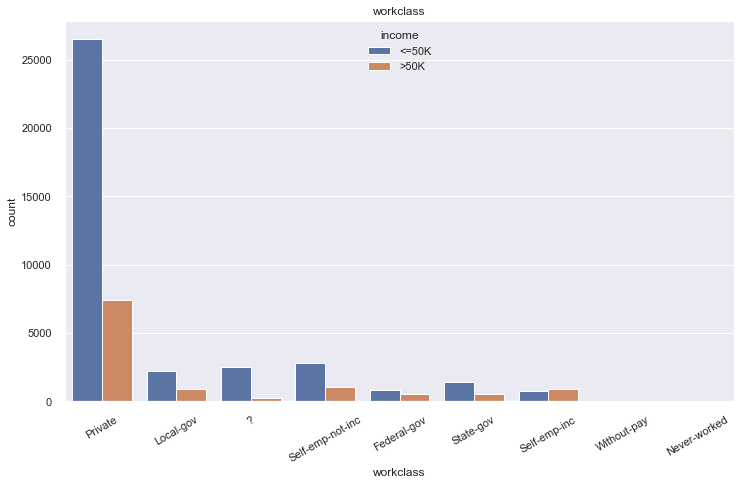
    


Some data are labelled "?". I could deal with this in a miriad of ways. I could remove all observations, or code a new column that is 1 when that observation was missing data, and 0 otherwise. Additionally, I could replace all "?" labels with the most frequent class label. To make this more concrete, I'll look at the percentage of the dataset containing people whose workclass is labelled "Private", and what precentage are labelled "?".


```python
# Display percentage of each instance in "workclass" column,
df['workclass'].value_counts(normalize = True) * 100
```


    Private             69.419762
    Self-emp-not-inc     7.907129
    Local-gov            6.420703
    ?                    5.730724
    State-gov            4.055935
    Self-emp-inc         3.470374
    Federal-gov          2.931903
    Without-pay          0.042996
    Never-worked         0.020474
    Name: workclass, dtype: float64


69% of workclass are labelled "Private", and only 5% are labelled "?". Therefore, I'm going to change all instances of "?" to "Private".


```python
# Replace all instances of "?" in the "worclass" column with "Private",
df['workclass'] = df['workclass'].str.replace('?', 'Private')
```


```python
# set a grey background.
sns.set(style = 'darkgrid')

# Replot "workclass" labels.
plotPredictors(df, 'workclass', 12, 8)
```


    
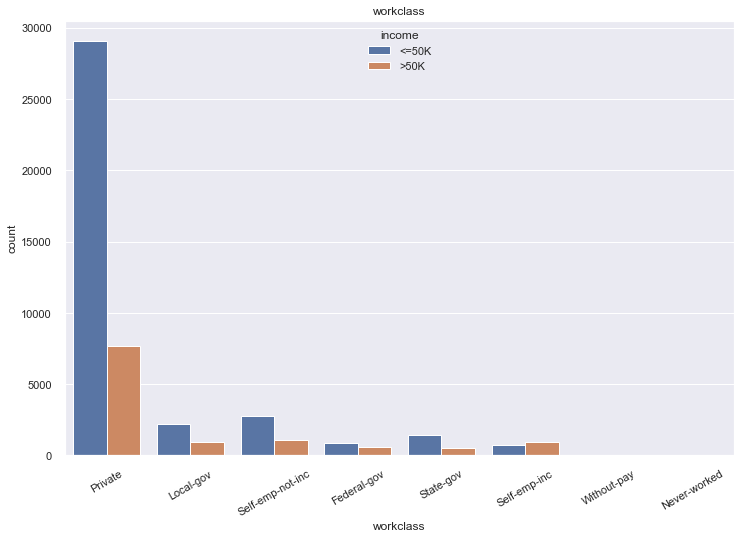
    


    ---------------------------------------------------------------------------

    AttributeError                            Traceback (most recent call last)

    <ipython-input-431-1ff445184ad4> in <module>
          5 plotPredictors(df, 'workclass', 12, 8)
          6 
    ----> 7 sns.savefig('images/workclass.png', dpi = 300)
    

    AttributeError: module 'seaborn' has no attribute 'savefig'


Conclusion: The majority of people in all working class categories make less than <=50K, with the exception of those who are self-employed. 

## Education


```python
# set a grey background.
sns.set(style = 'darkgrid')

# Plot "education" column labels.
plotPredictors(df, 'education', 20, 8)
```


    
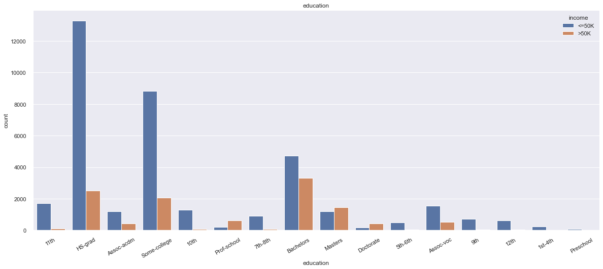
    


Conclusion: There is some data from individuals who do not have more than a preschool education, which is interesting given the minimum age of the dataset is 17. These won't be removed, but I may look at this later on.


```python
# set a grey background.
sns.set(style = 'darkgrid')

# Plot "educational_num" column labels.
plotPredictors(df, 'educational_num', 12, 8)
```


    
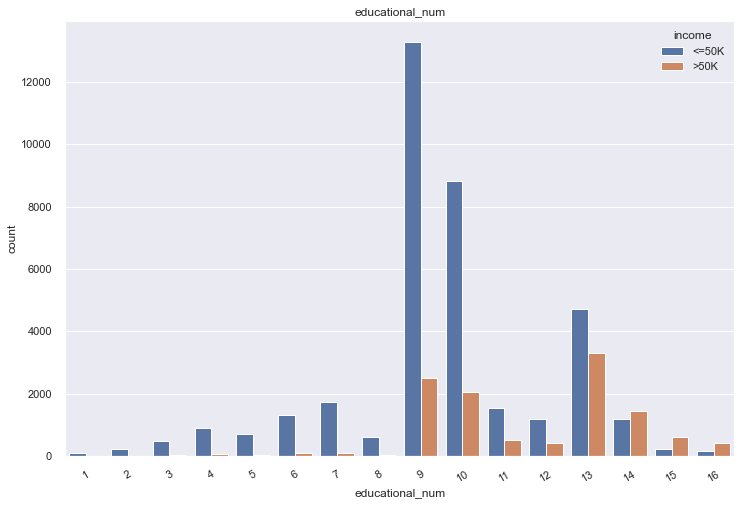
    


Conclusion: This variable looks like a categorical version of "education". Thus, it is redundent and can probably be removed.


```python
# Drop "educational_num" column.
df = df.drop(columns = ['educational_num'])
```

## Marital-status


```python
# set a grey background.
sns.set(style = 'darkgrid')

# Plot "marital_status" column labels.
plotPredictors(df, 'marital_status', 14, 8)
```


    
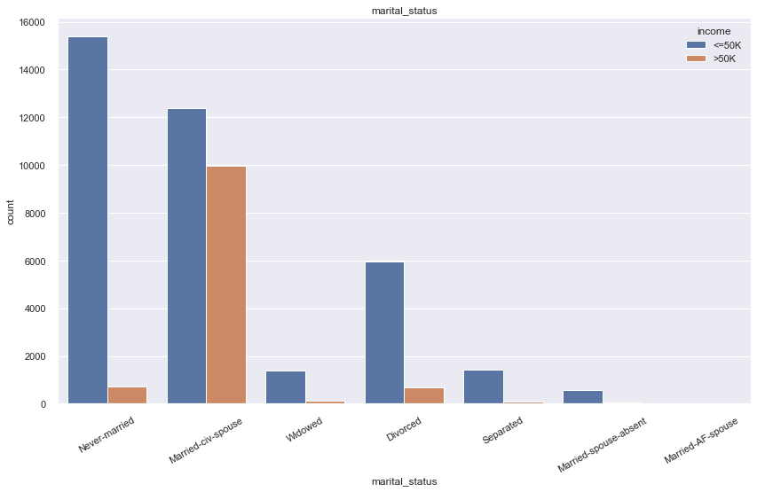
    


Conclusion: Unsurprisingly, married people seem to be the group who make a majority of people making >50K.

## Occupation


```python
# set a grey background.
sns.set(style = 'darkgrid')

# Plot "occupation" column labels.
plotPredictors(df, 'occupation', 18, 12)
```


    
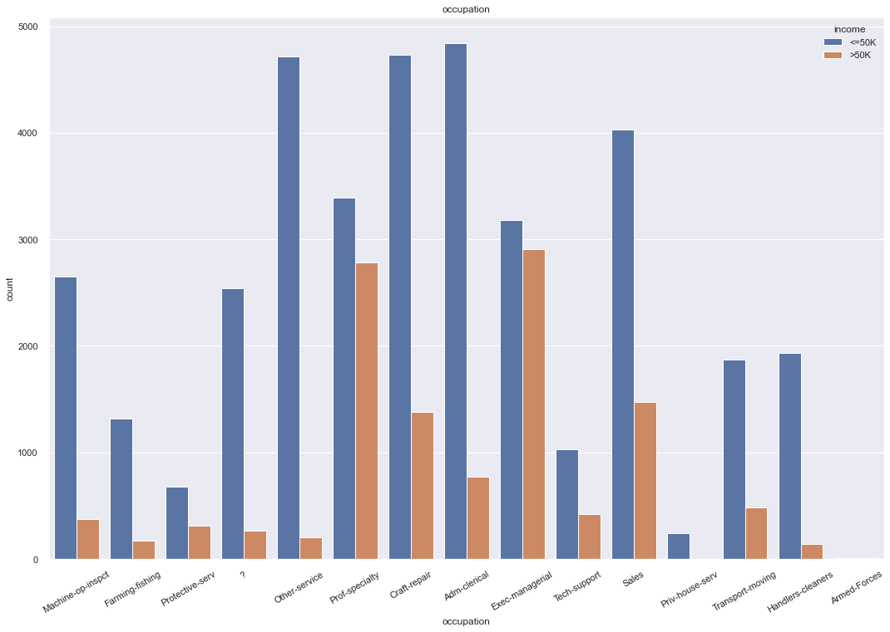
    


Conclusion: Like before, some data are labelled "?". I'll quickly look at which labels occur in the greatest number.


```python
# Display percentage of each instance in "workclass" column,
df['occupation'].value_counts(normalize = True) * 100
```


    Prof-specialty       12.636665
    Craft-repair         12.513820
    Exec-managerial      12.460587
    Adm-clerical         11.488064
    Sales                11.268990
    Other-service        10.079440
    Machine-op-inspct     6.187298
    ?                     5.751198
    Transport-moving      4.821670
    Handlers-cleaners     4.242251
    Farming-fishing       3.050653
    Tech-support          2.960567
    Protective-serv       2.012612
    Priv-house-serv       0.495475
    Armed-Forces          0.030711
    Name: occupation, dtype: float64


I could randomly assign the "?" labels to the top few most represented labels, but for consistency, I will assign them all to the top label "Prof-specialty".


```python
# Replace all instances of "?" with "Prof-specialty".
df['occupation'] = df['occupation'].str.replace('?', 'Prof-speciality')
```


```python
# set a grey background.
sns.set(style = 'darkgrid')

# Replot "occupation" column labels.
plotPredictors(df, 'occupation', 20, 8)
```


    
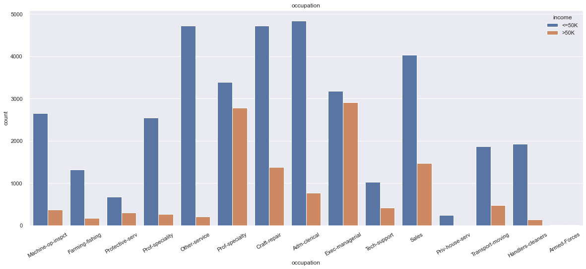
    


Conclusion: A few groups (e.g. "Exec-managerial", "Prof-specialty") seem to make the majority of people making >50K.

## Relationship


```python
# set a grey background.
sns.set(style = 'darkgrid')

# Plot "relationship" column labels.
plotPredictors(df, 'relationship', 10, 8)
```


    
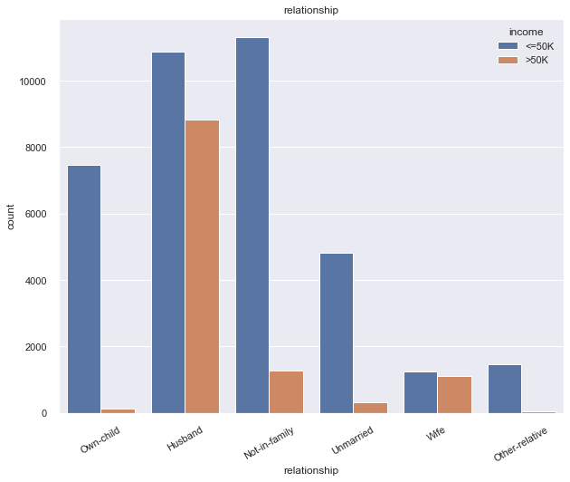
    


Conclusion: While wives are much less represented (probably because the dataset has more males), they seem to be just as likely to be in either category of the response variable. However, married people in general earn more.

## Race


```python
# set a grey background.
sns.set(style = 'darkgrid')

# Plot "race" column labels.
plotPredictors(df, 'race', 10, 8)
```


    
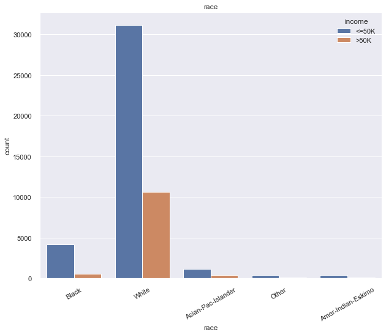
    


Conclusion: The race "White" seems to be more likely to make >50K, but they are also magnitudes more represented than any other group. For instance, "Asian-Pac-Islander" seems to make up proportionally the same amount of each response variable, but they are very underrepresented.

## Gender


```python
# set a grey background.
sns.set(style = 'darkgrid')

# Plot "gender" column labels.
plotPredictors(df, 'gender', 7, 8)
```


    

    


Conclusion: Males are more likely to make >50K than females, even accounting for their greater representation in the dataset.

## Native-Country


```python
# set a grey background.
sns.set(style = 'darkgrid')

# Plot "gender" column labels.
plotPredictors(df, 'native_country', 15, 8)
```


    
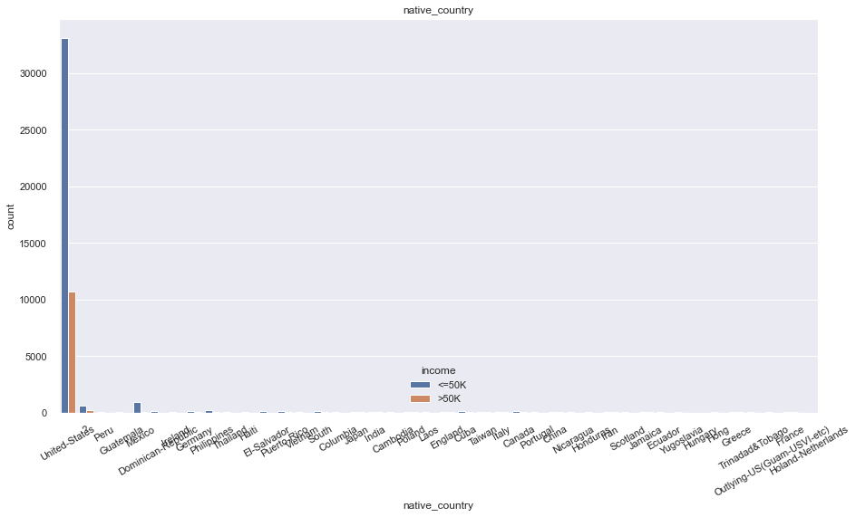
    


United states is so dominant, it is hard to see the other groups. I should remove the United States to see the others better.


```python
# Remove United-States from graph.
df2 = df[df['native_country'] != 'United-States']

# set a grey background.
sns.set(style = 'darkgrid')

# Plot "gender" column labels.
plotPredictors(df2, 'native_country', 15, 8)
```


    
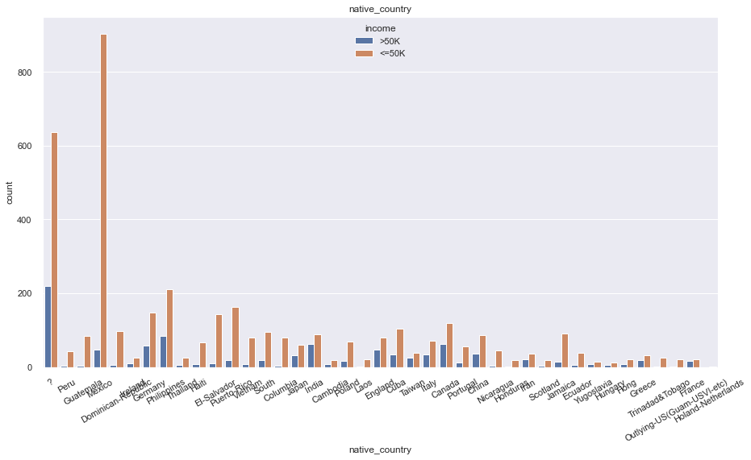
    


Note that the order of colors for the response variable has been flipped now (I won't correct this because it will only affect this graph). It appears that no "native_country" group dominates the >50K label. However, some data are labelled "?". I should see how they are represented compared to the other groups.


```python
# Display percentage of each instance in "workclass" column,
df['native_country'].value_counts(normalize = True) * 100
```


    United-States                 89.742435
    Mexico                         1.947095
    ?                              1.754637
    Philippines                    0.603988
    Germany                        0.421768
    Puerto-Rico                    0.376725
    Canada                         0.372630
    El-Salvador                    0.317350
    India                          0.309160
    Cuba                           0.282544
    England                        0.260022
    China                          0.249785
    South                          0.235453
    Jamaica                        0.217026
    Italy                          0.214979
    Dominican-Republic             0.210884
    Japan                          0.188362
    Guatemala                      0.180173
    Poland                         0.178125
    Vietnam                        0.176078
    Columbia                       0.174031
    Haiti                          0.153556
    Portugal                       0.137177
    Taiwan                         0.133082
    Iran                           0.120798
    Greece                         0.100323
    Nicaragua                      0.100323
    Peru                           0.094181
    Ecuador                        0.092134
    France                         0.077802
    Ireland                        0.075754
    Hong                           0.061423
    Thailand                       0.061423
    Cambodia                       0.057328
    Trinadad&Tobago                0.055280
    Laos                           0.047091
    Outlying-US(Guam-USVI-etc)     0.047091
    Yugoslavia                     0.047091
    Scotland                       0.042996
    Honduras                       0.040948
    Hungary                        0.038901
    Holand-Netherlands             0.002047
    Name: native_country, dtype: float64


1.7% of respondents have "?" as a country. Since the United States covers 89% of respondents native countries, I will replace all "?" with "United-States". Additionally, 1.75% of respondents are listed as being from "Inited-States". They will all be changed to "United-States" as well.


```python
# Replace all instances of "?" in the "worclass" column with "Private".
df['native_country'] = df['native_country'].str.replace('?','United-States')

# Replace all instances of "Inited-States" in the "worclass" column with "United-States".
df['native_country'] = df['native_country'].str.replace('Inited-States','United-States')
```


```python
# Remove United-States from graph.
df2 = df[df['native_country'] != 'United-States']

# set a grey background.
sns.set(style = 'darkgrid')

# Plot "gender" column labels.
plotPredictors(df2, 'native_country', 15, 8)
```


    
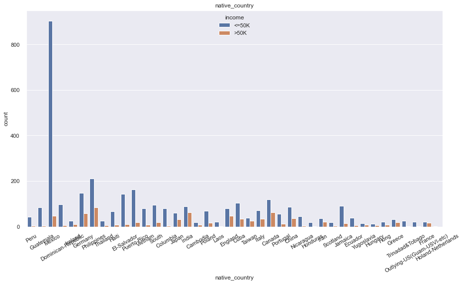
    


Conclusion: No group is more likely to make >50K, but groups like Guatemala are far more likely to make >50K.

## Capital-Gain/Capital-Loss


```python
# set a grey background.
sns.set(style = 'darkgrid')

# Set plot layout.
fig, ax = plt.subplots(figsize = (6, 4))

# Plot Capital-Gains/Captial-Loss graph.
sns.scatterplot(data = df, x = 'capital_gain', y = 'capital_loss', hue = 'income');
```


    
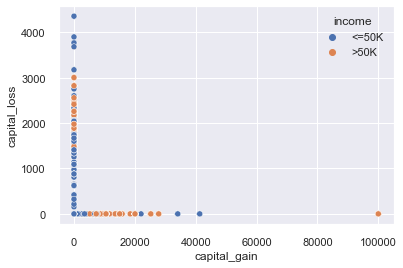
    


Conclusion: When people have zero capital gain, they have large capital-loss, and vis-versa. Perhaps these can be combined into a "capital-diff" difference score variable.


```python
# Make column "capital_diff" by taking the difference between "capital_gain" and "capital_loss".
df['capital_diff'] = df['capital_loss'] - df['capital_gain']

# Drop columns "capital_gain" and "capital_loss".
df = df.drop(columns = ['capital_gain', 'capital_loss'])
```

## Age


```python
# set a grey background.
sns.set(style = 'darkgrid')

# Set plot layout.
fig, ax = plt.subplots(figsize = (12, 8))

# Make indicator for "income" plot.
mask = df['income'] == '<=50K'

# Split data by indicator.
ax = sns.distplot(df[mask].age, label = '<=50K')
ax = sns.distplot(df[~mask].age,label = '>50K')

# Add legend.
ax.legend();
```


    
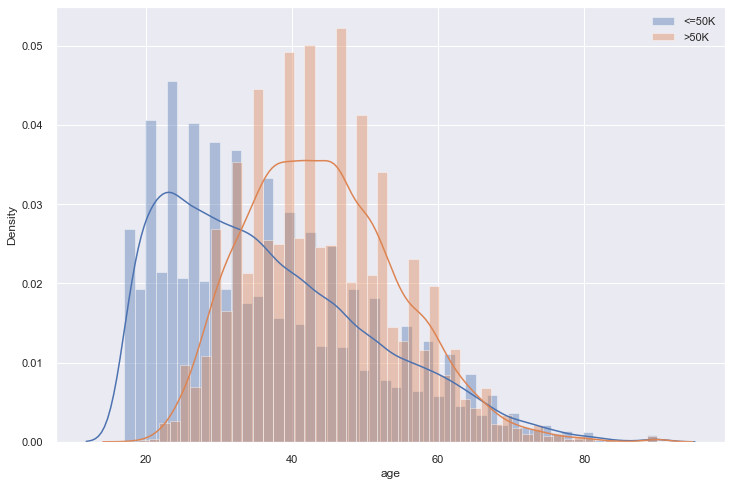
    


Conclusion: People making <=50K are skewed towards being younger, however, these proportions become almost identical once people reach retirement.


```python
# set a grey background.
sns.set(style = 'darkgrid')

# Display box and whisker plot for "age" column.
df['age'].plot(kind = 'box')

# Display plot.
plt.show()
```


    
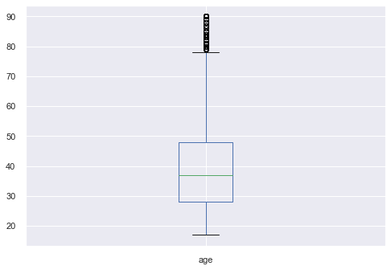
    


Conclusion: Their appear to be some outliers, but that's fine here. However, looking at the previous summary, the youngest person in the dataset is 17, yet there are people whose education stops at preschool. How is that possible? I'm going to seguay into a look at this here.


```python
# Print minimum age.
print('The minimum age is:', df['age'].min(), '\n')

# Print list of people with preschool-only education.
print('List of people with Preschool education: \n')
df.loc[df['education'] == 'Preschool']
```

    The minimum age is: 17 
    
    List of people with Preschool education: 
    
    


<div>
<style scoped>
    .dataframe tbody tr th:only-of-type {
        vertical-align: middle;
    }

    .dataframe tbody tr th {
        vertical-align: top;
    }

    .dataframe thead th {
        text-align: right;
    }
</style>
<table border="1" class="dataframe">
  <thead>
    <tr style="text-align: right;">
      <th></th>
      <th>age</th>
      <th>workclass</th>
      <th>fnlwgt</th>
      <th>education</th>
      <th>marital_status</th>
      <th>occupation</th>
      <th>relationship</th>
      <th>race</th>
      <th>gender</th>
      <th>hours_per_week</th>
      <th>native_country</th>
      <th>income</th>
      <th>capital_diff</th>
    </tr>
  </thead>
  <tbody>
    <tr>
      <th>779</th>
      <td>64</td>
      <td>Private</td>
      <td>86837</td>
      <td>Preschool</td>
      <td>Married-civ-spouse</td>
      <td>Handlers-cleaners</td>
      <td>Husband</td>
      <td>Asian-Pac-Islander</td>
      <td>Male</td>
      <td>40</td>
      <td>Philippines</td>
      <td>&lt;=50K</td>
      <td>0</td>
    </tr>
    <tr>
      <th>818</th>
      <td>21</td>
      <td>Private</td>
      <td>243368</td>
      <td>Preschool</td>
      <td>Never-married</td>
      <td>Farming-fishing</td>
      <td>Not-in-family</td>
      <td>White</td>
      <td>Male</td>
      <td>25</td>
      <td>Mexico</td>
      <td>&lt;=50K</td>
      <td>0</td>
    </tr>
    <tr>
      <th>1029</th>
      <td>57</td>
      <td>Private</td>
      <td>274680</td>
      <td>Preschool</td>
      <td>Separated</td>
      <td>Prof-speciality</td>
      <td>Not-in-family</td>
      <td>White</td>
      <td>Male</td>
      <td>40</td>
      <td>United-States</td>
      <td>&lt;=50K</td>
      <td>0</td>
    </tr>
    <tr>
      <th>1059</th>
      <td>31</td>
      <td>Private</td>
      <td>25610</td>
      <td>Preschool</td>
      <td>Never-married</td>
      <td>Handlers-cleaners</td>
      <td>Not-in-family</td>
      <td>Amer-Indian-Eskimo</td>
      <td>Male</td>
      <td>25</td>
      <td>United-States</td>
      <td>&lt;=50K</td>
      <td>0</td>
    </tr>
    <tr>
      <th>1489</th>
      <td>19</td>
      <td>Private</td>
      <td>277695</td>
      <td>Preschool</td>
      <td>Never-married</td>
      <td>Farming-fishing</td>
      <td>Not-in-family</td>
      <td>White</td>
      <td>Male</td>
      <td>36</td>
      <td>Mexico</td>
      <td>&lt;=50K</td>
      <td>0</td>
    </tr>
    <tr>
      <th>1498</th>
      <td>37</td>
      <td>Self-emp-not-inc</td>
      <td>227253</td>
      <td>Preschool</td>
      <td>Married-civ-spouse</td>
      <td>Sales</td>
      <td>Husband</td>
      <td>White</td>
      <td>Male</td>
      <td>30</td>
      <td>Mexico</td>
      <td>&lt;=50K</td>
      <td>0</td>
    </tr>
    <tr>
      <th>2364</th>
      <td>21</td>
      <td>Private</td>
      <td>436431</td>
      <td>Preschool</td>
      <td>Married-civ-spouse</td>
      <td>Prof-speciality</td>
      <td>Other-relative</td>
      <td>White</td>
      <td>Female</td>
      <td>40</td>
      <td>Mexico</td>
      <td>&lt;=50K</td>
      <td>0</td>
    </tr>
    <tr>
      <th>2465</th>
      <td>24</td>
      <td>Private</td>
      <td>403107</td>
      <td>Preschool</td>
      <td>Never-married</td>
      <td>Adm-clerical</td>
      <td>Not-in-family</td>
      <td>White</td>
      <td>Male</td>
      <td>40</td>
      <td>Mexico</td>
      <td>&lt;=50K</td>
      <td>0</td>
    </tr>
    <tr>
      <th>3037</th>
      <td>54</td>
      <td>Private</td>
      <td>99208</td>
      <td>Preschool</td>
      <td>Married-civ-spouse</td>
      <td>Prof-speciality</td>
      <td>Husband</td>
      <td>White</td>
      <td>Male</td>
      <td>16</td>
      <td>United-States</td>
      <td>&lt;=50K</td>
      <td>0</td>
    </tr>
    <tr>
      <th>3540</th>
      <td>29</td>
      <td>Private</td>
      <td>565769</td>
      <td>Preschool</td>
      <td>Never-married</td>
      <td>Prof-speciality</td>
      <td>Not-in-family</td>
      <td>Black</td>
      <td>Male</td>
      <td>40</td>
      <td>South</td>
      <td>&lt;=50K</td>
      <td>0</td>
    </tr>
    <tr>
      <th>4426</th>
      <td>30</td>
      <td>Private</td>
      <td>408328</td>
      <td>Preschool</td>
      <td>Married-spouse-absent</td>
      <td>Handlers-cleaners</td>
      <td>Unmarried</td>
      <td>White</td>
      <td>Male</td>
      <td>40</td>
      <td>Mexico</td>
      <td>&lt;=50K</td>
      <td>0</td>
    </tr>
    <tr>
      <th>4629</th>
      <td>28</td>
      <td>Private</td>
      <td>203784</td>
      <td>Preschool</td>
      <td>Never-married</td>
      <td>Farming-fishing</td>
      <td>Not-in-family</td>
      <td>White</td>
      <td>Male</td>
      <td>38</td>
      <td>Mexico</td>
      <td>&lt;=50K</td>
      <td>0</td>
    </tr>
    <tr>
      <th>4729</th>
      <td>50</td>
      <td>Private</td>
      <td>176773</td>
      <td>Preschool</td>
      <td>Married-civ-spouse</td>
      <td>Farming-fishing</td>
      <td>Husband</td>
      <td>Black</td>
      <td>Male</td>
      <td>40</td>
      <td>Haiti</td>
      <td>&lt;=50K</td>
      <td>0</td>
    </tr>
    <tr>
      <th>5795</th>
      <td>22</td>
      <td>Private</td>
      <td>267412</td>
      <td>Preschool</td>
      <td>Never-married</td>
      <td>Other-service</td>
      <td>Own-child</td>
      <td>Black</td>
      <td>Female</td>
      <td>20</td>
      <td>Jamaica</td>
      <td>&lt;=50K</td>
      <td>-594</td>
    </tr>
    <tr>
      <th>7054</th>
      <td>77</td>
      <td>Self-emp-not-inc</td>
      <td>161552</td>
      <td>Preschool</td>
      <td>Widowed</td>
      <td>Exec-managerial</td>
      <td>Not-in-family</td>
      <td>White</td>
      <td>Female</td>
      <td>60</td>
      <td>United-States</td>
      <td>&lt;=50K</td>
      <td>0</td>
    </tr>
    <tr>
      <th>7307</th>
      <td>60</td>
      <td>Self-emp-not-inc</td>
      <td>269485</td>
      <td>Preschool</td>
      <td>Divorced</td>
      <td>Other-service</td>
      <td>Unmarried</td>
      <td>White</td>
      <td>Female</td>
      <td>40</td>
      <td>Mexico</td>
      <td>&lt;=50K</td>
      <td>0</td>
    </tr>
    <tr>
      <th>7438</th>
      <td>61</td>
      <td>Self-emp-not-inc</td>
      <td>243019</td>
      <td>Preschool</td>
      <td>Married-civ-spouse</td>
      <td>Craft-repair</td>
      <td>Husband</td>
      <td>White</td>
      <td>Male</td>
      <td>40</td>
      <td>United-States</td>
      <td>&lt;=50K</td>
      <td>0</td>
    </tr>
    <tr>
      <th>7485</th>
      <td>37</td>
      <td>Private</td>
      <td>216845</td>
      <td>Preschool</td>
      <td>Married-civ-spouse</td>
      <td>Farming-fishing</td>
      <td>Husband</td>
      <td>White</td>
      <td>Male</td>
      <td>40</td>
      <td>Mexico</td>
      <td>&lt;=50K</td>
      <td>0</td>
    </tr>
    <tr>
      <th>7736</th>
      <td>30</td>
      <td>Private</td>
      <td>90308</td>
      <td>Preschool</td>
      <td>Never-married</td>
      <td>Other-service</td>
      <td>Unmarried</td>
      <td>White</td>
      <td>Male</td>
      <td>28</td>
      <td>El-Salvador</td>
      <td>&lt;=50K</td>
      <td>0</td>
    </tr>
    <tr>
      <th>7773</th>
      <td>19</td>
      <td>Private</td>
      <td>277695</td>
      <td>Preschool</td>
      <td>Never-married</td>
      <td>Farming-fishing</td>
      <td>Not-in-family</td>
      <td>White</td>
      <td>Male</td>
      <td>50</td>
      <td>Mexico</td>
      <td>&lt;=50K</td>
      <td>0</td>
    </tr>
    <tr>
      <th>10304</th>
      <td>50</td>
      <td>Private</td>
      <td>330543</td>
      <td>Preschool</td>
      <td>Married-civ-spouse</td>
      <td>Other-service</td>
      <td>Husband</td>
      <td>White</td>
      <td>Male</td>
      <td>40</td>
      <td>Mexico</td>
      <td>&lt;=50K</td>
      <td>0</td>
    </tr>
    <tr>
      <th>10721</th>
      <td>47</td>
      <td>Private</td>
      <td>98044</td>
      <td>Preschool</td>
      <td>Never-married</td>
      <td>Other-service</td>
      <td>Not-in-family</td>
      <td>White</td>
      <td>Male</td>
      <td>25</td>
      <td>El-Salvador</td>
      <td>&lt;=50K</td>
      <td>0</td>
    </tr>
    <tr>
      <th>10777</th>
      <td>53</td>
      <td>Private</td>
      <td>308082</td>
      <td>Preschool</td>
      <td>Never-married</td>
      <td>Other-service</td>
      <td>Not-in-family</td>
      <td>White</td>
      <td>Female</td>
      <td>15</td>
      <td>El-Salvador</td>
      <td>&lt;=50K</td>
      <td>0</td>
    </tr>
    <tr>
      <th>10954</th>
      <td>33</td>
      <td>Private</td>
      <td>295591</td>
      <td>Preschool</td>
      <td>Never-married</td>
      <td>Farming-fishing</td>
      <td>Not-in-family</td>
      <td>White</td>
      <td>Male</td>
      <td>40</td>
      <td>Mexico</td>
      <td>&lt;=50K</td>
      <td>0</td>
    </tr>
    <tr>
      <th>11456</th>
      <td>50</td>
      <td>Private</td>
      <td>193081</td>
      <td>Preschool</td>
      <td>Never-married</td>
      <td>Other-service</td>
      <td>Not-in-family</td>
      <td>Black</td>
      <td>Female</td>
      <td>40</td>
      <td>Haiti</td>
      <td>&lt;=50K</td>
      <td>0</td>
    </tr>
    <tr>
      <th>11677</th>
      <td>47</td>
      <td>Private</td>
      <td>235431</td>
      <td>Preschool</td>
      <td>Never-married</td>
      <td>Sales</td>
      <td>Unmarried</td>
      <td>Black</td>
      <td>Female</td>
      <td>40</td>
      <td>Haiti</td>
      <td>&lt;=50K</td>
      <td>0</td>
    </tr>
    <tr>
      <th>13568</th>
      <td>51</td>
      <td>Private</td>
      <td>186299</td>
      <td>Preschool</td>
      <td>Never-married</td>
      <td>Machine-op-inspct</td>
      <td>Not-in-family</td>
      <td>White</td>
      <td>Male</td>
      <td>30</td>
      <td>United-States</td>
      <td>&lt;=50K</td>
      <td>0</td>
    </tr>
    <tr>
      <th>13582</th>
      <td>43</td>
      <td>Self-emp-not-inc</td>
      <td>245056</td>
      <td>Preschool</td>
      <td>Married-civ-spouse</td>
      <td>Transport-moving</td>
      <td>Husband</td>
      <td>Black</td>
      <td>Male</td>
      <td>40</td>
      <td>Haiti</td>
      <td>&lt;=50K</td>
      <td>0</td>
    </tr>
    <tr>
      <th>14153</th>
      <td>21</td>
      <td>Private</td>
      <td>243368</td>
      <td>Preschool</td>
      <td>Never-married</td>
      <td>Farming-fishing</td>
      <td>Not-in-family</td>
      <td>White</td>
      <td>Male</td>
      <td>50</td>
      <td>Mexico</td>
      <td>&lt;=50K</td>
      <td>0</td>
    </tr>
    <tr>
      <th>15513</th>
      <td>35</td>
      <td>Private</td>
      <td>290498</td>
      <td>Preschool</td>
      <td>Married-civ-spouse</td>
      <td>Craft-repair</td>
      <td>Husband</td>
      <td>White</td>
      <td>Male</td>
      <td>38</td>
      <td>Mexico</td>
      <td>&lt;=50K</td>
      <td>0</td>
    </tr>
    <tr>
      <th>15654</th>
      <td>60</td>
      <td>Private</td>
      <td>225894</td>
      <td>Preschool</td>
      <td>Widowed</td>
      <td>Prof-speciality</td>
      <td>Not-in-family</td>
      <td>White</td>
      <td>Female</td>
      <td>40</td>
      <td>Guatemala</td>
      <td>&lt;=50K</td>
      <td>0</td>
    </tr>
    <tr>
      <th>15964</th>
      <td>61</td>
      <td>Private</td>
      <td>194804</td>
      <td>Preschool</td>
      <td>Separated</td>
      <td>Transport-moving</td>
      <td>Not-in-family</td>
      <td>Black</td>
      <td>Male</td>
      <td>40</td>
      <td>United-States</td>
      <td>&gt;50K</td>
      <td>-14344</td>
    </tr>
    <tr>
      <th>16505</th>
      <td>53</td>
      <td>Local-gov</td>
      <td>140359</td>
      <td>Preschool</td>
      <td>Never-married</td>
      <td>Machine-op-inspct</td>
      <td>Not-in-family</td>
      <td>White</td>
      <td>Female</td>
      <td>35</td>
      <td>United-States</td>
      <td>&lt;=50K</td>
      <td>0</td>
    </tr>
    <tr>
      <th>17213</th>
      <td>51</td>
      <td>Local-gov</td>
      <td>241843</td>
      <td>Preschool</td>
      <td>Married-civ-spouse</td>
      <td>Other-service</td>
      <td>Husband</td>
      <td>White</td>
      <td>Male</td>
      <td>40</td>
      <td>United-States</td>
      <td>&lt;=50K</td>
      <td>0</td>
    </tr>
    <tr>
      <th>19165</th>
      <td>71</td>
      <td>Private</td>
      <td>235079</td>
      <td>Preschool</td>
      <td>Widowed</td>
      <td>Craft-repair</td>
      <td>Unmarried</td>
      <td>Black</td>
      <td>Male</td>
      <td>10</td>
      <td>United-States</td>
      <td>&lt;=50K</td>
      <td>0</td>
    </tr>
    <tr>
      <th>19227</th>
      <td>31</td>
      <td>Private</td>
      <td>452405</td>
      <td>Preschool</td>
      <td>Never-married</td>
      <td>Other-service</td>
      <td>Other-relative</td>
      <td>White</td>
      <td>Female</td>
      <td>35</td>
      <td>Mexico</td>
      <td>&lt;=50K</td>
      <td>0</td>
    </tr>
    <tr>
      <th>19727</th>
      <td>33</td>
      <td>Private</td>
      <td>239781</td>
      <td>Preschool</td>
      <td>Married-civ-spouse</td>
      <td>Farming-fishing</td>
      <td>Husband</td>
      <td>White</td>
      <td>Male</td>
      <td>40</td>
      <td>Mexico</td>
      <td>&lt;=50K</td>
      <td>0</td>
    </tr>
    <tr>
      <th>19873</th>
      <td>39</td>
      <td>Private</td>
      <td>362685</td>
      <td>Preschool</td>
      <td>Widowed</td>
      <td>Prof-speciality</td>
      <td>Not-in-family</td>
      <td>White</td>
      <td>Female</td>
      <td>20</td>
      <td>El-Salvador</td>
      <td>&lt;=50K</td>
      <td>0</td>
    </tr>
    <tr>
      <th>20388</th>
      <td>52</td>
      <td>Private</td>
      <td>416129</td>
      <td>Preschool</td>
      <td>Married-civ-spouse</td>
      <td>Other-service</td>
      <td>Not-in-family</td>
      <td>White</td>
      <td>Male</td>
      <td>40</td>
      <td>El-Salvador</td>
      <td>&lt;=50K</td>
      <td>0</td>
    </tr>
    <tr>
      <th>22714</th>
      <td>27</td>
      <td>Private</td>
      <td>211032</td>
      <td>Preschool</td>
      <td>Married-civ-spouse</td>
      <td>Farming-fishing</td>
      <td>Other-relative</td>
      <td>White</td>
      <td>Male</td>
      <td>24</td>
      <td>Mexico</td>
      <td>&lt;=50K</td>
      <td>-41310</td>
    </tr>
    <tr>
      <th>23145</th>
      <td>54</td>
      <td>Private</td>
      <td>286989</td>
      <td>Preschool</td>
      <td>Married-civ-spouse</td>
      <td>Farming-fishing</td>
      <td>Husband</td>
      <td>White</td>
      <td>Male</td>
      <td>60</td>
      <td>United-States</td>
      <td>&lt;=50K</td>
      <td>0</td>
    </tr>
    <tr>
      <th>23351</th>
      <td>30</td>
      <td>Private</td>
      <td>193598</td>
      <td>Preschool</td>
      <td>Never-married</td>
      <td>Farming-fishing</td>
      <td>Not-in-family</td>
      <td>White</td>
      <td>Male</td>
      <td>40</td>
      <td>Mexico</td>
      <td>&lt;=50K</td>
      <td>0</td>
    </tr>
    <tr>
      <th>23454</th>
      <td>64</td>
      <td>Private</td>
      <td>140237</td>
      <td>Preschool</td>
      <td>Married-civ-spouse</td>
      <td>Prof-speciality</td>
      <td>Husband</td>
      <td>White</td>
      <td>Male</td>
      <td>40</td>
      <td>United-States</td>
      <td>&lt;=50K</td>
      <td>0</td>
    </tr>
    <tr>
      <th>24175</th>
      <td>26</td>
      <td>Private</td>
      <td>322614</td>
      <td>Preschool</td>
      <td>Married-spouse-absent</td>
      <td>Machine-op-inspct</td>
      <td>Not-in-family</td>
      <td>White</td>
      <td>Male</td>
      <td>40</td>
      <td>Mexico</td>
      <td>&lt;=50K</td>
      <td>1719</td>
    </tr>
    <tr>
      <th>24361</th>
      <td>21</td>
      <td>Private</td>
      <td>243368</td>
      <td>Preschool</td>
      <td>Never-married</td>
      <td>Farming-fishing</td>
      <td>Not-in-family</td>
      <td>White</td>
      <td>Male</td>
      <td>50</td>
      <td>Mexico</td>
      <td>&lt;=50K</td>
      <td>0</td>
    </tr>
    <tr>
      <th>24369</th>
      <td>54</td>
      <td>Private</td>
      <td>148657</td>
      <td>Preschool</td>
      <td>Married-civ-spouse</td>
      <td>Prof-speciality</td>
      <td>Wife</td>
      <td>White</td>
      <td>Female</td>
      <td>40</td>
      <td>Mexico</td>
      <td>&lt;=50K</td>
      <td>0</td>
    </tr>
    <tr>
      <th>24377</th>
      <td>52</td>
      <td>Private</td>
      <td>248113</td>
      <td>Preschool</td>
      <td>Married-spouse-absent</td>
      <td>Prof-speciality</td>
      <td>Other-relative</td>
      <td>White</td>
      <td>Male</td>
      <td>40</td>
      <td>Mexico</td>
      <td>&lt;=50K</td>
      <td>0</td>
    </tr>
    <tr>
      <th>25056</th>
      <td>20</td>
      <td>Private</td>
      <td>277700</td>
      <td>Preschool</td>
      <td>Never-married</td>
      <td>Other-service</td>
      <td>Own-child</td>
      <td>White</td>
      <td>Male</td>
      <td>32</td>
      <td>United-States</td>
      <td>&lt;=50K</td>
      <td>0</td>
    </tr>
    <tr>
      <th>26591</th>
      <td>59</td>
      <td>Private</td>
      <td>157305</td>
      <td>Preschool</td>
      <td>Never-married</td>
      <td>Machine-op-inspct</td>
      <td>Not-in-family</td>
      <td>White</td>
      <td>Male</td>
      <td>40</td>
      <td>Dominican-Republic</td>
      <td>&lt;=50K</td>
      <td>0</td>
    </tr>
    <tr>
      <th>27415</th>
      <td>32</td>
      <td>Private</td>
      <td>112137</td>
      <td>Preschool</td>
      <td>Married-civ-spouse</td>
      <td>Machine-op-inspct</td>
      <td>Wife</td>
      <td>Asian-Pac-Islander</td>
      <td>Female</td>
      <td>40</td>
      <td>Cambodia</td>
      <td>&lt;=50K</td>
      <td>-4508</td>
    </tr>
    <tr>
      <th>27641</th>
      <td>53</td>
      <td>Private</td>
      <td>188644</td>
      <td>Preschool</td>
      <td>Married-civ-spouse</td>
      <td>Other-service</td>
      <td>Husband</td>
      <td>White</td>
      <td>Male</td>
      <td>40</td>
      <td>Mexico</td>
      <td>&lt;=50K</td>
      <td>0</td>
    </tr>
    <tr>
      <th>28015</th>
      <td>65</td>
      <td>Private</td>
      <td>293385</td>
      <td>Preschool</td>
      <td>Married-civ-spouse</td>
      <td>Prof-speciality</td>
      <td>Husband</td>
      <td>Black</td>
      <td>Male</td>
      <td>30</td>
      <td>United-States</td>
      <td>&lt;=50K</td>
      <td>0</td>
    </tr>
    <tr>
      <th>29529</th>
      <td>68</td>
      <td>Private</td>
      <td>168794</td>
      <td>Preschool</td>
      <td>Never-married</td>
      <td>Machine-op-inspct</td>
      <td>Not-in-family</td>
      <td>White</td>
      <td>Male</td>
      <td>10</td>
      <td>United-States</td>
      <td>&lt;=50K</td>
      <td>0</td>
    </tr>
    <tr>
      <th>31340</th>
      <td>21</td>
      <td>Private</td>
      <td>243368</td>
      <td>Preschool</td>
      <td>Never-married</td>
      <td>Farming-fishing</td>
      <td>Not-in-family</td>
      <td>White</td>
      <td>Male</td>
      <td>50</td>
      <td>Mexico</td>
      <td>&lt;=50K</td>
      <td>0</td>
    </tr>
    <tr>
      <th>32778</th>
      <td>75</td>
      <td>Private</td>
      <td>71898</td>
      <td>Preschool</td>
      <td>Never-married</td>
      <td>Priv-house-serv</td>
      <td>Not-in-family</td>
      <td>Asian-Pac-Islander</td>
      <td>Female</td>
      <td>48</td>
      <td>Philippines</td>
      <td>&lt;=50K</td>
      <td>0</td>
    </tr>
    <tr>
      <th>32843</th>
      <td>46</td>
      <td>Private</td>
      <td>225065</td>
      <td>Preschool</td>
      <td>Married-civ-spouse</td>
      <td>Machine-op-inspct</td>
      <td>Wife</td>
      <td>White</td>
      <td>Female</td>
      <td>40</td>
      <td>Mexico</td>
      <td>&lt;=50K</td>
      <td>0</td>
    </tr>
    <tr>
      <th>34696</th>
      <td>24</td>
      <td>Private</td>
      <td>243368</td>
      <td>Preschool</td>
      <td>Never-married</td>
      <td>Farming-fishing</td>
      <td>Not-in-family</td>
      <td>White</td>
      <td>Male</td>
      <td>36</td>
      <td>Mexico</td>
      <td>&lt;=50K</td>
      <td>0</td>
    </tr>
    <tr>
      <th>36721</th>
      <td>63</td>
      <td>Private</td>
      <td>440607</td>
      <td>Preschool</td>
      <td>Married-civ-spouse</td>
      <td>Prof-specialty</td>
      <td>Husband</td>
      <td>Other</td>
      <td>Male</td>
      <td>30</td>
      <td>Mexico</td>
      <td>&lt;=50K</td>
      <td>0</td>
    </tr>
    <tr>
      <th>37651</th>
      <td>61</td>
      <td>Private</td>
      <td>98350</td>
      <td>Preschool</td>
      <td>Married-spouse-absent</td>
      <td>Other-service</td>
      <td>Not-in-family</td>
      <td>Asian-Pac-Islander</td>
      <td>Male</td>
      <td>40</td>
      <td>China</td>
      <td>&lt;=50K</td>
      <td>0</td>
    </tr>
    <tr>
      <th>37669</th>
      <td>24</td>
      <td>Private</td>
      <td>196678</td>
      <td>Preschool</td>
      <td>Never-married</td>
      <td>Machine-op-inspct</td>
      <td>Own-child</td>
      <td>White</td>
      <td>Female</td>
      <td>30</td>
      <td>United-States</td>
      <td>&lt;=50K</td>
      <td>0</td>
    </tr>
    <tr>
      <th>38003</th>
      <td>49</td>
      <td>Private</td>
      <td>149809</td>
      <td>Preschool</td>
      <td>Married-civ-spouse</td>
      <td>Other-service</td>
      <td>Husband</td>
      <td>White</td>
      <td>Male</td>
      <td>40</td>
      <td>United-States</td>
      <td>&lt;=50K</td>
      <td>0</td>
    </tr>
    <tr>
      <th>38075</th>
      <td>41</td>
      <td>Local-gov</td>
      <td>160893</td>
      <td>Preschool</td>
      <td>Never-married</td>
      <td>Handlers-cleaners</td>
      <td>Own-child</td>
      <td>White</td>
      <td>Female</td>
      <td>30</td>
      <td>United-States</td>
      <td>&lt;=50K</td>
      <td>0</td>
    </tr>
    <tr>
      <th>38448</th>
      <td>39</td>
      <td>Private</td>
      <td>341741</td>
      <td>Preschool</td>
      <td>Never-married</td>
      <td>Other-service</td>
      <td>Not-in-family</td>
      <td>White</td>
      <td>Female</td>
      <td>12</td>
      <td>United-States</td>
      <td>&lt;=50K</td>
      <td>0</td>
    </tr>
    <tr>
      <th>38812</th>
      <td>40</td>
      <td>Private</td>
      <td>182268</td>
      <td>Preschool</td>
      <td>Married-spouse-absent</td>
      <td>Adm-clerical</td>
      <td>Own-child</td>
      <td>White</td>
      <td>Male</td>
      <td>40</td>
      <td>United-States</td>
      <td>&lt;=50K</td>
      <td>0</td>
    </tr>
    <tr>
      <th>39221</th>
      <td>25</td>
      <td>Private</td>
      <td>266820</td>
      <td>Preschool</td>
      <td>Never-married</td>
      <td>Farming-fishing</td>
      <td>Not-in-family</td>
      <td>White</td>
      <td>Male</td>
      <td>35</td>
      <td>Mexico</td>
      <td>&lt;=50K</td>
      <td>0</td>
    </tr>
    <tr>
      <th>40456</th>
      <td>54</td>
      <td>Private</td>
      <td>349340</td>
      <td>Preschool</td>
      <td>Married-civ-spouse</td>
      <td>Craft-repair</td>
      <td>Husband</td>
      <td>Asian-Pac-Islander</td>
      <td>Male</td>
      <td>40</td>
      <td>India</td>
      <td>&lt;=50K</td>
      <td>0</td>
    </tr>
    <tr>
      <th>40839</th>
      <td>42</td>
      <td>Private</td>
      <td>572751</td>
      <td>Preschool</td>
      <td>Married-civ-spouse</td>
      <td>Craft-repair</td>
      <td>Husband</td>
      <td>White</td>
      <td>Male</td>
      <td>40</td>
      <td>Nicaragua</td>
      <td>&lt;=50K</td>
      <td>0</td>
    </tr>
    <tr>
      <th>40979</th>
      <td>32</td>
      <td>Private</td>
      <td>223212</td>
      <td>Preschool</td>
      <td>Married-civ-spouse</td>
      <td>Machine-op-inspct</td>
      <td>Husband</td>
      <td>White</td>
      <td>Male</td>
      <td>40</td>
      <td>Mexico</td>
      <td>&lt;=50K</td>
      <td>0</td>
    </tr>
    <tr>
      <th>41381</th>
      <td>48</td>
      <td>Private</td>
      <td>209182</td>
      <td>Preschool</td>
      <td>Separated</td>
      <td>Other-service</td>
      <td>Unmarried</td>
      <td>White</td>
      <td>Female</td>
      <td>40</td>
      <td>El-Salvador</td>
      <td>&lt;=50K</td>
      <td>0</td>
    </tr>
    <tr>
      <th>41394</th>
      <td>23</td>
      <td>Private</td>
      <td>69911</td>
      <td>Preschool</td>
      <td>Never-married</td>
      <td>Other-service</td>
      <td>Own-child</td>
      <td>White</td>
      <td>Female</td>
      <td>15</td>
      <td>United-States</td>
      <td>&lt;=50K</td>
      <td>0</td>
    </tr>
    <tr>
      <th>41508</th>
      <td>23</td>
      <td>Private</td>
      <td>240049</td>
      <td>Preschool</td>
      <td>Never-married</td>
      <td>Other-service</td>
      <td>Not-in-family</td>
      <td>Asian-Pac-Islander</td>
      <td>Female</td>
      <td>40</td>
      <td>Laos</td>
      <td>&lt;=50K</td>
      <td>0</td>
    </tr>
    <tr>
      <th>41933</th>
      <td>42</td>
      <td>Private</td>
      <td>144995</td>
      <td>Preschool</td>
      <td>Never-married</td>
      <td>Handlers-cleaners</td>
      <td>Not-in-family</td>
      <td>White</td>
      <td>Male</td>
      <td>25</td>
      <td>United-States</td>
      <td>&lt;=50K</td>
      <td>0</td>
    </tr>
    <tr>
      <th>42224</th>
      <td>19</td>
      <td>Private</td>
      <td>277695</td>
      <td>Preschool</td>
      <td>Never-married</td>
      <td>Farming-fishing</td>
      <td>Not-in-family</td>
      <td>White</td>
      <td>Male</td>
      <td>36</td>
      <td>Hong</td>
      <td>&lt;=50K</td>
      <td>0</td>
    </tr>
    <tr>
      <th>42782</th>
      <td>52</td>
      <td>Private</td>
      <td>370552</td>
      <td>Preschool</td>
      <td>Married-civ-spouse</td>
      <td>Machine-op-inspct</td>
      <td>Husband</td>
      <td>White</td>
      <td>Male</td>
      <td>40</td>
      <td>El-Salvador</td>
      <td>&lt;=50K</td>
      <td>0</td>
    </tr>
    <tr>
      <th>42887</th>
      <td>54</td>
      <td>Private</td>
      <td>175262</td>
      <td>Preschool</td>
      <td>Married-civ-spouse</td>
      <td>Craft-repair</td>
      <td>Husband</td>
      <td>Asian-Pac-Islander</td>
      <td>Male</td>
      <td>40</td>
      <td>China</td>
      <td>&lt;=50K</td>
      <td>0</td>
    </tr>
    <tr>
      <th>43433</th>
      <td>66</td>
      <td>Private</td>
      <td>236879</td>
      <td>Preschool</td>
      <td>Widowed</td>
      <td>Priv-house-serv</td>
      <td>Other-relative</td>
      <td>White</td>
      <td>Female</td>
      <td>40</td>
      <td>Guatemala</td>
      <td>&lt;=50K</td>
      <td>0</td>
    </tr>
    <tr>
      <th>43520</th>
      <td>34</td>
      <td>Local-gov</td>
      <td>144182</td>
      <td>Preschool</td>
      <td>Never-married</td>
      <td>Adm-clerical</td>
      <td>Own-child</td>
      <td>Black</td>
      <td>Female</td>
      <td>25</td>
      <td>United-States</td>
      <td>&lt;=50K</td>
      <td>0</td>
    </tr>
    <tr>
      <th>44676</th>
      <td>36</td>
      <td>Private</td>
      <td>252231</td>
      <td>Preschool</td>
      <td>Never-married</td>
      <td>Machine-op-inspct</td>
      <td>Not-in-family</td>
      <td>Black</td>
      <td>Male</td>
      <td>40</td>
      <td>Puerto-Rico</td>
      <td>&lt;=50K</td>
      <td>0</td>
    </tr>
    <tr>
      <th>48079</th>
      <td>31</td>
      <td>State-gov</td>
      <td>77634</td>
      <td>Preschool</td>
      <td>Never-married</td>
      <td>Other-service</td>
      <td>Not-in-family</td>
      <td>White</td>
      <td>Male</td>
      <td>24</td>
      <td>United-States</td>
      <td>&lt;=50K</td>
      <td>0</td>
    </tr>
    <tr>
      <th>48316</th>
      <td>40</td>
      <td>Private</td>
      <td>566537</td>
      <td>Preschool</td>
      <td>Married-civ-spouse</td>
      <td>Other-service</td>
      <td>Husband</td>
      <td>White</td>
      <td>Male</td>
      <td>40</td>
      <td>Mexico</td>
      <td>&lt;=50K</td>
      <td>1672</td>
    </tr>
    <tr>
      <th>48505</th>
      <td>40</td>
      <td>Private</td>
      <td>70645</td>
      <td>Preschool</td>
      <td>Never-married</td>
      <td>Other-service</td>
      <td>Not-in-family</td>
      <td>White</td>
      <td>Female</td>
      <td>20</td>
      <td>United-States</td>
      <td>&lt;=50K</td>
      <td>0</td>
    </tr>
    <tr>
      <th>48640</th>
      <td>46</td>
      <td>Private</td>
      <td>139514</td>
      <td>Preschool</td>
      <td>Married-civ-spouse</td>
      <td>Machine-op-inspct</td>
      <td>Other-relative</td>
      <td>Black</td>
      <td>Male</td>
      <td>75</td>
      <td>Dominican-Republic</td>
      <td>&lt;=50K</td>
      <td>0</td>
    </tr>
    <tr>
      <th>48713</th>
      <td>36</td>
      <td>Private</td>
      <td>208068</td>
      <td>Preschool</td>
      <td>Divorced</td>
      <td>Other-service</td>
      <td>Not-in-family</td>
      <td>Other</td>
      <td>Male</td>
      <td>72</td>
      <td>Mexico</td>
      <td>&lt;=50K</td>
      <td>0</td>
    </tr>
  </tbody>
</table>
</div>


People with only a pre-school education don't seem to have any obvious trends. It is definitely possible for for someone in the United States to never go to school as a kid/teenager (I looked it up), so this seems entirely possible and I will keep them in the dataset.

## Hours-per-week


```python
# set a grey background.
sns.set(style = 'darkgrid')

# Set plot layout.
fig, ax = plt.subplots(figsize = (12, 8))

# Make indicator for "income" plot.
mask = df['income'] == '<=50K'

# Split data by indicator.
ax = sns.distplot(df[mask]['hours_per_week'], label = '<=50K')
ax = sns.distplot(df[~mask]['hours_per_week'],label = '>50K')

# Add legend.
ax.legend();
```


    
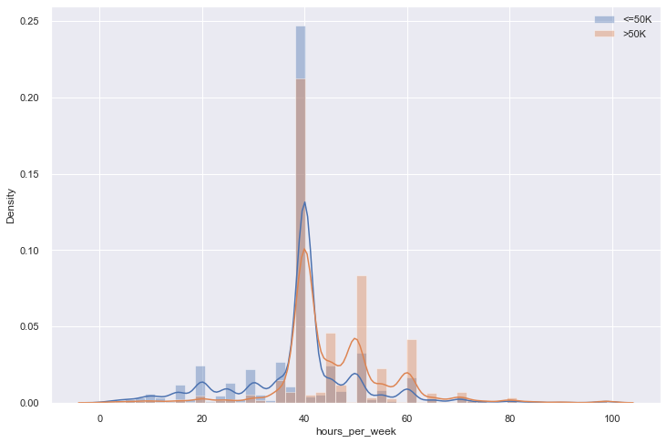
    


Conclusion: Most people seem to work a standard 40 hour work week. People who work less than 40 hours per week typically make <=50K, while people who work more than 40 hours per week typically make >50K.


```python
# set a grey background.
sns.set(style = 'darkgrid')

# Display box and whisker plots.
df['hours_per_week'].plot(kind = 'box')

# Display plot.
plt.show()
```


    
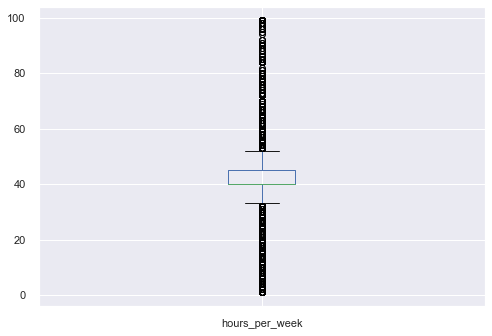
    


Conclusion: There are a lot's of outliers for "hours_per_week", but that is probably because the vast majority of people work a 40 hour workweek.

## Capital_diff


```python
# set a grey background.
sns.set(style = 'darkgrid')

# Set plot layout.
fig, ax = plt.subplots(figsize = (12, 8))

# Make indicator for "income" plot.
mask = df['income'] == '<=50K'

# Split data by indicator.
ax = sns.distplot(df[mask]['capital_diff'], label = '<=50K')
ax = sns.distplot(df[~mask]['capital_diff'],label = '>50K')

# Add legend.
ax.legend();
```


    
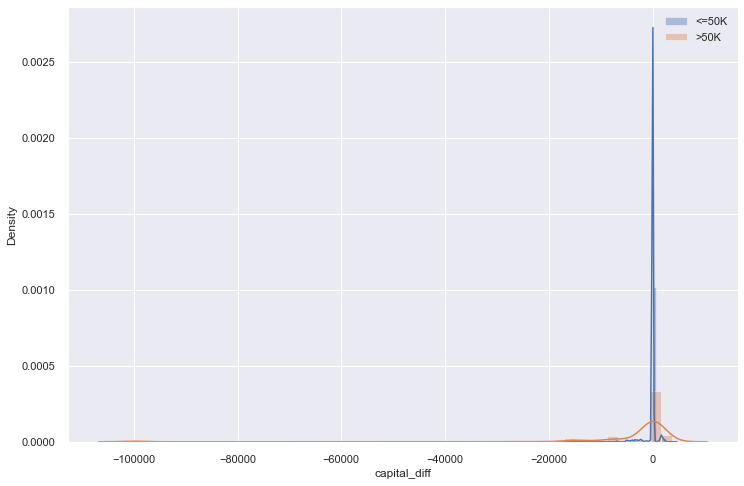
    


Conclusion: If people had a change in capital gain, those making <=50K were more likely to have lost money, and those making >50K were more likely to have earned money.


```python
# set a grey background.
sns.set(style = 'darkgrid')

# Display box and whisker plots.
df['capital_diff'].plot(kind = 'box')

# Display plot.
plt.show()
```


    
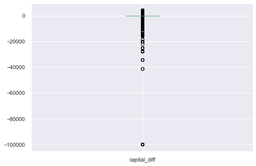
    


Conclusion: Most people did not see any capital gain/loss. Therefore, any change in capital is an outlier.

## Scaling continuous variables
If continuous variable are on wildly different scales, the machine learning algorithm may run into problems. I'm going to see whether this is the case for my 3 continuous predictors.


```python
# set a grey background.
sns.set(style = 'darkgrid')

# Set plot layout.
fig, axs = plt.subplots(1, 3, figsize=(15, 5))

# Plot continuous predictors side-by-side.
sns.histplot(data = df, x = 'age', kde = True, color = 'skyblue', ax = axs[0])
sns.histplot(data = df, x = 'capital_diff', kde = True, color = 'gold', ax = axs[1])
sns.histplot(data = df, x = 'hours_per_week', kde = True, color = 'teal', ax = axs[2])

# Display plot.
plt.show()
```


    
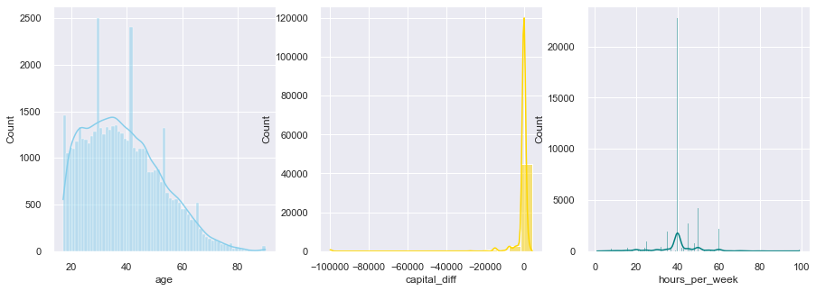
    


Conclusion: The continuous variable do not exactly fall within the same range. Standardisation will fix that.


```python
# List of variables I want to standardise.
col_names = ['age', 'capital_diff', 'hours_per_week']

# Select variables to standardise from dataframe.
features = df[col_names]

# Set StandardScaler instance.
scaler = StandardScaler().fit(features.values)

# Make array of standardised values corresponding to the columns in the dataframe.
features = scaler.transform(features.values)

# Convert standardised array to pandas dataframe.
scaled_features = pd.DataFrame(features, columns = col_names)

# Glimps standardised dataframe.
scaled_features.head()
```


<div>
<style scoped>
    .dataframe tbody tr th:only-of-type {
        vertical-align: middle;
    }

    .dataframe tbody tr th {
        vertical-align: top;
    }

    .dataframe thead th {
        text-align: right;
    }
</style>
<table border="1" class="dataframe">
  <thead>
    <tr style="text-align: right;">
      <th></th>
      <th>age</th>
      <th>capital_diff</th>
      <th>hours_per_week</th>
    </tr>
  </thead>
  <tbody>
    <tr>
      <th>0</th>
      <td>-0.995129</td>
      <td>0.132642</td>
      <td>-0.034087</td>
    </tr>
    <tr>
      <th>1</th>
      <td>-0.046942</td>
      <td>0.132642</td>
      <td>0.772930</td>
    </tr>
    <tr>
      <th>2</th>
      <td>-0.776316</td>
      <td>0.132642</td>
      <td>-0.034087</td>
    </tr>
    <tr>
      <th>3</th>
      <td>0.390683</td>
      <td>-0.895787</td>
      <td>-0.034087</td>
    </tr>
    <tr>
      <th>4</th>
      <td>-1.505691</td>
      <td>0.132642</td>
      <td>-0.841104</td>
    </tr>
  </tbody>
</table>
</div>


Now the continuous predictors appear to be on a standardised scale. I'll plot them again to see.


```python
# set a grey background.
sns.set(style = 'darkgrid')

# Set plot layout.
fig, axs = plt.subplots(1, 3, figsize = (15, 5))

# Plot continuous predictors side-by-side.
sns.histplot(data = scaled_features, x = 'age', kde = True, color = 'skyblue', ax = axs[0])
sns.histplot(data = scaled_features, x = 'capital_diff', kde = True, color = 'gold', ax = axs[1])
sns.histplot(data = scaled_features, x = 'hours_per_week', kde = True, color = 'teal', ax = axs[2])

# Display plot.
plt.show()
```


    
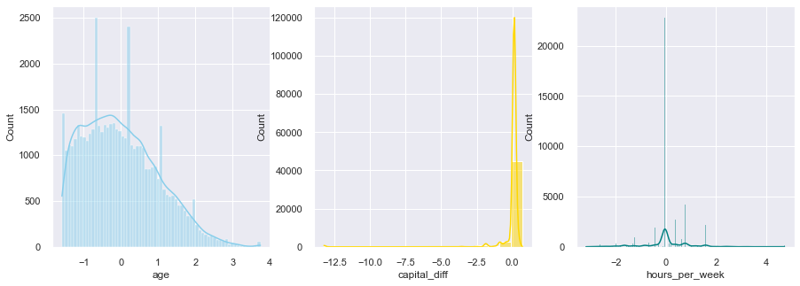
    


They look standardised now, so I just need to replace the standardised values with the original values in the dataframe.


```python
# Replace non-standardised columns with standardised columns.
df = df.assign(age = scaled_features['age'], capital_diff = scaled_features['capital_diff'], hours_per_week = scaled_features['hours_per_week'])
```


```python
# Glimps dataframe.
df.head()
```


<div>
<style scoped>
    .dataframe tbody tr th:only-of-type {
        vertical-align: middle;
    }

    .dataframe tbody tr th {
        vertical-align: top;
    }

    .dataframe thead th {
        text-align: right;
    }
</style>
<table border="1" class="dataframe">
  <thead>
    <tr style="text-align: right;">
      <th></th>
      <th>age</th>
      <th>workclass</th>
      <th>fnlwgt</th>
      <th>education</th>
      <th>marital_status</th>
      <th>occupation</th>
      <th>relationship</th>
      <th>race</th>
      <th>gender</th>
      <th>hours_per_week</th>
      <th>native_country</th>
      <th>income</th>
      <th>capital_diff</th>
    </tr>
  </thead>
  <tbody>
    <tr>
      <th>0</th>
      <td>-0.995129</td>
      <td>Private</td>
      <td>226802</td>
      <td>11th</td>
      <td>Never-married</td>
      <td>Machine-op-inspct</td>
      <td>Own-child</td>
      <td>Black</td>
      <td>Male</td>
      <td>-0.034087</td>
      <td>United-States</td>
      <td>&lt;=50K</td>
      <td>0.132642</td>
    </tr>
    <tr>
      <th>1</th>
      <td>-0.046942</td>
      <td>Private</td>
      <td>89814</td>
      <td>HS-grad</td>
      <td>Married-civ-spouse</td>
      <td>Farming-fishing</td>
      <td>Husband</td>
      <td>White</td>
      <td>Male</td>
      <td>0.772930</td>
      <td>United-States</td>
      <td>&lt;=50K</td>
      <td>0.132642</td>
    </tr>
    <tr>
      <th>2</th>
      <td>-0.776316</td>
      <td>Local-gov</td>
      <td>336951</td>
      <td>Assoc-acdm</td>
      <td>Married-civ-spouse</td>
      <td>Protective-serv</td>
      <td>Husband</td>
      <td>White</td>
      <td>Male</td>
      <td>-0.034087</td>
      <td>United-States</td>
      <td>&gt;50K</td>
      <td>0.132642</td>
    </tr>
    <tr>
      <th>3</th>
      <td>0.390683</td>
      <td>Private</td>
      <td>160323</td>
      <td>Some-college</td>
      <td>Married-civ-spouse</td>
      <td>Machine-op-inspct</td>
      <td>Husband</td>
      <td>Black</td>
      <td>Male</td>
      <td>-0.034087</td>
      <td>United-States</td>
      <td>&gt;50K</td>
      <td>-0.895787</td>
    </tr>
    <tr>
      <th>4</th>
      <td>-1.505691</td>
      <td>Private</td>
      <td>103497</td>
      <td>Some-college</td>
      <td>Never-married</td>
      <td>Prof-speciality</td>
      <td>Own-child</td>
      <td>White</td>
      <td>Female</td>
      <td>-0.841104</td>
      <td>United-States</td>
      <td>&lt;=50K</td>
      <td>0.132642</td>
    </tr>
  </tbody>
</table>
</div>


## fnlwgt
This variable is some sort of weighting unit. I want to see how many unique values it has.


```python
# Display number of unique "fnlwgt" labels.
df['fnlwgt'].nunique()
```


    28523


Conclusion: With so many unique labels, I'm not convinced they will be useful for machine learning, so I will drop this variable.


```python
# Drop "fnlwgt" from dataframe.
df = df.drop(columns = ['fnlwgt'])
```

# Final Data Tweaks

## Dummy Coding
Categorical variables need to be numerically coded for most machine-learning algorithms. However, simply giving a unique value to each label of a predictor will imply a rank to each instance (which is not the case for any of these predictors). To get around that, each predictor will be given as many columns as instances, and will be designated 1 if that observation is an instance of it, and 0 otherwise. First, I want to see which predictors actually are categorical.


```python
# Make list displaying whether a column is continuous or object-based.
s = (df.dtypes == 'object')

# Drop income, since I want to save labels with a label encoder.
s = s.drop(['income'])

# Make list of column names with object instances.
object_cols = list(s[s].index)

# Print names of all columns with categorical instances.
print('Categorical variables:', '\n')
print(object_cols)
```

    Categorical variables: 
    
    ['workclass', 'education', 'marital_status', 'occupation', 'relationship', 'race', 'gender', 'native_country']
    

Each of these variables needs to be dummy coded.


```python
# Dummy code categorical predictors. 
df = pd.concat([df, pd.get_dummies(data = df, columns = list(s[s].index), drop_first = True)], axis = 1)
```

Now, I can remove the none-dummy coded categorical predictors.


```python
# Remove non-dummy coded object columns.
df.drop(object_cols, axis = 1, inplace = True)
```


```python
# Recheck dataframe.
df.head()
```


<div>
<style scoped>
    .dataframe tbody tr th:only-of-type {
        vertical-align: middle;
    }

    .dataframe tbody tr th {
        vertical-align: top;
    }

    .dataframe thead th {
        text-align: right;
    }
</style>
<table border="1" class="dataframe">
  <thead>
    <tr style="text-align: right;">
      <th></th>
      <th>age</th>
      <th>hours_per_week</th>
      <th>income</th>
      <th>capital_diff</th>
      <th>age</th>
      <th>hours_per_week</th>
      <th>income</th>
      <th>capital_diff</th>
      <th>workclass_Local-gov</th>
      <th>workclass_Never-worked</th>
      <th>workclass_Private</th>
      <th>workclass_Self-emp-inc</th>
      <th>workclass_Self-emp-not-inc</th>
      <th>workclass_State-gov</th>
      <th>workclass_Without-pay</th>
      <th>education_11th</th>
      <th>education_12th</th>
      <th>education_1st-4th</th>
      <th>education_5th-6th</th>
      <th>education_7th-8th</th>
      <th>education_9th</th>
      <th>education_Assoc-acdm</th>
      <th>education_Assoc-voc</th>
      <th>education_Bachelors</th>
      <th>education_Doctorate</th>
      <th>education_HS-grad</th>
      <th>education_Masters</th>
      <th>education_Preschool</th>
      <th>education_Prof-school</th>
      <th>education_Some-college</th>
      <th>marital_status_Married-AF-spouse</th>
      <th>marital_status_Married-civ-spouse</th>
      <th>marital_status_Married-spouse-absent</th>
      <th>marital_status_Never-married</th>
      <th>marital_status_Separated</th>
      <th>marital_status_Widowed</th>
      <th>occupation_Armed-Forces</th>
      <th>occupation_Craft-repair</th>
      <th>occupation_Exec-managerial</th>
      <th>occupation_Farming-fishing</th>
      <th>occupation_Handlers-cleaners</th>
      <th>occupation_Machine-op-inspct</th>
      <th>occupation_Other-service</th>
      <th>occupation_Priv-house-serv</th>
      <th>occupation_Prof-speciality</th>
      <th>occupation_Prof-specialty</th>
      <th>occupation_Protective-serv</th>
      <th>occupation_Sales</th>
      <th>occupation_Tech-support</th>
      <th>occupation_Transport-moving</th>
      <th>relationship_Not-in-family</th>
      <th>relationship_Other-relative</th>
      <th>relationship_Own-child</th>
      <th>relationship_Unmarried</th>
      <th>relationship_Wife</th>
      <th>race_Asian-Pac-Islander</th>
      <th>race_Black</th>
      <th>race_Other</th>
      <th>race_White</th>
      <th>gender_Male</th>
      <th>native_country_Canada</th>
      <th>native_country_China</th>
      <th>native_country_Columbia</th>
      <th>native_country_Cuba</th>
      <th>native_country_Dominican-Republic</th>
      <th>native_country_Ecuador</th>
      <th>native_country_El-Salvador</th>
      <th>native_country_England</th>
      <th>native_country_France</th>
      <th>native_country_Germany</th>
      <th>native_country_Greece</th>
      <th>native_country_Guatemala</th>
      <th>native_country_Haiti</th>
      <th>native_country_Holand-Netherlands</th>
      <th>native_country_Honduras</th>
      <th>native_country_Hong</th>
      <th>native_country_Hungary</th>
      <th>native_country_India</th>
      <th>native_country_Iran</th>
      <th>native_country_Ireland</th>
      <th>native_country_Italy</th>
      <th>native_country_Jamaica</th>
      <th>native_country_Japan</th>
      <th>native_country_Laos</th>
      <th>native_country_Mexico</th>
      <th>native_country_Nicaragua</th>
      <th>native_country_Outlying-US(Guam-USVI-etc)</th>
      <th>native_country_Peru</th>
      <th>native_country_Philippines</th>
      <th>native_country_Poland</th>
      <th>native_country_Portugal</th>
      <th>native_country_Puerto-Rico</th>
      <th>native_country_Scotland</th>
      <th>native_country_South</th>
      <th>native_country_Taiwan</th>
      <th>native_country_Thailand</th>
      <th>native_country_Trinadad&amp;Tobago</th>
      <th>native_country_United-States</th>
      <th>native_country_Vietnam</th>
      <th>native_country_Yugoslavia</th>
    </tr>
  </thead>
  <tbody>
    <tr>
      <th>0</th>
      <td>-0.995129</td>
      <td>-0.034087</td>
      <td>&lt;=50K</td>
      <td>0.132642</td>
      <td>-0.995129</td>
      <td>-0.034087</td>
      <td>&lt;=50K</td>
      <td>0.132642</td>
      <td>0</td>
      <td>0</td>
      <td>1</td>
      <td>0</td>
      <td>0</td>
      <td>0</td>
      <td>0</td>
      <td>1</td>
      <td>0</td>
      <td>0</td>
      <td>0</td>
      <td>0</td>
      <td>0</td>
      <td>0</td>
      <td>0</td>
      <td>0</td>
      <td>0</td>
      <td>0</td>
      <td>0</td>
      <td>0</td>
      <td>0</td>
      <td>0</td>
      <td>0</td>
      <td>0</td>
      <td>0</td>
      <td>1</td>
      <td>0</td>
      <td>0</td>
      <td>0</td>
      <td>0</td>
      <td>0</td>
      <td>0</td>
      <td>0</td>
      <td>1</td>
      <td>0</td>
      <td>0</td>
      <td>0</td>
      <td>0</td>
      <td>0</td>
      <td>0</td>
      <td>0</td>
      <td>0</td>
      <td>0</td>
      <td>0</td>
      <td>1</td>
      <td>0</td>
      <td>0</td>
      <td>0</td>
      <td>1</td>
      <td>0</td>
      <td>0</td>
      <td>1</td>
      <td>0</td>
      <td>0</td>
      <td>0</td>
      <td>0</td>
      <td>0</td>
      <td>0</td>
      <td>0</td>
      <td>0</td>
      <td>0</td>
      <td>0</td>
      <td>0</td>
      <td>0</td>
      <td>0</td>
      <td>0</td>
      <td>0</td>
      <td>0</td>
      <td>0</td>
      <td>0</td>
      <td>0</td>
      <td>0</td>
      <td>0</td>
      <td>0</td>
      <td>0</td>
      <td>0</td>
      <td>0</td>
      <td>0</td>
      <td>0</td>
      <td>0</td>
      <td>0</td>
      <td>0</td>
      <td>0</td>
      <td>0</td>
      <td>0</td>
      <td>0</td>
      <td>0</td>
      <td>0</td>
      <td>0</td>
      <td>1</td>
      <td>0</td>
      <td>0</td>
    </tr>
    <tr>
      <th>1</th>
      <td>-0.046942</td>
      <td>0.772930</td>
      <td>&lt;=50K</td>
      <td>0.132642</td>
      <td>-0.046942</td>
      <td>0.772930</td>
      <td>&lt;=50K</td>
      <td>0.132642</td>
      <td>0</td>
      <td>0</td>
      <td>1</td>
      <td>0</td>
      <td>0</td>
      <td>0</td>
      <td>0</td>
      <td>0</td>
      <td>0</td>
      <td>0</td>
      <td>0</td>
      <td>0</td>
      <td>0</td>
      <td>0</td>
      <td>0</td>
      <td>0</td>
      <td>0</td>
      <td>1</td>
      <td>0</td>
      <td>0</td>
      <td>0</td>
      <td>0</td>
      <td>0</td>
      <td>1</td>
      <td>0</td>
      <td>0</td>
      <td>0</td>
      <td>0</td>
      <td>0</td>
      <td>0</td>
      <td>0</td>
      <td>1</td>
      <td>0</td>
      <td>0</td>
      <td>0</td>
      <td>0</td>
      <td>0</td>
      <td>0</td>
      <td>0</td>
      <td>0</td>
      <td>0</td>
      <td>0</td>
      <td>0</td>
      <td>0</td>
      <td>0</td>
      <td>0</td>
      <td>0</td>
      <td>0</td>
      <td>0</td>
      <td>0</td>
      <td>1</td>
      <td>1</td>
      <td>0</td>
      <td>0</td>
      <td>0</td>
      <td>0</td>
      <td>0</td>
      <td>0</td>
      <td>0</td>
      <td>0</td>
      <td>0</td>
      <td>0</td>
      <td>0</td>
      <td>0</td>
      <td>0</td>
      <td>0</td>
      <td>0</td>
      <td>0</td>
      <td>0</td>
      <td>0</td>
      <td>0</td>
      <td>0</td>
      <td>0</td>
      <td>0</td>
      <td>0</td>
      <td>0</td>
      <td>0</td>
      <td>0</td>
      <td>0</td>
      <td>0</td>
      <td>0</td>
      <td>0</td>
      <td>0</td>
      <td>0</td>
      <td>0</td>
      <td>0</td>
      <td>0</td>
      <td>0</td>
      <td>0</td>
      <td>1</td>
      <td>0</td>
      <td>0</td>
    </tr>
    <tr>
      <th>2</th>
      <td>-0.776316</td>
      <td>-0.034087</td>
      <td>&gt;50K</td>
      <td>0.132642</td>
      <td>-0.776316</td>
      <td>-0.034087</td>
      <td>&gt;50K</td>
      <td>0.132642</td>
      <td>1</td>
      <td>0</td>
      <td>0</td>
      <td>0</td>
      <td>0</td>
      <td>0</td>
      <td>0</td>
      <td>0</td>
      <td>0</td>
      <td>0</td>
      <td>0</td>
      <td>0</td>
      <td>0</td>
      <td>1</td>
      <td>0</td>
      <td>0</td>
      <td>0</td>
      <td>0</td>
      <td>0</td>
      <td>0</td>
      <td>0</td>
      <td>0</td>
      <td>0</td>
      <td>1</td>
      <td>0</td>
      <td>0</td>
      <td>0</td>
      <td>0</td>
      <td>0</td>
      <td>0</td>
      <td>0</td>
      <td>0</td>
      <td>0</td>
      <td>0</td>
      <td>0</td>
      <td>0</td>
      <td>0</td>
      <td>0</td>
      <td>1</td>
      <td>0</td>
      <td>0</td>
      <td>0</td>
      <td>0</td>
      <td>0</td>
      <td>0</td>
      <td>0</td>
      <td>0</td>
      <td>0</td>
      <td>0</td>
      <td>0</td>
      <td>1</td>
      <td>1</td>
      <td>0</td>
      <td>0</td>
      <td>0</td>
      <td>0</td>
      <td>0</td>
      <td>0</td>
      <td>0</td>
      <td>0</td>
      <td>0</td>
      <td>0</td>
      <td>0</td>
      <td>0</td>
      <td>0</td>
      <td>0</td>
      <td>0</td>
      <td>0</td>
      <td>0</td>
      <td>0</td>
      <td>0</td>
      <td>0</td>
      <td>0</td>
      <td>0</td>
      <td>0</td>
      <td>0</td>
      <td>0</td>
      <td>0</td>
      <td>0</td>
      <td>0</td>
      <td>0</td>
      <td>0</td>
      <td>0</td>
      <td>0</td>
      <td>0</td>
      <td>0</td>
      <td>0</td>
      <td>0</td>
      <td>0</td>
      <td>1</td>
      <td>0</td>
      <td>0</td>
    </tr>
    <tr>
      <th>3</th>
      <td>0.390683</td>
      <td>-0.034087</td>
      <td>&gt;50K</td>
      <td>-0.895787</td>
      <td>0.390683</td>
      <td>-0.034087</td>
      <td>&gt;50K</td>
      <td>-0.895787</td>
      <td>0</td>
      <td>0</td>
      <td>1</td>
      <td>0</td>
      <td>0</td>
      <td>0</td>
      <td>0</td>
      <td>0</td>
      <td>0</td>
      <td>0</td>
      <td>0</td>
      <td>0</td>
      <td>0</td>
      <td>0</td>
      <td>0</td>
      <td>0</td>
      <td>0</td>
      <td>0</td>
      <td>0</td>
      <td>0</td>
      <td>0</td>
      <td>1</td>
      <td>0</td>
      <td>1</td>
      <td>0</td>
      <td>0</td>
      <td>0</td>
      <td>0</td>
      <td>0</td>
      <td>0</td>
      <td>0</td>
      <td>0</td>
      <td>0</td>
      <td>1</td>
      <td>0</td>
      <td>0</td>
      <td>0</td>
      <td>0</td>
      <td>0</td>
      <td>0</td>
      <td>0</td>
      <td>0</td>
      <td>0</td>
      <td>0</td>
      <td>0</td>
      <td>0</td>
      <td>0</td>
      <td>0</td>
      <td>1</td>
      <td>0</td>
      <td>0</td>
      <td>1</td>
      <td>0</td>
      <td>0</td>
      <td>0</td>
      <td>0</td>
      <td>0</td>
      <td>0</td>
      <td>0</td>
      <td>0</td>
      <td>0</td>
      <td>0</td>
      <td>0</td>
      <td>0</td>
      <td>0</td>
      <td>0</td>
      <td>0</td>
      <td>0</td>
      <td>0</td>
      <td>0</td>
      <td>0</td>
      <td>0</td>
      <td>0</td>
      <td>0</td>
      <td>0</td>
      <td>0</td>
      <td>0</td>
      <td>0</td>
      <td>0</td>
      <td>0</td>
      <td>0</td>
      <td>0</td>
      <td>0</td>
      <td>0</td>
      <td>0</td>
      <td>0</td>
      <td>0</td>
      <td>0</td>
      <td>0</td>
      <td>1</td>
      <td>0</td>
      <td>0</td>
    </tr>
    <tr>
      <th>4</th>
      <td>-1.505691</td>
      <td>-0.841104</td>
      <td>&lt;=50K</td>
      <td>0.132642</td>
      <td>-1.505691</td>
      <td>-0.841104</td>
      <td>&lt;=50K</td>
      <td>0.132642</td>
      <td>0</td>
      <td>0</td>
      <td>1</td>
      <td>0</td>
      <td>0</td>
      <td>0</td>
      <td>0</td>
      <td>0</td>
      <td>0</td>
      <td>0</td>
      <td>0</td>
      <td>0</td>
      <td>0</td>
      <td>0</td>
      <td>0</td>
      <td>0</td>
      <td>0</td>
      <td>0</td>
      <td>0</td>
      <td>0</td>
      <td>0</td>
      <td>1</td>
      <td>0</td>
      <td>0</td>
      <td>0</td>
      <td>1</td>
      <td>0</td>
      <td>0</td>
      <td>0</td>
      <td>0</td>
      <td>0</td>
      <td>0</td>
      <td>0</td>
      <td>0</td>
      <td>0</td>
      <td>0</td>
      <td>1</td>
      <td>0</td>
      <td>0</td>
      <td>0</td>
      <td>0</td>
      <td>0</td>
      <td>0</td>
      <td>0</td>
      <td>1</td>
      <td>0</td>
      <td>0</td>
      <td>0</td>
      <td>0</td>
      <td>0</td>
      <td>1</td>
      <td>0</td>
      <td>0</td>
      <td>0</td>
      <td>0</td>
      <td>0</td>
      <td>0</td>
      <td>0</td>
      <td>0</td>
      <td>0</td>
      <td>0</td>
      <td>0</td>
      <td>0</td>
      <td>0</td>
      <td>0</td>
      <td>0</td>
      <td>0</td>
      <td>0</td>
      <td>0</td>
      <td>0</td>
      <td>0</td>
      <td>0</td>
      <td>0</td>
      <td>0</td>
      <td>0</td>
      <td>0</td>
      <td>0</td>
      <td>0</td>
      <td>0</td>
      <td>0</td>
      <td>0</td>
      <td>0</td>
      <td>0</td>
      <td>0</td>
      <td>0</td>
      <td>0</td>
      <td>0</td>
      <td>0</td>
      <td>0</td>
      <td>1</td>
      <td>0</td>
      <td>0</td>
    </tr>
  </tbody>
</table>
</div>


Now there are far more columns than before, but they are properly coded.

## Check For Duplicate Columns
When I change a lot of predictors in an analysis, mistakes can sometimes be made. I want to make sure no variables have been duplicated by mistake.


```python
# Get list of duplicate columns
duplicateColumnNames = getDuplicateColumns(df)
print('Duplicate Columns are as follows:')

# Loop that prints contents of duplicate list.
for col in duplicateColumnNames:
    print('Column name : ', col)
```

    Duplicate Columns are as follows:
    Column name :  age
    Column name :  capital_diff
    Column name :  hours_per_week
    Column name :  income
    

Somewhere along the way, these 4 predictors were duplicated. This would be redundent information for the machine-learning algorithm, so I will remove them.


```python
# Remove duplicate columns.
df = df.loc[:, ~df.columns.duplicated()]
```


```python
# Get list of duplicate columns
duplicateColumnNames = getDuplicateColumns(df)
print('Duplicate Columns are as follows:')

# Loop that prints contents of duplicate list.
for col in duplicateColumnNames:
    print('Column name : ', col)
```

    Duplicate Columns are as follows:
    

Now there are no duplicates, and I', ready to prepare the machine-learning model!

# Machine Learning Model

## Define Predictors And Response Variable


```python
# Define response variable.
y = df['income']

# Define predictor variables.
X = df.drop(columns = 'income')

# Define label encoder.
lab = preprocessing.LabelEncoder()

# Transform response variable vector (y) to numeric.
y = lab.fit_transform(y)

# Invert numeric response variables (so that <=50K is a positive class).
y = np.where((y == 0)|(y == 1), y^1, y)

# Print numerical y.
print('Numerical y:', y)

# Invert numerical y and print label.
print('Labelled y:', lab.inverse_transform(y))
```

    Numerical y: [1 1 0 ... 1 1 0]
    Labelled y: ['>50K' '>50K' '<=50K' ... '>50K' '>50K' '<=50K']
    

A cursory glance at the first and last few response variables show that "1" = ">50K" and "0" = "<=50K".

## Define Training, Validation, And Testing Sets
I will add a validation set so that I can use grid search later withour contaminating the test set.


```python
# Split into train/test sets.
X_train, X_test, y_train, y_test = model_selection.train_test_split(X, y, test_size = 0.2, random_state = 42,stratify = y)

# Get validation for hyperparameter tuning.
X_train, X_val, y_train, y_val = model_selection.train_test_split(X_train, y_train, test_size = 0.25, random_state = 1,stratify = y_train)

# Print size of training, validation, and testing set for verification.
print('X_Train Shape =', round(X_train.shape[0]/48842 * 100),'%')
print('X_Validate Shape =', round(X_val.shape[0]/48842 * 100),'%')
print('X_Test Shape =', round(X_test.shape[0]/48842 * 100),'%')
print('') # Add space.
```

    X_Train Shape = 60 %
    X_Validate Shape = 20 %
    X_Test Shape = 20 %
    
    

## Testing Different Classifiers
I'll first test a dummy classifier, which randomly guesses which class each observation belongs to. This will be a soft benchmark that all machine learning classifiers I test must pass. Then I will test a series of different classes of classifier to get a rough benchmark for each of those. From there, I will pick the best one and further tune its parameters. Of note, the function I wrote to test each classifier tests against the validation set, and not the test set. That's because I will further assess the winning classifier and so I don't want to double dip. 

The classifiers I will train are: a dummy classifier (guesses), logistic regression, decision tree, k nearest neighbor, gaussian naive bayes, random forest, and xgboost.


```python
# Create dataframe of classifier performance using testClassifier() function.
testClassifiers([DummyClassifier,
                 LogisticRegression,
                 DecisionTreeClassifier,
                 KNeighborsClassifier,
                 GaussianNB,
                 RandomForestClassifier,
                 xgboost.XGBClassifier],
                X_train, y_train, X_val, y_val)
```


<div>
<style scoped>
    .dataframe tbody tr th:only-of-type {
        vertical-align: middle;
    }

    .dataframe tbody tr th {
        vertical-align: top;
    }

    .dataframe thead th {
        text-align: right;
    }
</style>
<table border="1" class="dataframe">
  <thead>
    <tr style="text-align: right;">
      <th></th>
      <th>Classifier</th>
      <th>Accuracy</th>
      <th>Recall</th>
      <th>Precision</th>
      <th>f1</th>
    </tr>
  </thead>
  <tbody>
    <tr>
      <th>0</th>
      <td>DummyClassifier</td>
      <td>0.760774</td>
      <td>1.000000</td>
      <td>0.760774</td>
      <td>0.864136</td>
    </tr>
    <tr>
      <th>1</th>
      <td>LogisticRegression</td>
      <td>0.846658</td>
      <td>0.934876</td>
      <td>0.872645</td>
      <td>0.902689</td>
    </tr>
    <tr>
      <th>2</th>
      <td>DecisionTreeClassifier</td>
      <td>0.820452</td>
      <td>0.873654</td>
      <td>0.888478</td>
      <td>0.881004</td>
    </tr>
    <tr>
      <th>3</th>
      <td>KNeighborsClassifier</td>
      <td>0.833760</td>
      <td>0.913213</td>
      <td>0.873938</td>
      <td>0.893144</td>
    </tr>
    <tr>
      <th>4</th>
      <td>GaussianNB</td>
      <td>0.562903</td>
      <td>0.445102</td>
      <td>0.957730</td>
      <td>0.607753</td>
    </tr>
    <tr>
      <th>5</th>
      <td>RandomForestClassifier</td>
      <td>0.847374</td>
      <td>0.920479</td>
      <td>0.883736</td>
      <td>0.901733</td>
    </tr>
    <tr>
      <th>6</th>
      <td>XGBClassifier</td>
      <td>0.869792</td>
      <td>0.947390</td>
      <td>0.888791</td>
      <td>0.917155</td>
    </tr>
  </tbody>
</table>
</div>


First, total accuracy is not a good metric here. That's because the classes are imbalanced, and so a classifier that guesses could have accuracy much higher than 50% if it guesses that every instance belongs to the most common class. Therefore, I will use the harmonic mean (aka f1) as my metric because it is a good measure for comparing classifiers. Additionally, the dummy classifier acts randomly, so it should be the benchmark such that all other classifiers should perform better than it does. Based on the above output, the xgboost classifier is both more accurate and has a higher f1 score than any other classifier. It also beats the dummy classifier.

## Stacked Model
Stacked models combine the outputs of a bunch of previously tested models in an attempt to improve overall fit. Here I'll take all of the previous model's outputs and see if that can achieve better results than the xgboost algorithm.


```python
# Stacked Models for simultanious stacking.
clfs = [x() for x in [LogisticRegression,
                      DecisionTreeClassifier,
                      KNeighborsClassifier,
                      GaussianNB,
                      RandomForestClassifier,
                      xgboost.XGBClassifier]]

# Specify stacking classifier..
stack = StackingClassifier(classifiers = clfs,meta_classifier = LogisticRegression())

# Use 10-fold cross-validation.
kfold = model_selection.KFold(n_splits = 10)

# Get stacked model score.
s = model_selection.cross_val_score(stack, X_train, y_train, scoring = "roc_auc", cv = kfold)

# Print stacked model accuracy and standard deviation.
print(f"{stack.__class__.__name__} " f"AUC: {s.mean():.3f} STD: {s.std():.2f}")
```

    StackingClassifier AUC: 0.856 STD: 0.01
    

I am only using accuracy as a metric here, but it does not seem to perform better than the xgboost classifier. Therefore, the xgboost classifier is what I will use.

## XGBoost Base Model
First, I will refit the xgboost algorithm and test it using the validation set.


```python
# Create dataframe of classifier performance using testClassifier() function.
xgboost_baseline = testClassifiers([xgboost.XGBClassifier], X_train, y_train, X_val, y_val)

# Display output.
xgboost_baseline
```


<div>
<style scoped>
    .dataframe tbody tr th:only-of-type {
        vertical-align: middle;
    }

    .dataframe tbody tr th {
        vertical-align: top;
    }

    .dataframe thead th {
        text-align: right;
    }
</style>
<table border="1" class="dataframe">
  <thead>
    <tr style="text-align: right;">
      <th></th>
      <th>Classifier</th>
      <th>Accuracy</th>
      <th>Recall</th>
      <th>Precision</th>
      <th>f1</th>
    </tr>
  </thead>
  <tbody>
    <tr>
      <th>0</th>
      <td>XGBClassifier</td>
      <td>0.869792</td>
      <td>0.94739</td>
      <td>0.888791</td>
      <td>0.917155</td>
    </tr>
  </tbody>
</table>
</div>


This is the baseline output of the xgboost classifier. On the validation set, it assigned 87% of samples to the correct label. Of all the <=50K samples it encountered, it correctly classified 95% of them. Finally, of all the times it classified an observation a <=50K, it was correct 89% of the time. Now, I will see whether I can enhance these metrics.

## XGBoost Grid Search
I want to run a grid search, but xgboost has a ton of parameters. In an ideal world, I could tune the model to every iteration of parameters, but here, it would take too long. Therefore I'm only going to focus on a few important parameters.

Below is a parameter dictionary with the parameters I want to tune:


```python
# Parameter dictionary. I will update these based on the best parameters found during grid search.
params = {
    'max_depth':6,
    'min_child_weight': 1,
    'eta':.3,
    'subsample': 1,
    'colsample_bytree': 1,
    'objective':'binary:logistic',
}
```


```python
# Tuning 'max_depth' and 'min_child_weight'.

# Set first grid search model.
xgb_grid1 = xgboost.XGBClassifier()

# Set parameter range for grid search.
params = {'max_depth': np.arange(1, 9, 1),
          'min_child_weight': np.arange(1, 9, 1)}

# Fit training data to all parameter combinations.
cv = model_selection.GridSearchCV(xgb_grid1, params, n_jobs = -1).fit(X_train, y_train)

# Print parameters that result in highest prediction accuracy.
print(cv.best_params_)
```

    {'max_depth': 4, 'min_child_weight': 1}
    


```python
# Update parameter list with gridsearch's best parameters.
params['max_depth'] = 4
params['min_child_weight'] = 1
```


```python
# Start tuning 'subsample' and 'colsample_bytree'.

# Set second grid search model.
xgb_grid2 = xgboost.XGBClassifier()

# Set parameter range for grid search.
params = {'subsample': np.arange(0.1, 0.9, 0.1),
          'colsample_bytree': np.arange(0.1, 0.9, 0.1)}

# Fit training data to all parameter combinations.
cv = model_selection.GridSearchCV(xgb_grid1, params, n_jobs = -1).fit(X_train, y_train)

# Print parameters that result in highest prediction accuracy.
print(cv.best_params_)
```

    {'colsample_bytree': 0.2, 'subsample': 0.8}
    


```python
# Update parameter list with gridsearch's best parameters.
params['subsample'] = 0.8
params['colsample_bytree'] = 0.2
```


```python
# Start tuning 'eta'.

# Set second grid search model.
xgb_grid3 = xgboost.XGBClassifier()

# Set parameter range for grid search.
params = {'eta': [.3, .2, .1, .05, .01, .005]}

# Fit training data to all parameter combinations.
cv = model_selection.GridSearchCV(xgb_grid3, params, n_jobs = -1).fit(X_train, y_train)

# Print parameters that result in highest prediction accuracy.
print(cv.best_params_)
```

    {'eta': 0.1}
    


```python
# Update parameter list with gridsearch's best parameter.
params['eta'] = 0.1
```


```python
# Plot validation set accuracy.
xgb_class.score(X_test, y_test)
```


    0.8713276691575391


```python
xgboost_mod = testxgboost([xgboost.XGBClassifier],
                X_train, y_train, X_val, y_val)
```


```python
print('xgboost baseline')
print(xgboost_baseline)
print('')
print('xgboost grid search')
print(xgboost_mod)
```

    xgboost baseline
          Classifier  Accuracy   Recall  Precision        f1
    0  XGBClassifier  0.869792  0.94739   0.888791  0.917155
    
    xgboost grid search
          Classifier  Accuracy    Recall  Precision        f1
    0  XGBClassifier  0.864572  0.960038    0.87428  0.915154
    

Conclusion: While the gridsearch identified different parameter values than those selected by the inital model fit, their combined effect does not enhance or detract the total accuracy.


```python
# Change xgboost handle.
import xgboost as xgb

# Specify xgboost classifier.
xgb_class = xgb.XGBClassifier(random_state = 42,
                              eta = 0.2,
                              ubsample = 0.8,
                              colsample_bytree = 0.3,
                              max_depth = 4,
                              min_child_weight = 2,
                             use_label_encoder = False)

# Fit xgboost model.
xgb_class.fit(X_train, y_train, early_stopping_rounds = 10, eval_set = [(X_val, y_val)], verbose = False)
```


    XGBClassifier(base_score=0.5, booster='gbtree', colsample_bylevel=1,
                  colsample_bynode=1, colsample_bytree=0.3, eta=0.2, gamma=0,
                  gpu_id=-1, importance_type='gain', interaction_constraints='',
                  learning_rate=0.200000003, max_delta_step=0, max_depth=4,
                  min_child_weight=2, missing=nan, monotone_constraints='()',
                  n_estimators=100, n_jobs=8, num_parallel_tree=1, random_state=42,
                  reg_alpha=0, reg_lambda=1, scale_pos_weight=1, subsample=1,
                  tree_method='exact', ubsample=0.8, use_label_encoder=False,
                  validate_parameters=1, verbosity=None)


# Model Evaluation

## Validation Curve
The validation curve can help show how different parameter levels affect classification accuracy. As an example, I will look at one of the more important parameters "max_depth".


```python
# Set plot layout.
fig, ax = plt.subplots(figsize = (6, 4))

# Validation curve specificaions.
vc_viz = ValidationCurve(xgboost.XGBClassifier(verbosity = 0),
                         param_name = 'max_depth',
                         param_range = np.arange(1, 11),
                         cv = 10,
                         scoring = 'accuracy',
                         n_jobs = -1)

# Run validation curve.
vc_viz.fit(X_test, y_test)

# Plot validation curve.
vc_viz.poof();

# Save validation curve plot.
fig.savefig('images/ValidationCurve.png', dpi = 300)
```


    
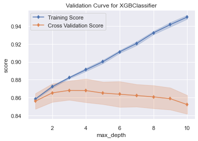
    


Conclusion: The cross-validation score is what I want to maximize here. It looks like a max tree depth of 2 or 3 would be optimal, altohugh it doesn't really change the overall model accuracy. Max depth was tuned to 4 by the xgboost I used, but that still looks good based on the curve.

## Learning Curve
This can show a number of things. First, it can indicate whether more data should be collected, and it can be informative as to whether the model is overfitting or underfitting to the data.


```python
# Set plot layout.
fig, ax = plt.subplots(figsize = (6, 4))

# Learning curve specificaions.
lc3_viz = LearningCurve(xgboost.XGBClassifier(n_estimators = 100), cv = 10)

# Run learning curve.
lc3_viz.fit(X_test, y_test)

# Plot learning curve.
lc3_viz.poof();

# Save learning curve plot.
fig.savefig('images/LearningCurve.png', dpi = 300)
```


    
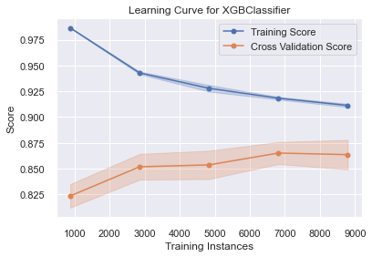
    


Conclusion: First, it looks like collecting more data would lead to very mediocre improvements to the cross-validation score: it has essentially plateued. There is very little variability in the training score (the "cloud" around the line) so I know the model is not biased (i.e. no underfitting). There is some variability in the cross-validation score, indicating that the model may have some variance (i.e. some overfitting). Regularisation can sometimes be applied to reduce overfitting, but here I think this model looks decent.

# Metrics And Classification Evaluation

## Confusion Matrix
The confusion matrix will give me a lot of important information related to accuacy, recall, and precision.


```python
# Set plot layout.
fig, ax = plt.subplots(figsize = (6, 6))

# Confusion matrix specificaions.
cm_viz = ConfusionMatrix(xgb_class, classes = ['>50K', '<=50K'], label_encoder = {0: '>50K', 1: '<=50K'})

# Get confusion matrix score.
cm_viz.score(X_test, y_test)

# Plot confusion matrix.
cm_viz.poof();

# Save confusion matrix plot.
fig.savefig('images/ConfusionMatrix.png', dpi = 300)
```


    
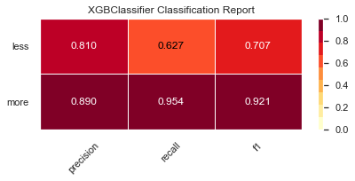
    


Conclusion: Since I defined <=50K as being the positive class, I will consider the bottom right corner to be true positives, and the top left corner to be true negatives.


```python
# Defining true positives (tp), false positives (fp), false negatives (fn), and true negatives (tn).
tp = 7028
fp = 854
fn = 403
tn = 1484
```

## Accuracy
First, Let's see, overall, how well the classifier correctly predicts positive and negative classes.

### Manual Calculation


```python
# Manually calculate accuracy.
(tp + tn)/(tp + fp + fn + tn)
```


    0.8713276691575391


### ScikitLearn Calculation


```python
# Make predictions on test set.
y_predict = xgb_class.predict(X_test)

# Compute test set accuracy.
accuracy_score(y_test, y_predict)
```


    0.8713276691575391


Conclusion: Our model can accurately identify ~88% of people above and below 50K. But, classes were unbalanced (i.e. their are far more people making <=50K). Thus, one could acheive relatively high overall accuracy by just predicting every sample belongs to the class <=50K. In this situation, it's better to look at how well the xgboost algorithm predicts specific classes on a few metrics.

## Recall/Sensitivity (True Positive Rate)
Recall shows how many positive cases the classifier actually identified as positive.

### Manual Calculation


```python
# Manually calculate recall/sensitivity.
tp/(tp + fn)
```


    0.9457677297806486


### ScikitLearn Calculation


```python
# Make predictions on test set.
y_predict = xgb_class.predict(X_test)

# Compute test set recall/sensitivity.
recall_score(y_test, y_predict)
```


    0.9457677297806486


Conclusion: 95% of people making <=50K were correctly identified.

## Precision
Precision shows how many positive predictions were actually correct.

### Manual Calculation


```python
# Manually calculate precision.
tp/(tp + fp)
```


    0.8916518650088809


### ScikitLearn Calculation


```python
# Make predictions on test set.
y_predict = xgb_class.predict(X_test)

# Compute test set precision.
precision_score(y_test, y_predict)
```


    0.8916518650088809


Conclusion: Of all the times our classifier predicted someone made <=50K, it was correct 89% of the time.

## F1 (Harmonic Mean)
The F1 score is a combination of recall and precision scores. Importantly, one shouldn't use the f1 score to assess the model's accuracy. Rather, the f1 score can be useful for comparing different classifier  models.

### Manual Calculation


```python
# Manually calculate f1 score.
(2 * (tp / (tp + fp)) * (tp / (tp + fn))) / ((tp / (tp + fp)) + (tp / (tp + fn)))
```


    0.9179128844772415


### ScikitLearn Calculation


```python
# Make predictions on test set.
y_predict = xgb_class.predict(X_test)

# Compute test set f1 score.
f1_score(y_test, y_predict)
```


    0.9179128844772415


Conclusion: The harmonic mean is 92%, and is a weighted average between precision and recall.

## Classification Report


```python
# Set plot layout.
fig, ax = plt.subplots(figsize=(6, 3))

# Classification report specificaions.
cm_viz = ClassificationReport(xgb_class, classes = ['>50K', '<=50K'], label_encoder = {0: '>50K', 1: '<=50K'}, support = True)

# Get classification report score.
cm_viz.score(X_test, y_test)

# Plot classification report.
cm_viz.poof();

# Save classification report plot.
fig.savefig('images/ClassificationReport.png', dpi = 300)
```


    
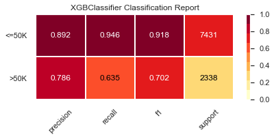
    


Conclusion: 

For the positive class, I have already interpreted the results.

For the negative class, the clssifier seems much less competant overall. First, of all negative predictions it made, it was right 79% of the time (Precision). Second, of all the negative cases the classifier encountered, only 64% were classified correctly (Recall).

If I only cared about identifying people making <=50K, this might be a good classifier. However, because I am tasked with identifying people making <=50K, this classifier is doing what I want. Later I will demonstrate how to manually change the decision threshold to affect these values.

## ROC
An ROC illustrates how the classifier performs by tracking the true positive rate (recall/sensitivity) as the false positive rate (inverted specificity) changes. The plot should bulge to the left, indicating a good balance between true and false positives.


```python
# Set plot layout.
fig, ax = plt.subplots(figsize = (6, 6))

# Setup ROC with xgboost model.
roc_viz = ROCAUC(xgb_class)

# Fit ROC.
roc_viz.fit(X_train, y_train) 

# Get ROC scores.
roc_viz.score(X_test, y_test)

# Plot ROC.
roc_viz.poof();

# Save ROC plot.
fig.savefig('images/ROC.png', dpi = 300)
```


    
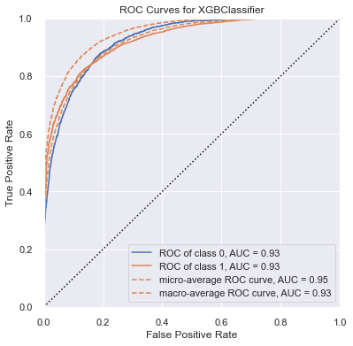
    


Conclusion: The plot bulges left, so I have a good classifier. If I were unhappy with the balance betwen true and false positives, the decision threshold could be tweaked to change this curve.

## Precision-Recall Curve
The ROC curve may be overly optimistic for imbalanced classes, something this dataset suffers from. Another option for evaluating classifiers is using a precision-recall curve. Classification is a balancing act of finding everything you need (recall) while limiting the junk results (precision). This is typically a trade-off. As recall goes up, precision usually goes down and vice versa.


```python
# Set plot layout.
fig, ax = plt.subplots(figsize = (6, 4))

# Setup precision-recall curve with xgboost model.
viz = PrecisionRecallCurve(xgb_class)

# Fit precision-recall curve.
viz.fit(X_train, y_train)

# Get precision-recall curve scores.
viz.score(X_test, y_test)

# plot precision-recall curve.
viz.poof();

# Save precision-recall curve plot.
fig.savefig('images/PrecisionRecallCurve.png', dpi = 300)
```


    
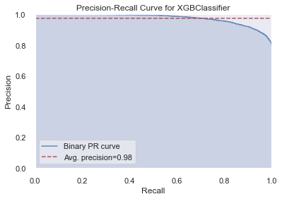
    


Conclusion: This can give me some indication about how precision and recall change as a function of one another. If I wanted to improve recall, I would need to lower precision (and vis versa).

## Cumulative Gains Plot
This plot visualising the gain in true positives (sensitivity) for a given fraction of the total population targeted by the classifier. As I sample more of the dataset, I can see how it affects the true positive rate. If, for instance, I wanted to find 80% of the population that made <=50K, I could trace the plot below from 0.8 on the y-axis to the blue line, and the corresponding x-axis would tell me the fraction of the populaton I might need to sample to find 80%.


```python
# Set plot layout.
fig, ax = plt.subplots(figsize = (6, 6))

# Setup cumulative gains plot with xgboost model.
y_probas = xgb_class.predict_proba(X_test)

# plot cumulative gains plot.
scikitplot.metrics.plot_cumulative_gain(y_test, y_probas, ax = ax);

# Save cumulative gains plot.
fig.savefig('images/CumulativeGains.png', dpi = 300, bbox_inches = 'tight')
```


    
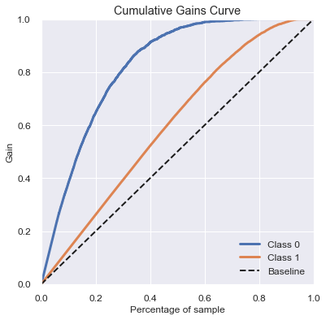
    


Conclusion: If there is a cost to contacting people, this may give an idea of how much the cost is. For instance, if I sampled 40% of the dataset, I would already have over 90% of people making <=50K. If this was all I cared about, it may be useful to know that I won't need to contact 10,000 people in the future. However, at 40% I also have less than 50% of people making >50K. If I wanted to find more than 90% of them, I would potentially need to contact 10,000+ people.

## Lift Curve
Lift curve shows the ratio between the proportion of true positive instances in the selection and the proportion of people sampled.


```python
# Set plot layout.
fig, ax = plt.subplots(figsize = (6, 6))

# Setup lift curve with xgboost model.
y_probas = xgb_class.predict_proba(X_test)

# plot lift curve.
scikitplot.metrics.plot_lift_curve(y_test, y_probas, ax = ax);

# Save lift curve plot.
fig.savefig('images/Lift.png', dpi = 300, bbox_inches = 'tight')
```


    
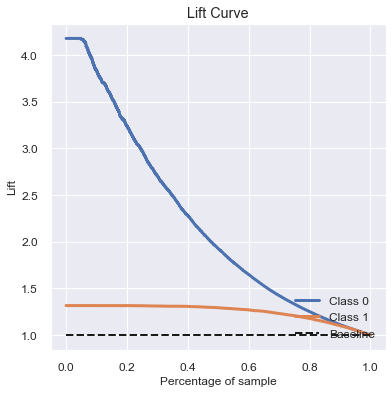
    


Conclusion: The dashed line (baseline) shows how a random classifier would perform. I can see that, if I only sampled 20% of the dataset, I would already find nearly 3.5 times more people making <=50K than a random classifier would find. I see much less improvement regarding the classification of people making >50K, but also no real decrease to lift asmore peaople are sampled.

## Class Prediction Error
This plot will display the same information as the confusion matrix, but also gives a better sense of class balance (which is unbalanced in this dataset).


```python
# Set plot layout.
fig, ax = plt.subplots(figsize = (10, 8))

# Add class labels.
cpe_viz = ClassPredictionError(xgb_class, classes = ['>50K', '<=50K'])

# Fit class prediction error plot.
cpe_viz.score(X_test, y_test)

# Plot class prediction error plot.
cpe_viz.poof();

# Save class prediction error plot.
fig.savefig('images/ClassPredictionError.png', dpi = 300)
```


    
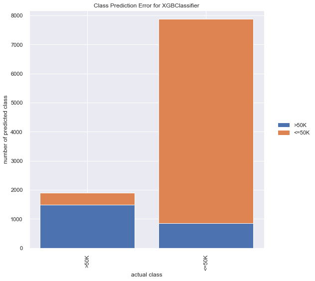
    


Conclusion: The top right bar shows the the true positives, the bottom right shows the false negatives, the top left shows the flase positives, and the bottom left shows the true negatives. THese have already been discussed previously.

## Discrimination Threshold
Here I will look at the tradeoff between precision and recall, and figure out how to shift the classifier's decision boundary should I decide to improve one metric over the other. 

If I wanted to identify every person who makes <=50K, I would enhance recall over precision, as it would decrease the false negative rate. Subsequently, however, the false positive rate would go up too (because I would be biasing the classifier towards making positive predictions).

Conversely, if I only want to identify people who make <=50K if they actually make <=50K, I would instead enhance precision over recall in order to decrease the false positive rate. However, the false negative rate would also go up (because the classifier would now be biased towards making negative predictions).


```python
# Set plot layout.
fig, ax = plt.subplots(figsize = (9, 9));

# Setup discrimination threshold plot with xgboost model.
dt_viz = DiscriminationThreshold(xgb_class);

# Fit discrimination threshold plot.
dt_viz.fit(X_test, y_test);

# Plot discrimination threshold plot.
dt_viz.poof();

# Save discrimination threshold plot.
fig.savefig('images/DiscriminationThreshold.png', dpi = 300)
```


    
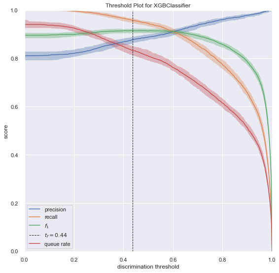
    


Conclusion:In terms of predicting people making <=50K, the model has good overall precision and recall. However, I can tune the model such that one of these metrics is favored over the other. Below, I will do just that. 

# Tuning Decision Threshold
Depending on the goal of the project, I may want to change the decision threshold to suite the objective better. First, I will look at the metrics again.


```python
# Get predictions for confusion matrix.
predictions = xgb_class.predict(X_test)

# Print: precision, recall, accuracy, and f1 score.
print('Precision: %.2f' % precision_score( y_test, predictions))
print('Recall: %.2f' % recall_score( y_test, predictions))
print('Accuracy: %.2f' % accuracy_score( y_test, predictions))
print('F1: %.2f' % f1_score( y_test, predictions))

# Fit model for confusion matrix.
cm = confusion_matrix( y_test , predictions)

# Set plot layout.
plt.figure(figsize = (3, 3))

# Set confusion matrix specifications.
sns.heatmap(cm, annot = True, annot_kws = {'size': 25}, fmt = 'd', cmap = 'viridis', cbar = False)

# Plot confusion matrix.
plt.show()
```

    Precision: 0.89
    Recall: 0.95
    Accuracy: 0.87
    F1: 0.92
    


    
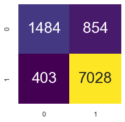
    


## Identify Everyone Making <=50K
If the goal is to simply maximize the identification people making <=50K, recall should be increased. 


```python
# Lower decision threshold to 0.25.
discrimination_threshold = 0.25

# Get predictions for confusion matrix.
predictions = xgb_class.predict_proba(X_test)

# Adjust confusion matrix to account for new decision threshold.
predictions = (predictions[::,1] > discrimination_threshold ) * 1

# Print: precision, recall, accuracy, and f1 score.
print('The precision score is: %.2f' % precision_score( y_test, predictions))
print('The recall score is: %.2f' % recall_score( y_test, predictions), "\n")
print('Accuracy score is: %.2f' % accuracy_score( y_test, predictions))
print('The F1 score is: %.2f' % f1_score( y_test, predictions))

# Fit model for confusion matrix.
cm = confusion_matrix( y_test , predictions)

# Set plot layout.
plt.figure(figsize = (3, 3))

# Set confusion matrix specifications.
sns.heatmap(cm, annot = True, annot_kws = {'size': 25}, fmt = 'd', cmap = 'viridis', cbar = False)

# Plot confusion matrix.
plt.show()
```

    The precision score is: 0.83
    The recall score is: 0.99 
    
    Accuracy score is: 0.84
    The F1 score is: 0.90
    


    
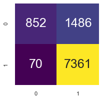
    


Conclusion: The confusion matrix shows that almost everyone who makes <=50K is correctly identified. However, many more  people who make >50K are now classified as making <=50K. If the goal was to find everyone who make <=50K, this might be a better model than the one currently being  used.

## Correctly Identify Everyone Making <=50K
If I don't want incorrectly identify people making <=50K, precision should be increased.


```python
# Raise decision threshold to 0.95.
discrimination_threshold = 0.95

# Get predictions for confusion matrix.
predictions = xgb_class.predict_proba(X_test)

# Adjust confusion matrix to account for new decision threshold.
predictions = (predictions[::, 1] > discrimination_threshold ) * 1

# Print: precision, recall, accuracy, and f1 score.
print('The precision score is: %.2f' % precision_score( y_test, predictions))
print('The recall score is: %.2f' % recall_score( y_test, predictions))
print('Accuracy score is: %.2f' % accuracy_score( y_test, predictions))
print('The F1 score is: %.2f' % f1_score( y_test, predictions))

# Fit model for confusion matrix.
cm = confusion_matrix( y_test , predictions)

# Set plot layout.
plt.figure(figsize = (3, 3))

# Set confusion matrix specifications.
sns.heatmap(cm, annot = True, annot_kws = {'size': 25}, fmt = 'd', cmap = 'viridis', cbar = False)

# Plot confusion matrix.
plt.show()
```

    The precision score is: 0.99
    The recall score is: 0.54
    Accuracy score is: 0.65
    The F1 score is: 0.70
    


    
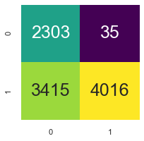
    


Conclusion: Virtually every person predicted to make <=50K actually made <=50K. However, there are now many more false negatives. But, if I want to make sure every person I identify as making <=50K is actually in that class, this might be a better model.

# Model Exploration
I'm not going to do much model exploration, but it's always a good idea to be aware of some tools that might help investigate model outliers, or interesting groupings.

## Shapley Additive Explanations (SHAP)
A SHAP plot shows how features each contribute to pushing a model output from the base value (the average model output over the training dataset I passed) to the model output. Features pushing the prediction higher are shown in red, while those pushing the prediction lower are in blue. As an example, I will look at participant 4 (who was predicted to make <=50K).


```python
# Explain the xgboost model's predictions using SHAP.
explainer = shap.Explainer(xgb_class)

# Fit SHAP model.
shap_values = explainer(X_test)

# visualize a single prediction's prediction's explanation
shap.plots.waterfall(shap_values[3])
```


    
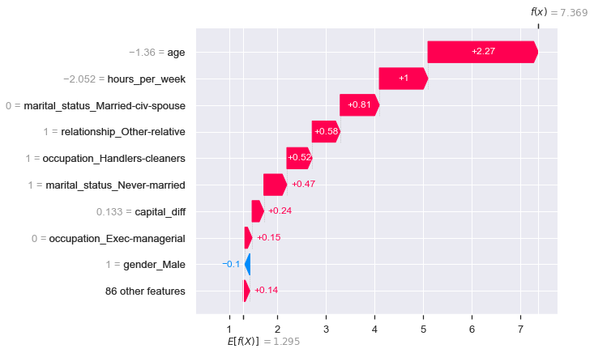
    


Conclusion: Factors such as the person being young, working less than 40 hours per week, and having a low status job all contribute greatly to the person being predicted to make <=50K. Interestingly, because the individual is male, this was the only contributing factor to them being pushed towards a prediction of >50K.

## Force Plot
The above graph can also be more concisly displayed using a force plot, which plots the same information as above, but takes less visual space.

### <=50K Force Plot


```python
# Set javascript display.
#shap.initjs()

# Assign force plot to xgboost model.
s = shap.TreeExplainer(xgb_class)

# Fit force plot.
shap_vals = s.shap_values(X_test)

# Plot force plot.
shap.force_plot(s.expected_value, shap_vals[3, :], feature_names = X_test.columns)

```


<div id='iC14AN35RKC75UEPXC0IW'>
<div style='color: #900; text-align: center;'>
  <b>Visualization omitted, Javascript library not loaded!</b><br>
  Have you run `initjs()` in this notebook? If this notebook was from another
  user you must also trust this notebook (File -> Trust notebook). If you are viewing
  this notebook on github the Javascript has been stripped for security. If you are using
  JupyterLab this error is because a JupyterLab extension has not yet been written.
</div></div>
 <script>
   if (window.SHAP) SHAP.ReactDom.render(
    SHAP.React.createElement(SHAP.AdditiveForceVisualizer, {"outNames": ["f(x)"], "baseValue": 1.2948299646377563, "outValue": 7.369071006774902, "link": "identity", "featureNames": ["age", "hours_per_week", "capital_diff", "workclass_Local-gov", "workclass_Never-worked", "workclass_Private", "workclass_Self-emp-inc", "workclass_Self-emp-not-inc", "workclass_State-gov", "workclass_Without-pay", "education_11th", "education_12th", "education_1st-4th", "education_5th-6th", "education_7th-8th", "education_9th", "education_Assoc-acdm", "education_Assoc-voc", "education_Bachelors", "education_Doctorate", "education_HS-grad", "education_Masters", "education_Preschool", "education_Prof-school", "education_Some-college", "marital_status_Married-AF-spouse", "marital_status_Married-civ-spouse", "marital_status_Married-spouse-absent", "marital_status_Never-married", "marital_status_Separated", "marital_status_Widowed", "occupation_Armed-Forces", "occupation_Craft-repair", "occupation_Exec-managerial", "occupation_Farming-fishing", "occupation_Handlers-cleaners", "occupation_Machine-op-inspct", "occupation_Other-service", "occupation_Priv-house-serv", "occupation_Prof-speciality", "occupation_Prof-specialty", "occupation_Protective-serv", "occupation_Sales", "occupation_Tech-support", "occupation_Transport-moving", "relationship_Not-in-family", "relationship_Other-relative", "relationship_Own-child", "relationship_Unmarried", "relationship_Wife", "race_Asian-Pac-Islander", "race_Black", "race_Other", "race_White", "gender_Male", "native_country_Canada", "native_country_China", "native_country_Columbia", "native_country_Cuba", "native_country_Dominican-Republic", "native_country_Ecuador", "native_country_El-Salvador", "native_country_England", "native_country_France", "native_country_Germany", "native_country_Greece", "native_country_Guatemala", "native_country_Haiti", "native_country_Holand-Netherlands", "native_country_Honduras", "native_country_Hong", "native_country_Hungary", "native_country_India", "native_country_Iran", "native_country_Ireland", "native_country_Italy", "native_country_Jamaica", "native_country_Japan", "native_country_Laos", "native_country_Mexico", "native_country_Nicaragua", "native_country_Outlying-US(Guam-USVI-etc)", "native_country_Peru", "native_country_Philippines", "native_country_Poland", "native_country_Portugal", "native_country_Puerto-Rico", "native_country_Scotland", "native_country_South", "native_country_Taiwan", "native_country_Thailand", "native_country_Trinadad&Tobago", "native_country_United-States", "native_country_Vietnam", "native_country_Yugoslavia"], "features": {"0": {"effect": 2.272460460662842, "value": ""}, "1": {"effect": 1.000981092453003, "value": ""}, "2": {"effect": 0.242911234498024, "value": ""}, "3": {"effect": -8.006691496120766e-05, "value": ""}, "5": {"effect": 0.011362389661371708, "value": ""}, "6": {"effect": 0.010384461842477322, "value": ""}, "7": {"effect": 0.015137304551899433, "value": ""}, "8": {"effect": -0.011136351153254509, "value": ""}, "10": {"effect": -0.01004623994231224, "value": ""}, "11": {"effect": 0.0011318831238895655, "value": ""}, "12": {"effect": -0.002795739099383354, "value": ""}, "13": {"effect": -0.007270321249961853, "value": ""}, "14": {"effect": -0.009872627444565296, "value": ""}, "15": {"effect": -0.005477596540004015, "value": ""}, "16": {"effect": 0.012725196778774261, "value": ""}, "17": {"effect": 0.0041872295551002026, "value": ""}, "18": {"effect": 0.06834699958562851, "value": ""}, "19": {"effect": 0.018027381971478462, "value": ""}, "20": {"effect": -0.07444911450147629, "value": ""}, "21": {"effect": 0.054238252341747284, "value": ""}, "22": {"effect": -0.0006209510611370206, "value": ""}, "23": {"effect": 0.025541109964251518, "value": ""}, "24": {"effect": 0.022836120799183846, "value": ""}, "26": {"effect": 0.8052214980125427, "value": ""}, "27": {"effect": -0.00010148902947548777, "value": ""}, "28": {"effect": 0.47310319542884827, "value": ""}, "29": {"effect": -0.003077602479606867, "value": ""}, "30": {"effect": 0.002005999209359288, "value": ""}, "32": {"effect": -0.00029341340996325016, "value": ""}, "33": {"effect": 0.14836090803146362, "value": ""}, "34": {"effect": -0.011837933212518692, "value": ""}, "35": {"effect": 0.5211024284362793, "value": ""}, "36": {"effect": -0.01307558175176382, "value": ""}, "37": {"effect": -0.03777359053492546, "value": ""}, "38": {"effect": -0.0006554679130204022, "value": ""}, "39": {"effect": -0.006470437161624432, "value": ""}, "40": {"effect": 0.10265155881643295, "value": ""}, "41": {"effect": 0.010425006039440632, "value": ""}, "42": {"effect": 0.02221417799592018, "value": ""}, "43": {"effect": 0.016841361299157143, "value": ""}, "44": {"effect": -0.001253533293493092, "value": ""}, "45": {"effect": -0.019635699689388275, "value": ""}, "46": {"effect": 0.5771146416664124, "value": ""}, "47": {"effect": -0.04689821973443031, "value": ""}, "48": {"effect": -0.0284947007894516, "value": ""}, "49": {"effect": 0.06957260519266129, "value": ""}, "50": {"effect": 0.0020995866507291794, "value": ""}, "51": {"effect": -0.005213580094277859, "value": ""}, "53": {"effect": -0.02443348802626133, "value": ""}, "54": {"effect": -0.10270685702562332, "value": ""}, "55": {"effect": 0.0009879498975351453, "value": ""}, "56": {"effect": -0.00019955389143433422, "value": ""}, "57": {"effect": -0.0002730363921727985, "value": ""}, "59": {"effect": -0.00035769707756116986, "value": ""}, "63": {"effect": 0.00015686295228078961, "value": ""}, "66": {"effect": -6.082322579459287e-05, "value": ""}, "72": {"effect": 0.0007789076771587133, "value": ""}, "74": {"effect": 0.0006803844589740038, "value": ""}, "79": {"effect": -0.005665365140885115, "value": ""}, "82": {"effect": -0.00025701598497107625, "value": ""}, "83": {"effect": 0.000847990158945322, "value": ""}, "86": {"effect": -0.0006393006769940257, "value": ""}, "88": {"effect": -0.0004177664523012936, "value": ""}, "92": {"effect": -0.008654101751744747, "value": ""}}, "plot_cmap": "RdBu", "labelMargin": 20}),
    document.getElementById('iC14AN35RKC75UEPXC0IW')
  );
</script>


```python
# Print predicted probability for [>50K, <=50K].
print(xgb_class.predict_proba(X_test.iloc[[3]]))
```

    [[6.300807e-04 9.993699e-01]]
    

This person was classified as making <=50K. Again, I can see that their age, hours worked per week, and their job, all contributed the most to them being predicted as making <=50K. Additionally, the predicted probability of them making <=50K is 99.9%.

### >50K Force Plot


```python
# Set javascript display.
#shap.initjs()

# Plot force plot.
shap.force_plot(s.expected_value, shap_vals[7, :], feature_names = X_test.columns)
```


<div id='iY0SQ3LTXI3P2YCAPIMT8'>
<div style='color: #900; text-align: center;'>
  <b>Visualization omitted, Javascript library not loaded!</b><br>
  Have you run `initjs()` in this notebook? If this notebook was from another
  user you must also trust this notebook (File -> Trust notebook). If you are viewing
  this notebook on github the Javascript has been stripped for security. If you are using
  JupyterLab this error is because a JupyterLab extension has not yet been written.
</div></div>
 <script>
   if (window.SHAP) SHAP.ReactDom.render(
    SHAP.React.createElement(SHAP.AdditiveForceVisualizer, {"outNames": ["f(x)"], "baseValue": 1.2948299646377563, "outValue": -5.637387275695801, "link": "identity", "featureNames": ["age", "hours_per_week", "capital_diff", "workclass_Local-gov", "workclass_Never-worked", "workclass_Private", "workclass_Self-emp-inc", "workclass_Self-emp-not-inc", "workclass_State-gov", "workclass_Without-pay", "education_11th", "education_12th", "education_1st-4th", "education_5th-6th", "education_7th-8th", "education_9th", "education_Assoc-acdm", "education_Assoc-voc", "education_Bachelors", "education_Doctorate", "education_HS-grad", "education_Masters", "education_Preschool", "education_Prof-school", "education_Some-college", "marital_status_Married-AF-spouse", "marital_status_Married-civ-spouse", "marital_status_Married-spouse-absent", "marital_status_Never-married", "marital_status_Separated", "marital_status_Widowed", "occupation_Armed-Forces", "occupation_Craft-repair", "occupation_Exec-managerial", "occupation_Farming-fishing", "occupation_Handlers-cleaners", "occupation_Machine-op-inspct", "occupation_Other-service", "occupation_Priv-house-serv", "occupation_Prof-speciality", "occupation_Prof-specialty", "occupation_Protective-serv", "occupation_Sales", "occupation_Tech-support", "occupation_Transport-moving", "relationship_Not-in-family", "relationship_Other-relative", "relationship_Own-child", "relationship_Unmarried", "relationship_Wife", "race_Asian-Pac-Islander", "race_Black", "race_Other", "race_White", "gender_Male", "native_country_Canada", "native_country_China", "native_country_Columbia", "native_country_Cuba", "native_country_Dominican-Republic", "native_country_Ecuador", "native_country_El-Salvador", "native_country_England", "native_country_France", "native_country_Germany", "native_country_Greece", "native_country_Guatemala", "native_country_Haiti", "native_country_Holand-Netherlands", "native_country_Honduras", "native_country_Hong", "native_country_Hungary", "native_country_India", "native_country_Iran", "native_country_Ireland", "native_country_Italy", "native_country_Jamaica", "native_country_Japan", "native_country_Laos", "native_country_Mexico", "native_country_Nicaragua", "native_country_Outlying-US(Guam-USVI-etc)", "native_country_Peru", "native_country_Philippines", "native_country_Poland", "native_country_Portugal", "native_country_Puerto-Rico", "native_country_Scotland", "native_country_South", "native_country_Taiwan", "native_country_Thailand", "native_country_Trinadad&Tobago", "native_country_United-States", "native_country_Vietnam", "native_country_Yugoslavia"], "features": {"0": {"effect": -0.1516767144203186, "value": ""}, "1": {"effect": -0.34876275062561035, "value": ""}, "2": {"effect": -5.030587673187256, "value": ""}, "3": {"effect": -8.60509680933319e-05, "value": ""}, "5": {"effect": -0.010628673247992992, "value": ""}, "6": {"effect": 0.016017602756619453, "value": ""}, "7": {"effect": -0.046532101929187775, "value": ""}, "8": {"effect": -0.011674487963318825, "value": ""}, "10": {"effect": -0.01973268948495388, "value": ""}, "11": {"effect": -0.002946664812043309, "value": ""}, "12": {"effect": -0.002827043179422617, "value": ""}, "13": {"effect": -0.007806092966347933, "value": ""}, "14": {"effect": -0.018139353021979332, "value": ""}, "15": {"effect": -0.012317121960222721, "value": ""}, "16": {"effect": 0.00797185767441988, "value": ""}, "17": {"effect": 0.004406524822115898, "value": ""}, "18": {"effect": -0.4800519645214081, "value": ""}, "19": {"effect": 0.01678149588406086, "value": ""}, "20": {"effect": -0.08860518038272858, "value": ""}, "21": {"effect": 0.036384761333465576, "value": ""}, "22": {"effect": -0.0006330748437903821, "value": ""}, "23": {"effect": 0.027927406132221222, "value": ""}, "24": {"effect": -0.002484417986124754, "value": ""}, "26": {"effect": -0.2780696749687195, "value": ""}, "27": {"effect": -0.002780122682452202, "value": ""}, "28": {"effect": -0.15956081449985504, "value": ""}, "29": {"effect": 0.00034617347409948707, "value": ""}, "30": {"effect": 0.0018647069809958339, "value": ""}, "32": {"effect": -0.0007693544030189514, "value": ""}, "33": {"effect": 0.10816886276006699, "value": ""}, "34": {"effect": -0.03313439339399338, "value": ""}, "35": {"effect": -0.017164146527647972, "value": ""}, "36": {"effect": -0.018576735630631447, "value": ""}, "37": {"effect": -0.048215679824352264, "value": ""}, "38": {"effect": -0.0006443852325901389, "value": ""}, "39": {"effect": -0.007204627152532339, "value": ""}, "40": {"effect": 0.07471416890621185, "value": ""}, "41": {"effect": 0.00940017867833376, "value": ""}, "42": {"effect": -0.22969800233840942, "value": ""}, "43": {"effect": 0.014478460885584354, "value": ""}, "44": {"effect": -0.007499453146010637, "value": ""}, "45": {"effect": -0.03409415856003761, "value": ""}, "46": {"effect": -0.008943413384258747, "value": ""}, "47": {"effect": -0.025904903188347816, "value": ""}, "48": {"effect": -0.039960458874702454, "value": ""}, "49": {"effect": 0.03210126608610153, "value": ""}, "50": {"effect": 0.0013728791382163763, "value": ""}, "51": {"effect": -0.005353688262403011, "value": ""}, "53": {"effect": -0.011432700790464878, "value": ""}, "54": {"effect": -0.1082707867026329, "value": ""}, "55": {"effect": 0.001315911067649722, "value": ""}, "56": {"effect": -0.0001519739889772609, "value": ""}, "57": {"effect": -0.0003923263866454363, "value": ""}, "59": {"effect": -0.0004217843525111675, "value": ""}, "63": {"effect": 0.00013859123282600194, "value": ""}, "66": {"effect": -0.00012235442409291863, "value": ""}, "72": {"effect": 0.00020719468011520803, "value": ""}, "74": {"effect": 0.0007595334318466485, "value": ""}, "79": {"effect": -0.009074030444025993, "value": ""}, "82": {"effect": -0.00025032099802047014, "value": ""}, "83": {"effect": 0.0004078976926393807, "value": ""}, "86": {"effect": -0.0010192027548328042, "value": ""}, "88": {"effect": -0.0004177664523012936, "value": ""}, "92": {"effect": -0.0023631907533854246, "value": ""}}, "plot_cmap": "RdBu", "labelMargin": 20}),
    document.getElementById('iY0SQ3LTXI3P2YCAPIMT8')
  );
</script>


```python
# Plot class prediction interval for force plot observation.
xgb_class.predict_proba(X_test.iloc[[7]])
```


    array([[0.9964505 , 0.00354952]], dtype=float32)


This person was predicted to make >50K. I can see that their capital_diff score, education level, and hours worked per week, all contributed the most at pushing them towards a high probability of making >50K.


```python
# visualize a single prediction's prediction's explanation
shap.plots.waterfall(shap_values[7])
```


    
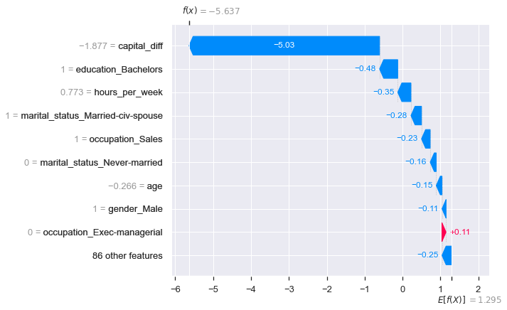
    


Indeed, this person has a large negative captial_diff score (meaning they made money), and they work almost 1 standard deviation above the average.

Conclusion: Force plots a great way to determine why someone might be an outlier, and if their are interesting followups based on group differences. For example, is there something about people with only a preschool education that uniquely contributes to <=50K being a common prediction that does not include education level? These won't be followed up on here, but they certainly could be interesting avenues to explore.

## Bee Swarm Plot
To get an overview of which features are most important for the model's predictions, I can plot the SHAP values of every feature for every sample. The plot below sorts features by the sum of SHAP value magnitudes over all samples, and uses SHAP values to show the distribution of the impacts each feature has on the model output.


```python
# summarize the effects of all the features.
shap.plots.beeswarm(shap_values)
```


    
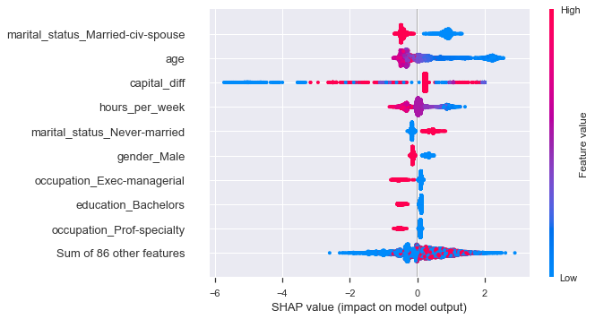
    


Conclusion: There are some very clear and interesting (albeit obvious) patterns. For instance, almost everyone who is married is predicted to make >50K, and almost everyone who is not married is predicted to make <=50K. For capital_diff, there is no clear amount that helps predict loses, and only when people see capital gains exceeding 4 standard deviations from the mean are they guarenteed to be classified as making >50K. There is also a clear divide amongst those working more or less than 40 hours per week, with those working more making more, and those working less making less. Finally, having a bachelors degree seems to almost guarantee the person will be classified as making >50K. 

## SHAP Bar Plot
I can also just take the mean absolute value of the SHAP values for each feature to get a standard bar plot.


```python
# Summarise overall effects for most important features.
shap.plots.bar(shap_values)
```


    
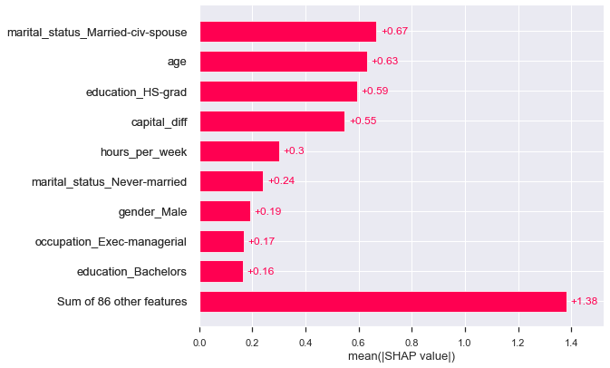
    


Conclusion: Here I can see the most important features determining what class someone will be predicted to be in. If I wanted to send out some surveys that targeted people making <=50K, I might want to focus more strongly on those who are younger, unmarried, high school dropouts, and are female. If information like education was more easy to obtain, I could instead find people who did not graduate high school, or those who did but did not attend university.

## SHAP Dot Plot
To understand how a single feature affects the output of the model I can plot the SHAP value of that feature vs. the value of the feature for all the examples in a dataset. Vertical dispersion at a single value of a predictor could represent interaction effects with other features. To help reveal these interactions I can color by another feature. If I pass the whole explanation tensor to the color argument the scatter plot will pick the best feature to color by. I will pick a few of the more interesting ones I have found below.

### SHAP Dot Plot: gender_Male


```python
#Plot 2 predictors against each other.
shap.plots.scatter(shap_values[:, 'gender_Male'], color = shap_values)
```


    
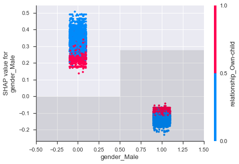
    


Here, it is clear that males are more likely to make >50K than females. however, if either sex has a child, a very strong interaction is observed. Females are more likely to make >50K if they have a child, but males are more likely to make <=50K if they have a child. Thus, having a child affects earnings very differently for either sex. One possibility is child support payments being more likely to be made if you are male, and more likely to be recieved if you are female. If I wanted to target people by sex, it might be useful to contact females without children, or males with children.

### SHAP Dot Plot: gender_Male


```python
#Plot 2 predictors against each other.
shap.plots.scatter(shap_values[:, 'hours_per_week'], color = shap_values)
```


    
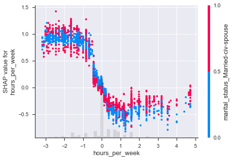
    


This one is a bit trickier to interpret, but I can try. First, there is a clear divide at 40 hours per week (o on the plot),where people working more than 40 hours making more, and people working less making less. However, if someone has a spouse, this causes an interaction. People working less than 40 hours who have a spouse are more likely to make >50K than those without a spouse, and people working more than 40 hours are less likely to make >50K if they have a spouse. THis second interaction holds no matter how many standard deviations someone is above 40 hours.

# Conclusion
Now that the model is built, many decisions can be made about precision, recall, etc. The model could then be used to determine which people in a databank are most likely to fall in the category of <=50K.
