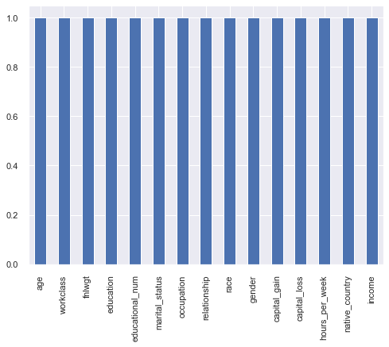
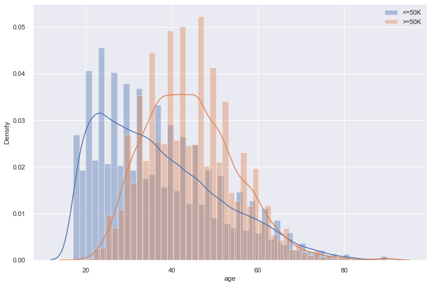

https://www.kaggle.com/alokevil/simple-eda-for-beginners

# Census Income Data Set

# Introduction
A census is the procedure of systematically acquiring and recording information about the members of a given population. The census is a special, wide-range activity, which takes place once a decade in the entire country. The purpose is to gather information about the general population, in order to present a full and reliable picture of the population in the country - its housing conditions and demographic, social and economic characteristics. The information collected includes data on age, gender, country of origin, marital status, housing conditions, marriage, education, employment, etc.

### Data description
This data was extracted from the 1994 Census bureau database by Ronny Kohavi and Barry Becker (Data Mining and Visualization, Silicon Graphics). The prediction task is to determine whether a person makes over $50K a year.

### Categorical Attributes

- *workclass*: Individual work category
>**levels**: Private, Self-emp-not-inc, Self-emp-inc, Federal-gov, Local-gov, State-gov, Without-pay, Never-worked.
- *education*: Individual's highest education degree
>**levels**: Bachelors, Some-college, 11th, HS-grad, Prof-school, Assoc-acdm, Assoc-voc, 9th, 7th-8th, 12th, Masters, 1st-4th, 10th, Doctorate, 5th-6th, Preschool.
- *marital-status*: Individual marital status
>**levels**: Married-civ-spouse, Divorced, Never-married, Separated, Widowed, Married-spouse-absent, Married-AF-spouse.
- *occupation*: Individual's occupation
>**levels**: Tech-support, Craft-repair, Other-service, Sales, Exec-managerial, Prof-specialty, Handlers-cleaners, Machine-op-inspct, Adm-clerical, Farming-fishing, Transport-moving, Priv-house-serv, Protective-serv, Armed-Forces.
- *relationship*: Individual's relation in a family
>**levels**: Wife, Own-child, Husband, Not-in-family, Other-relative, Unmarried.
- *race*: Race of Individual
>**levels**: White, Asian-Pac-Islander, Amer-Indian-Eskimo, Other, Black.
- *sex*: Individual's sex
>**levels**: Female, Male.
- *native-country*: Individual's native country
>**levels**: United-States, Cambodia, England, Puerto-Rico, Canada, Germany, Outlying-US(Guam-USVI-etc), India, Japan, Greece, South, China, Cuba, Iran, Honduras, Philippines, Italy, Poland, Jamaica, Vietnam, Mexico, Portugal, Ireland, France, Dominican-Republic, Laos, Ecuador, Taiwan, Haiti, Columbia, Hungary, Guatemala, Nicaragua, Scotland, Thailand, Yugoslavia, El-Salvador, Trinadad&Tobago, Peru, Hong, Holand-Netherlands.
<br>
<br>


### Continuous Attributes

- *age*: Age of an individual

- *fnlwgt*: final weight 

- *capital-gain* 

- *capital-loss* 

- *hours-per-week*: Individual's working hour per week

# Setup

### Load Libraries


```python
import matplotlib.pyplot as plt
import matplotlib
import seaborn as sns
import pandas as pd
import numpy as np
from sklearn import ensemble, preprocessing, tree, model_selection, metrics
from sklearn.preprocessing import StandardScaler
from sklearn.dummy import DummyClassifier
from sklearn.linear_model import LogisticRegression
from sklearn.tree import DecisionTreeClassifier
from sklearn.neighbors import KNeighborsClassifier
from sklearn.naive_bayes import GaussianNB
from sklearn.svm import SVC
from sklearn.ensemble import RandomForestClassifier
from sklearn.metrics import confusion_matrix, roc_auc_score
import xgboost
from mlxtend.classifier import StackingClassifier
from yellowbrick.classifier import ConfusionMatrix, ROCAUC
from yellowbrick.model_selection import LearningCurve
from sklearn.model_selection import StratifiedKFold
import missingno as msno
from pathlib import Path
import warnings
warnings.filterwarnings('ignore')
```

### Path Manager


```python
# Make project folder working directory.
%cd "C:\Users\STPI0560\Desktop\Python Projects\Adult Income"
```

    C:\Users\STPI0560\Desktop\Python Projects\Adult Income
    

### Load Functions


```python
# %load "bin\getDuplicateColumns.py"
def getDuplicateColumns(df):
    '''
    Get a list of duplicate columns.
    It will iterate over all the columns in dataframe and find the columns whose contents are duplicate.
    :param df: Dataframe object
    :return: List of columns whose contents are duplicates.
    '''
    duplicateColumnNames = set()
    # Iterate over all the columns in dataframe
    for x in range(df.shape[1]):
        # Select column at xth index.
        col = df.iloc[:, x]
        # Iterate over all the columns in DataFrame from (x+1)th index till end
        for y in range(x + 1, df.shape[1]):
            # Select column at yth index.
            otherCol = df.iloc[:, y]
            # Check if two columns at x 7 y index are equal
            if col.equals(otherCol):
                duplicateColumnNames.add(df.columns.values[y])
    return list(duplicateColumnNames)
```


```python
# %load "bin\plotPredictors.py"
def plotPredictors(data, predictor, width, height):
    '''
    Return a plot with frequency of categorical variables for an inputed predictor.
    data: Input dataframe in pandas format.
    predictor: Name of predictor column, in quotes ("").
    width: Width of plot.
    height: Height of plot.
    '''
    # Set plot size.
    plt.figure(figsize=(width,height))
    plt.title(predictor)
    ax = sns.countplot(x=predictor, data=data)
    for p in ax.patches:
        height = p.get_height()
        return plt.show()
```

### Load Data


```python
# Read data.
df = pd.read_csv('data\Adult.csv')
```

### Quick Look


```python
# Glimps dataframe.
df.head()
```


<div>
<style scoped>
    .dataframe tbody tr th:only-of-type {
        vertical-align: middle;
    }

    .dataframe tbody tr th {
        vertical-align: top;
    }

    .dataframe thead th {
        text-align: right;
    }
</style>
<table border="1" class="dataframe">
  <thead>
    <tr style="text-align: right;">
      <th></th>
      <th>age</th>
      <th>workclass</th>
      <th>fnlwgt</th>
      <th>education</th>
      <th>educational-num</th>
      <th>marital-status</th>
      <th>occupation</th>
      <th>relationship</th>
      <th>race</th>
      <th>gender</th>
      <th>capital-gain</th>
      <th>capital-loss</th>
      <th>hours-per-week</th>
      <th>native-country</th>
      <th>income</th>
    </tr>
  </thead>
  <tbody>
    <tr>
      <th>0</th>
      <td>25</td>
      <td>Private</td>
      <td>226802</td>
      <td>11th</td>
      <td>7</td>
      <td>Never-married</td>
      <td>Machine-op-inspct</td>
      <td>Own-child</td>
      <td>Black</td>
      <td>Male</td>
      <td>0</td>
      <td>0</td>
      <td>40</td>
      <td>United-States</td>
      <td>&lt;=50K</td>
    </tr>
    <tr>
      <th>1</th>
      <td>38</td>
      <td>Private</td>
      <td>89814</td>
      <td>HS-grad</td>
      <td>9</td>
      <td>Married-civ-spouse</td>
      <td>Farming-fishing</td>
      <td>Husband</td>
      <td>White</td>
      <td>Male</td>
      <td>0</td>
      <td>0</td>
      <td>50</td>
      <td>United-States</td>
      <td>&lt;=50K</td>
    </tr>
    <tr>
      <th>2</th>
      <td>28</td>
      <td>Local-gov</td>
      <td>336951</td>
      <td>Assoc-acdm</td>
      <td>12</td>
      <td>Married-civ-spouse</td>
      <td>Protective-serv</td>
      <td>Husband</td>
      <td>White</td>
      <td>Male</td>
      <td>0</td>
      <td>0</td>
      <td>40</td>
      <td>United-States</td>
      <td>&gt;50K</td>
    </tr>
    <tr>
      <th>3</th>
      <td>44</td>
      <td>Private</td>
      <td>160323</td>
      <td>Some-college</td>
      <td>10</td>
      <td>Married-civ-spouse</td>
      <td>Machine-op-inspct</td>
      <td>Husband</td>
      <td>Black</td>
      <td>Male</td>
      <td>7688</td>
      <td>0</td>
      <td>40</td>
      <td>United-States</td>
      <td>&gt;50K</td>
    </tr>
    <tr>
      <th>4</th>
      <td>18</td>
      <td>?</td>
      <td>103497</td>
      <td>Some-college</td>
      <td>10</td>
      <td>Never-married</td>
      <td>?</td>
      <td>Own-child</td>
      <td>White</td>
      <td>Female</td>
      <td>0</td>
      <td>0</td>
      <td>30</td>
      <td>United-States</td>
      <td>&lt;=50K</td>
    </tr>
  </tbody>
</table>
</div>


```python
# Check shape of data.
df.shape
```


    (48842, 15)


```python
# Check data type of each column.
print('Data type of each column of Dataframe :')
df.dtypes
```

    Data type of each column of Dataframe :
    


    age                 int64
    workclass          object
    fnlwgt              int64
    education          object
    educational-num     int64
    marital-status     object
    occupation         object
    relationship       object
    race               object
    gender             object
    capital-gain        int64
    capital-loss        int64
    hours-per-week      int64
    native-country     object
    income             object
    dtype: object


```python
df.describe(include='all')
```


<div>
<style scoped>
    .dataframe tbody tr th:only-of-type {
        vertical-align: middle;
    }

    .dataframe tbody tr th {
        vertical-align: top;
    }

    .dataframe thead th {
        text-align: right;
    }
</style>
<table border="1" class="dataframe">
  <thead>
    <tr style="text-align: right;">
      <th></th>
      <th>age</th>
      <th>workclass</th>
      <th>fnlwgt</th>
      <th>education</th>
      <th>educational-num</th>
      <th>marital-status</th>
      <th>occupation</th>
      <th>relationship</th>
      <th>race</th>
      <th>gender</th>
      <th>capital-gain</th>
      <th>capital-loss</th>
      <th>hours-per-week</th>
      <th>native-country</th>
      <th>income</th>
    </tr>
  </thead>
  <tbody>
    <tr>
      <th>count</th>
      <td>48842.000000</td>
      <td>48842</td>
      <td>4.884200e+04</td>
      <td>48842</td>
      <td>48842.000000</td>
      <td>48842</td>
      <td>48842</td>
      <td>48842</td>
      <td>48842</td>
      <td>48842</td>
      <td>48842.000000</td>
      <td>48842.000000</td>
      <td>48842.000000</td>
      <td>48842</td>
      <td>48842</td>
    </tr>
    <tr>
      <th>unique</th>
      <td>NaN</td>
      <td>9</td>
      <td>NaN</td>
      <td>16</td>
      <td>NaN</td>
      <td>7</td>
      <td>15</td>
      <td>6</td>
      <td>5</td>
      <td>2</td>
      <td>NaN</td>
      <td>NaN</td>
      <td>NaN</td>
      <td>42</td>
      <td>2</td>
    </tr>
    <tr>
      <th>top</th>
      <td>NaN</td>
      <td>Private</td>
      <td>NaN</td>
      <td>HS-grad</td>
      <td>NaN</td>
      <td>Married-civ-spouse</td>
      <td>Prof-specialty</td>
      <td>Husband</td>
      <td>White</td>
      <td>Male</td>
      <td>NaN</td>
      <td>NaN</td>
      <td>NaN</td>
      <td>United-States</td>
      <td>&lt;=50K</td>
    </tr>
    <tr>
      <th>freq</th>
      <td>NaN</td>
      <td>33906</td>
      <td>NaN</td>
      <td>15784</td>
      <td>NaN</td>
      <td>22379</td>
      <td>6172</td>
      <td>19716</td>
      <td>41762</td>
      <td>32650</td>
      <td>NaN</td>
      <td>NaN</td>
      <td>NaN</td>
      <td>43832</td>
      <td>37155</td>
    </tr>
    <tr>
      <th>mean</th>
      <td>38.643585</td>
      <td>NaN</td>
      <td>1.896641e+05</td>
      <td>NaN</td>
      <td>10.078089</td>
      <td>NaN</td>
      <td>NaN</td>
      <td>NaN</td>
      <td>NaN</td>
      <td>NaN</td>
      <td>1079.067626</td>
      <td>87.502314</td>
      <td>40.422382</td>
      <td>NaN</td>
      <td>NaN</td>
    </tr>
    <tr>
      <th>std</th>
      <td>13.710510</td>
      <td>NaN</td>
      <td>1.056040e+05</td>
      <td>NaN</td>
      <td>2.570973</td>
      <td>NaN</td>
      <td>NaN</td>
      <td>NaN</td>
      <td>NaN</td>
      <td>NaN</td>
      <td>7452.019058</td>
      <td>403.004552</td>
      <td>12.391444</td>
      <td>NaN</td>
      <td>NaN</td>
    </tr>
    <tr>
      <th>min</th>
      <td>17.000000</td>
      <td>NaN</td>
      <td>1.228500e+04</td>
      <td>NaN</td>
      <td>1.000000</td>
      <td>NaN</td>
      <td>NaN</td>
      <td>NaN</td>
      <td>NaN</td>
      <td>NaN</td>
      <td>0.000000</td>
      <td>0.000000</td>
      <td>1.000000</td>
      <td>NaN</td>
      <td>NaN</td>
    </tr>
    <tr>
      <th>25%</th>
      <td>28.000000</td>
      <td>NaN</td>
      <td>1.175505e+05</td>
      <td>NaN</td>
      <td>9.000000</td>
      <td>NaN</td>
      <td>NaN</td>
      <td>NaN</td>
      <td>NaN</td>
      <td>NaN</td>
      <td>0.000000</td>
      <td>0.000000</td>
      <td>40.000000</td>
      <td>NaN</td>
      <td>NaN</td>
    </tr>
    <tr>
      <th>50%</th>
      <td>37.000000</td>
      <td>NaN</td>
      <td>1.781445e+05</td>
      <td>NaN</td>
      <td>10.000000</td>
      <td>NaN</td>
      <td>NaN</td>
      <td>NaN</td>
      <td>NaN</td>
      <td>NaN</td>
      <td>0.000000</td>
      <td>0.000000</td>
      <td>40.000000</td>
      <td>NaN</td>
      <td>NaN</td>
    </tr>
    <tr>
      <th>75%</th>
      <td>48.000000</td>
      <td>NaN</td>
      <td>2.376420e+05</td>
      <td>NaN</td>
      <td>12.000000</td>
      <td>NaN</td>
      <td>NaN</td>
      <td>NaN</td>
      <td>NaN</td>
      <td>NaN</td>
      <td>0.000000</td>
      <td>0.000000</td>
      <td>45.000000</td>
      <td>NaN</td>
      <td>NaN</td>
    </tr>
    <tr>
      <th>max</th>
      <td>90.000000</td>
      <td>NaN</td>
      <td>1.490400e+06</td>
      <td>NaN</td>
      <td>16.000000</td>
      <td>NaN</td>
      <td>NaN</td>
      <td>NaN</td>
      <td>NaN</td>
      <td>NaN</td>
      <td>99999.000000</td>
      <td>4356.000000</td>
      <td>99.000000</td>
      <td>NaN</td>
      <td>NaN</td>
    </tr>
  </tbody>
</table>
</div>


```python
df = df.rename(columns={'educational-num': 'educational_num', 'marital-status': 'marital_status', 'capital-gain': 'capital_gain', 'capital-loss': 'capital_loss', 'hours-per-week': 'hours_per_week', 'native-country': 'native_country'})
```

# Missing Data

### Print A List


```python
# Print a list of each column that has at least 1 missing value.
print('List of columns with missing values:', [col for col in df.columns if df[col].isnull().any()], '\n')
print('Number of missing values per column:')
df.isnull().mean() * 100
```

    List of columns with missing values: [] 
    
    Number of missing values per column:
    


    age                0.0
    workclass          0.0
    fnlwgt             0.0
    education          0.0
    educational_num    0.0
    marital_status     0.0
    occupation         0.0
    relationship       0.0
    race               0.0
    gender             0.0
    capital_gain       0.0
    capital_loss       0.0
    hours_per_week     0.0
    native_country     0.0
    income             0.0
    dtype: float64


### Plot Percentage Missing


```python
# Amount of missing data. White spots indicate missing values. If missing data were not random, the line
# on the side would show a pattern.
ax = msno.matrix(df.sample(10000))
ax.get_figure().savefig("results\missingdata1.png")
```


### Plot Percentage Not Missing


```python
#Percentage of non-missing data
fig, ax = plt.subplots(figsize=(8, 6))
(1 - df.isnull().mean()).abs().plot.bar(ax=ax)
fig.savefig("results/missingdata2.png", dpi=300)
```





Conclusion: No missing data.

# Assess variables
Below I'm going to simultaniously plot the data and clean it if necessary. I'll do this in sections for each predictor. Categorical variable will go first, followed by continuous variables.

### Workclass


```python
plotPredictors(df, "workclass", 10, 8)
```


Conclusion:Some data are labelled "?". Many options on how to deal with this. We could remove all observations, or code a new column that is 1 when that observation was missing data, and 0 otherwise. What percentage of the dataset contains people whose workclass is "Private"?


```python
df['workclass'].value_counts(normalize=True) * 100
```


    Private             69.419762
    Self-emp-not-inc     7.907129
    Local-gov            6.420703
    ?                    5.730724
    State-gov            4.055935
    Self-emp-inc         3.470374
    Federal-gov          2.931903
    Without-pay          0.042996
    Never-worked         0.020474
    Name: workclass, dtype: float64


69% of workclass are private, and only 5% are ?. Therefore, I'm going to change all instances of ? to "Private".


```python
df['workclass'] = df['workclass'].str.replace("?","Private")
```


```python
plotPredictors(df, "workclass", 10, 8)
```


### Education


```python
plotPredictors(df, "education", 20, 8)
```


Conclusion: Some data from individuals in preschool and grade school. Might not be useful since anyone in elementary school or below won't make money, so we can always predict that they make less than 50,000 a year. However, these values may also help the model find patterns in those making less than 50,000 per year. Thus, we will keep them in.


```python
plotPredictors(df, "educational_num", 12, 8)
```


Conclusion: This variable looks like a categorical version of "education". Redundent, so can probably be removed.


```python
df = df.drop(columns=['educational_num'])
```

### Marriage-status


```python
plotPredictors(df, "marital_status", 12, 8)
```


Conclusion: No obvious issues.

### Occupation


```python
plotPredictors(df, "occupation", 20, 8)
```


Conclusion:Some data are labelled "?". Let's replace it "Prof-Speciality"


```python
df['occupation'] = df['occupation'].str.replace("?","Prof-speciality")
```

### Relationship


```python
plotPredictors(df, "relationship", 10, 8)
```


Conclusion: No obvious issues.

### Race


```python
plotPredictors(df, "race", 10, 8)
```


Conclusion: No obvious issues.

### Gender


```python
plotPredictors(df, "gender", 7, 8)
```


Conclusion: Dataset skewed towards males. But, this isn't an issue for the model.


```python
df
```


<div>
<style scoped>
    .dataframe tbody tr th:only-of-type {
        vertical-align: middle;
    }

    .dataframe tbody tr th {
        vertical-align: top;
    }

    .dataframe thead th {
        text-align: right;
    }
</style>
<table border="1" class="dataframe">
  <thead>
    <tr style="text-align: right;">
      <th></th>
      <th>age</th>
      <th>workclass</th>
      <th>fnlwgt</th>
      <th>education</th>
      <th>marital_status</th>
      <th>occupation</th>
      <th>relationship</th>
      <th>race</th>
      <th>gender</th>
      <th>capital_gain</th>
      <th>capital_loss</th>
      <th>hours_per_week</th>
      <th>native_country</th>
      <th>income</th>
    </tr>
  </thead>
  <tbody>
    <tr>
      <th>0</th>
      <td>25</td>
      <td>Private</td>
      <td>226802</td>
      <td>11th</td>
      <td>Never-married</td>
      <td>Machine-op-inspct</td>
      <td>Own-child</td>
      <td>Black</td>
      <td>Male</td>
      <td>0</td>
      <td>0</td>
      <td>40</td>
      <td>United-States</td>
      <td>&lt;=50K</td>
    </tr>
    <tr>
      <th>1</th>
      <td>38</td>
      <td>Private</td>
      <td>89814</td>
      <td>HS-grad</td>
      <td>Married-civ-spouse</td>
      <td>Farming-fishing</td>
      <td>Husband</td>
      <td>White</td>
      <td>Male</td>
      <td>0</td>
      <td>0</td>
      <td>50</td>
      <td>United-States</td>
      <td>&lt;=50K</td>
    </tr>
    <tr>
      <th>2</th>
      <td>28</td>
      <td>Local-gov</td>
      <td>336951</td>
      <td>Assoc-acdm</td>
      <td>Married-civ-spouse</td>
      <td>Protective-serv</td>
      <td>Husband</td>
      <td>White</td>
      <td>Male</td>
      <td>0</td>
      <td>0</td>
      <td>40</td>
      <td>United-States</td>
      <td>&gt;50K</td>
    </tr>
    <tr>
      <th>3</th>
      <td>44</td>
      <td>Private</td>
      <td>160323</td>
      <td>Some-college</td>
      <td>Married-civ-spouse</td>
      <td>Machine-op-inspct</td>
      <td>Husband</td>
      <td>Black</td>
      <td>Male</td>
      <td>7688</td>
      <td>0</td>
      <td>40</td>
      <td>United-States</td>
      <td>&gt;50K</td>
    </tr>
    <tr>
      <th>4</th>
      <td>18</td>
      <td>Private</td>
      <td>103497</td>
      <td>Some-college</td>
      <td>Never-married</td>
      <td>Prof-speciality</td>
      <td>Own-child</td>
      <td>White</td>
      <td>Female</td>
      <td>0</td>
      <td>0</td>
      <td>30</td>
      <td>United-States</td>
      <td>&lt;=50K</td>
    </tr>
    <tr>
      <th>...</th>
      <td>...</td>
      <td>...</td>
      <td>...</td>
      <td>...</td>
      <td>...</td>
      <td>...</td>
      <td>...</td>
      <td>...</td>
      <td>...</td>
      <td>...</td>
      <td>...</td>
      <td>...</td>
      <td>...</td>
      <td>...</td>
    </tr>
    <tr>
      <th>48837</th>
      <td>27</td>
      <td>Private</td>
      <td>257302</td>
      <td>Assoc-acdm</td>
      <td>Married-civ-spouse</td>
      <td>Tech-support</td>
      <td>Wife</td>
      <td>White</td>
      <td>Female</td>
      <td>0</td>
      <td>0</td>
      <td>38</td>
      <td>United-States</td>
      <td>&lt;=50K</td>
    </tr>
    <tr>
      <th>48838</th>
      <td>40</td>
      <td>Private</td>
      <td>154374</td>
      <td>HS-grad</td>
      <td>Married-civ-spouse</td>
      <td>Machine-op-inspct</td>
      <td>Husband</td>
      <td>White</td>
      <td>Male</td>
      <td>0</td>
      <td>0</td>
      <td>40</td>
      <td>United-States</td>
      <td>&gt;50K</td>
    </tr>
    <tr>
      <th>48839</th>
      <td>58</td>
      <td>Private</td>
      <td>151910</td>
      <td>HS-grad</td>
      <td>Widowed</td>
      <td>Adm-clerical</td>
      <td>Unmarried</td>
      <td>White</td>
      <td>Female</td>
      <td>0</td>
      <td>0</td>
      <td>40</td>
      <td>United-States</td>
      <td>&lt;=50K</td>
    </tr>
    <tr>
      <th>48840</th>
      <td>22</td>
      <td>Private</td>
      <td>201490</td>
      <td>HS-grad</td>
      <td>Never-married</td>
      <td>Adm-clerical</td>
      <td>Own-child</td>
      <td>White</td>
      <td>Male</td>
      <td>0</td>
      <td>0</td>
      <td>20</td>
      <td>United-States</td>
      <td>&lt;=50K</td>
    </tr>
    <tr>
      <th>48841</th>
      <td>52</td>
      <td>Self-emp-inc</td>
      <td>287927</td>
      <td>HS-grad</td>
      <td>Married-civ-spouse</td>
      <td>Exec-managerial</td>
      <td>Wife</td>
      <td>White</td>
      <td>Female</td>
      <td>15024</td>
      <td>0</td>
      <td>40</td>
      <td>United-States</td>
      <td>&gt;50K</td>
    </tr>
  </tbody>
</table>
<p>48842 rows × 14 columns</p>
</div>


### Capital-Gain/Capital-loss


```python
fig, ax = plt.subplots(figsize=(6, 4))
df.plot.scatter(x="capital_gain", y="capital_loss", ax=ax, alpha=0.3)
```

    *c* argument looks like a single numeric RGB or RGBA sequence, which should be avoided as value-mapping will have precedence in case its length matches with *x* & *y*.  Please use the *color* keyword-argument or provide a 2D array with a single row if you intend to specify the same RGB or RGBA value for all points.
    


    <AxesSubplot:xlabel='capital_gain', ylabel='capital_loss'>


Conclusion: When peoplehave zero capital gain, they have large capital-loss, and vis-versa. Perhaps these can be combined into a "capital-change" difference score variable.


```python
df["capital_diff"] = df["capital_gain"] - df["capital_loss"]
df = df.drop(columns=['capital_gain', 'capital_loss'])
```

### Age


```python
fig, ax = plt.subplots(figsize=(12, 8))
mask = df["income"] == "<=50K"
ax = sns.distplot(df[mask].age, label='<=50K')
ax = sns.distplot(df[~mask].age,label='>=50K')
#ax.set_xlim(-1.5, 1.5)
ax.legend()
```


    <matplotlib.legend.Legend at 0x2006e3cf508>





Conclusion: People making less than 50,000 a year are younger, however, these proportions become almost identical once people reach retirement.


```python
# Display box and whisker plots.
df['age'].plot(kind='box')
plt.show()
```


Conclusion: Some outliers, but that's fine here. However, looking at the previous summary, the youngest person in the dataset is 17, yet there are people whose education stops at preschool. How is that possible?


```python
df['age'].min()
df.loc[df['education'] == 'Preschool']
```


<div>
<style scoped>
    .dataframe tbody tr th:only-of-type {
        vertical-align: middle;
    }

    .dataframe tbody tr th {
        vertical-align: top;
    }

    .dataframe thead th {
        text-align: right;
    }
</style>
<table border="1" class="dataframe">
  <thead>
    <tr style="text-align: right;">
      <th></th>
      <th>age</th>
      <th>workclass</th>
      <th>fnlwgt</th>
      <th>education</th>
      <th>marital_status</th>
      <th>occupation</th>
      <th>relationship</th>
      <th>race</th>
      <th>gender</th>
      <th>capital_gain</th>
      <th>capital_loss</th>
      <th>hours_per_week</th>
      <th>native_country</th>
      <th>income</th>
      <th>capital_diff</th>
    </tr>
  </thead>
  <tbody>
    <tr>
      <th>779</th>
      <td>64</td>
      <td>Private</td>
      <td>86837</td>
      <td>Preschool</td>
      <td>Married-civ-spouse</td>
      <td>Handlers-cleaners</td>
      <td>Husband</td>
      <td>Asian-Pac-Islander</td>
      <td>Male</td>
      <td>0</td>
      <td>0</td>
      <td>40</td>
      <td>Philippines</td>
      <td>&lt;=50K</td>
      <td>0</td>
    </tr>
    <tr>
      <th>818</th>
      <td>21</td>
      <td>Private</td>
      <td>243368</td>
      <td>Preschool</td>
      <td>Never-married</td>
      <td>Farming-fishing</td>
      <td>Not-in-family</td>
      <td>White</td>
      <td>Male</td>
      <td>0</td>
      <td>0</td>
      <td>25</td>
      <td>Mexico</td>
      <td>&lt;=50K</td>
      <td>0</td>
    </tr>
    <tr>
      <th>1029</th>
      <td>57</td>
      <td>Private</td>
      <td>274680</td>
      <td>Preschool</td>
      <td>Separated</td>
      <td>Prof-speciality</td>
      <td>Not-in-family</td>
      <td>White</td>
      <td>Male</td>
      <td>0</td>
      <td>0</td>
      <td>40</td>
      <td>United-States</td>
      <td>&lt;=50K</td>
      <td>0</td>
    </tr>
    <tr>
      <th>1059</th>
      <td>31</td>
      <td>Private</td>
      <td>25610</td>
      <td>Preschool</td>
      <td>Never-married</td>
      <td>Handlers-cleaners</td>
      <td>Not-in-family</td>
      <td>Amer-Indian-Eskimo</td>
      <td>Male</td>
      <td>0</td>
      <td>0</td>
      <td>25</td>
      <td>United-States</td>
      <td>&lt;=50K</td>
      <td>0</td>
    </tr>
    <tr>
      <th>1489</th>
      <td>19</td>
      <td>Private</td>
      <td>277695</td>
      <td>Preschool</td>
      <td>Never-married</td>
      <td>Farming-fishing</td>
      <td>Not-in-family</td>
      <td>White</td>
      <td>Male</td>
      <td>0</td>
      <td>0</td>
      <td>36</td>
      <td>Mexico</td>
      <td>&lt;=50K</td>
      <td>0</td>
    </tr>
    <tr>
      <th>...</th>
      <td>...</td>
      <td>...</td>
      <td>...</td>
      <td>...</td>
      <td>...</td>
      <td>...</td>
      <td>...</td>
      <td>...</td>
      <td>...</td>
      <td>...</td>
      <td>...</td>
      <td>...</td>
      <td>...</td>
      <td>...</td>
      <td>...</td>
    </tr>
    <tr>
      <th>48079</th>
      <td>31</td>
      <td>State-gov</td>
      <td>77634</td>
      <td>Preschool</td>
      <td>Never-married</td>
      <td>Other-service</td>
      <td>Not-in-family</td>
      <td>White</td>
      <td>Male</td>
      <td>0</td>
      <td>0</td>
      <td>24</td>
      <td>United-States</td>
      <td>&lt;=50K</td>
      <td>0</td>
    </tr>
    <tr>
      <th>48316</th>
      <td>40</td>
      <td>Private</td>
      <td>566537</td>
      <td>Preschool</td>
      <td>Married-civ-spouse</td>
      <td>Other-service</td>
      <td>Husband</td>
      <td>White</td>
      <td>Male</td>
      <td>0</td>
      <td>1672</td>
      <td>40</td>
      <td>Mexico</td>
      <td>&lt;=50K</td>
      <td>-1672</td>
    </tr>
    <tr>
      <th>48505</th>
      <td>40</td>
      <td>Private</td>
      <td>70645</td>
      <td>Preschool</td>
      <td>Never-married</td>
      <td>Other-service</td>
      <td>Not-in-family</td>
      <td>White</td>
      <td>Female</td>
      <td>0</td>
      <td>0</td>
      <td>20</td>
      <td>United-States</td>
      <td>&lt;=50K</td>
      <td>0</td>
    </tr>
    <tr>
      <th>48640</th>
      <td>46</td>
      <td>Private</td>
      <td>139514</td>
      <td>Preschool</td>
      <td>Married-civ-spouse</td>
      <td>Machine-op-inspct</td>
      <td>Other-relative</td>
      <td>Black</td>
      <td>Male</td>
      <td>0</td>
      <td>0</td>
      <td>75</td>
      <td>Dominican-Republic</td>
      <td>&lt;=50K</td>
      <td>0</td>
    </tr>
    <tr>
      <th>48713</th>
      <td>36</td>
      <td>Private</td>
      <td>208068</td>
      <td>Preschool</td>
      <td>Divorced</td>
      <td>Other-service</td>
      <td>Not-in-family</td>
      <td>Other</td>
      <td>Male</td>
      <td>0</td>
      <td>0</td>
      <td>72</td>
      <td>Mexico</td>
      <td>&lt;=50K</td>
      <td>0</td>
    </tr>
  </tbody>
</table>
<p>83 rows × 15 columns</p>
</div>


People with only a pre-school education don't seem to have any obvious trends. It is definitely possible though for someone to never go to school as a kid/teenager (I looked it up), so this seems possible.

### Hours-per-week


```python
fig, ax = plt.subplots(figsize=(12, 8))
mask = df["income"] == "<=50K"
ax = sns.distplot(df[mask]["hours_per_week"], label='<=50K')
ax = sns.distplot(df[~mask]["hours_per_week"],label='>=50K')
#ax.set_xlim(-1.5, 1.5)
ax.legend()
```


    <matplotlib.legend.Legend at 0x200694b3588>


Most people seem to work a standard 40 hour work week. People who work less than 40 hours per week typically make less than 50,000, while people who work more than 40 hours per week make more than 50,000.


```python
# Display box and whisker plots.
df['hours_per_week'].plot(kind='box')
plt.show()
```


Lot's of outliers for hours per week, but that is probably because the vast majority of people work a 40 hour workweek.

### Capital_diff


```python
fig, ax = plt.subplots(figsize=(12, 8))
mask = df["income"] == "<=50K"
ax = sns.distplot(df[mask]["capital_diff"], label='<=50K')
ax = sns.distplot(df[~mask]["capital_diff"],label='>=50K')
ax.legend()
```


    <matplotlib.legend.Legend at 0x200690afcc8>


Conclusion: Hard to see, but it seems like people making more than 50,000 per year are more spread out.


```python
# Display box and whisker plots.
df['capital_diff'].plot(kind='box')
plt.show()
```


Seems like most people did not seem much capital gains or losses, but outliers skew more towards gains.

### Continuous variables


```python
# libraries & dataset

# set a grey background (use sns.set_theme() if seaborn version 0.11.0 or above) 
sns.set(style="darkgrid")

fig, axs = plt.subplots(1, 3, figsize=(15, 5))

sns.histplot(data=df, x="age", kde=True, color="skyblue", ax=axs[0])
sns.histplot(data=df, x="capital_diff", kde=True, color="gold", ax=axs[1])
sns.histplot(data=df, x="hours_per_week", kde=True, color="teal", ax=axs[2])

plt.show()
```


```python

col_names = ['age', 'capital_diff', 'hours_per_week']
features = df[col_names]

scaler = StandardScaler().fit(features.values)
features = scaler.transform(features.values)
scaled_features = pd.DataFrame(features, columns = col_names)
scaled_features.head()
```


<div>
<style scoped>
    .dataframe tbody tr th:only-of-type {
        vertical-align: middle;
    }

    .dataframe tbody tr th {
        vertical-align: top;
    }

    .dataframe thead th {
        text-align: right;
    }
</style>
<table border="1" class="dataframe">
  <thead>
    <tr style="text-align: right;">
      <th></th>
      <th>age</th>
      <th>capital_diff</th>
      <th>hours_per_week</th>
    </tr>
  </thead>
  <tbody>
    <tr>
      <th>0</th>
      <td>-0.995129</td>
      <td>-0.132642</td>
      <td>-0.034087</td>
    </tr>
    <tr>
      <th>1</th>
      <td>-0.046942</td>
      <td>-0.132642</td>
      <td>0.772930</td>
    </tr>
    <tr>
      <th>2</th>
      <td>-0.776316</td>
      <td>-0.132642</td>
      <td>-0.034087</td>
    </tr>
    <tr>
      <th>3</th>
      <td>0.390683</td>
      <td>0.895787</td>
      <td>-0.034087</td>
    </tr>
    <tr>
      <th>4</th>
      <td>-1.505691</td>
      <td>-0.132642</td>
      <td>-0.841104</td>
    </tr>
  </tbody>
</table>
</div>


```python
# libraries & dataset

# set a grey background (use sns.set_theme() if seaborn version 0.11.0 or above) 
sns.set(style="darkgrid")

fig, axs = plt.subplots(1, 3, figsize=(15, 5))

sns.histplot(data=scaled_features, x="age", kde=True, color="skyblue", ax=axs[0])
sns.histplot(data=scaled_features, x="capital_diff", kde=True, color="gold", ax=axs[1])
sns.histplot(data=scaled_features, x="hours_per_week", kde=True, color="teal", ax=axs[2])

plt.show()
```


```python
df = df.assign(age=scaled_features['age'])
df = df.assign(capital_diff=scaled_features['capital_diff'])
df = df.assign(hours_per_week=scaled_features['hours_per_week'])
```


```python
df
```


<div>
<style scoped>
    .dataframe tbody tr th:only-of-type {
        vertical-align: middle;
    }

    .dataframe tbody tr th {
        vertical-align: top;
    }

    .dataframe thead th {
        text-align: right;
    }
</style>
<table border="1" class="dataframe">
  <thead>
    <tr style="text-align: right;">
      <th></th>
      <th>age</th>
      <th>workclass</th>
      <th>fnlwgt</th>
      <th>education</th>
      <th>marital_status</th>
      <th>occupation</th>
      <th>relationship</th>
      <th>race</th>
      <th>gender</th>
      <th>capital_gain</th>
      <th>capital_loss</th>
      <th>hours_per_week</th>
      <th>native_country</th>
      <th>income</th>
      <th>capital_diff</th>
    </tr>
  </thead>
  <tbody>
    <tr>
      <th>0</th>
      <td>-0.995129</td>
      <td>Private</td>
      <td>226802</td>
      <td>11th</td>
      <td>Never-married</td>
      <td>Machine-op-inspct</td>
      <td>Own-child</td>
      <td>Black</td>
      <td>Male</td>
      <td>0</td>
      <td>0</td>
      <td>-0.034087</td>
      <td>United-States</td>
      <td>&lt;=50K</td>
      <td>-0.132642</td>
    </tr>
    <tr>
      <th>1</th>
      <td>-0.046942</td>
      <td>Private</td>
      <td>89814</td>
      <td>HS-grad</td>
      <td>Married-civ-spouse</td>
      <td>Farming-fishing</td>
      <td>Husband</td>
      <td>White</td>
      <td>Male</td>
      <td>0</td>
      <td>0</td>
      <td>0.772930</td>
      <td>United-States</td>
      <td>&lt;=50K</td>
      <td>-0.132642</td>
    </tr>
    <tr>
      <th>2</th>
      <td>-0.776316</td>
      <td>Local-gov</td>
      <td>336951</td>
      <td>Assoc-acdm</td>
      <td>Married-civ-spouse</td>
      <td>Protective-serv</td>
      <td>Husband</td>
      <td>White</td>
      <td>Male</td>
      <td>0</td>
      <td>0</td>
      <td>-0.034087</td>
      <td>United-States</td>
      <td>&gt;50K</td>
      <td>-0.132642</td>
    </tr>
    <tr>
      <th>3</th>
      <td>0.390683</td>
      <td>Private</td>
      <td>160323</td>
      <td>Some-college</td>
      <td>Married-civ-spouse</td>
      <td>Machine-op-inspct</td>
      <td>Husband</td>
      <td>Black</td>
      <td>Male</td>
      <td>7688</td>
      <td>0</td>
      <td>-0.034087</td>
      <td>United-States</td>
      <td>&gt;50K</td>
      <td>0.895787</td>
    </tr>
    <tr>
      <th>4</th>
      <td>-1.505691</td>
      <td>Private</td>
      <td>103497</td>
      <td>Some-college</td>
      <td>Never-married</td>
      <td>Prof-speciality</td>
      <td>Own-child</td>
      <td>White</td>
      <td>Female</td>
      <td>0</td>
      <td>0</td>
      <td>-0.841104</td>
      <td>United-States</td>
      <td>&lt;=50K</td>
      <td>-0.132642</td>
    </tr>
    <tr>
      <th>...</th>
      <td>...</td>
      <td>...</td>
      <td>...</td>
      <td>...</td>
      <td>...</td>
      <td>...</td>
      <td>...</td>
      <td>...</td>
      <td>...</td>
      <td>...</td>
      <td>...</td>
      <td>...</td>
      <td>...</td>
      <td>...</td>
      <td>...</td>
    </tr>
    <tr>
      <th>48837</th>
      <td>-0.849254</td>
      <td>Private</td>
      <td>257302</td>
      <td>Assoc-acdm</td>
      <td>Married-civ-spouse</td>
      <td>Tech-support</td>
      <td>Wife</td>
      <td>White</td>
      <td>Female</td>
      <td>0</td>
      <td>0</td>
      <td>-0.195490</td>
      <td>United-States</td>
      <td>&lt;=50K</td>
      <td>-0.132642</td>
    </tr>
    <tr>
      <th>48838</th>
      <td>0.098933</td>
      <td>Private</td>
      <td>154374</td>
      <td>HS-grad</td>
      <td>Married-civ-spouse</td>
      <td>Machine-op-inspct</td>
      <td>Husband</td>
      <td>White</td>
      <td>Male</td>
      <td>0</td>
      <td>0</td>
      <td>-0.034087</td>
      <td>United-States</td>
      <td>&gt;50K</td>
      <td>-0.132642</td>
    </tr>
    <tr>
      <th>48839</th>
      <td>1.411808</td>
      <td>Private</td>
      <td>151910</td>
      <td>HS-grad</td>
      <td>Widowed</td>
      <td>Adm-clerical</td>
      <td>Unmarried</td>
      <td>White</td>
      <td>Female</td>
      <td>0</td>
      <td>0</td>
      <td>-0.034087</td>
      <td>United-States</td>
      <td>&lt;=50K</td>
      <td>-0.132642</td>
    </tr>
    <tr>
      <th>48840</th>
      <td>-1.213941</td>
      <td>Private</td>
      <td>201490</td>
      <td>HS-grad</td>
      <td>Never-married</td>
      <td>Adm-clerical</td>
      <td>Own-child</td>
      <td>White</td>
      <td>Male</td>
      <td>0</td>
      <td>0</td>
      <td>-1.648120</td>
      <td>United-States</td>
      <td>&lt;=50K</td>
      <td>-0.132642</td>
    </tr>
    <tr>
      <th>48841</th>
      <td>0.974183</td>
      <td>Self-emp-inc</td>
      <td>287927</td>
      <td>HS-grad</td>
      <td>Married-civ-spouse</td>
      <td>Exec-managerial</td>
      <td>Wife</td>
      <td>White</td>
      <td>Female</td>
      <td>15024</td>
      <td>0</td>
      <td>-0.034087</td>
      <td>United-States</td>
      <td>&gt;50K</td>
      <td>1.877130</td>
    </tr>
  </tbody>
</table>
<p>48842 rows × 15 columns</p>
</div>


### fnlwgt


```python
df['fnlwgt'].nunique()
```


    28523


Conclusion: I'm not sure whether to keep this or not. Not sure how this value could aid prediction.

### Categorical variables


```python
# Get list of categorical variables
s = (df.dtypes == 'object')
object_cols = list(s[s].index)

# Print all values in list.
print("Categorical variables:", "\n")
print(object_cols)
```

    Categorical variables: 
    
    ['workclass', 'education', 'marital_status', 'occupation', 'relationship', 'race', 'gender', 'native_country', 'income']
    


```python
# Check levels for each categorical variable.
for i in df.columns:
    if df.dtypes[i] != 'int64':
        print(i, df[i].value_counts(dropna=False), "\n")
```

    age -0.192816    1348
    -0.265754    1337
    -0.411629    1335
    -1.141004    1329
    -0.557504    1325
                 ... 
     3.599933       6
     3.381121       5
     3.526996       3
     3.672871       2
     3.454058       1
    Name: age, Length: 74, dtype: int64 
    
    workclass Private             36705
    Self-emp-not-inc     3862
    Local-gov            3136
    State-gov            1981
    Self-emp-inc         1695
    Federal-gov          1432
    Without-pay            21
    Never-worked           10
    Name: workclass, dtype: int64 
    
    education HS-grad         15784
    Some-college    10878
    Bachelors        8025
    Masters          2657
    Assoc-voc        2061
    11th             1812
    Assoc-acdm       1601
    10th             1389
    7th-8th           955
    Prof-school       834
    9th               756
    12th              657
    Doctorate         594
    5th-6th           509
    1st-4th           247
    Preschool          83
    Name: education, dtype: int64 
    
    marital_status Married-civ-spouse       22379
    Never-married            16117
    Divorced                  6633
    Separated                 1530
    Widowed                   1518
    Married-spouse-absent      628
    Married-AF-spouse           37
    Name: marital_status, dtype: int64 
    
    occupation Prof-specialty       6172
    Craft-repair         6112
    Exec-managerial      6086
    Adm-clerical         5611
    Sales                5504
    Other-service        4923
    Machine-op-inspct    3022
    Prof-speciality      2809
    Transport-moving     2355
    Handlers-cleaners    2072
    Farming-fishing      1490
    Tech-support         1446
    Protective-serv       983
    Priv-house-serv       242
    Armed-Forces           15
    Name: occupation, dtype: int64 
    
    relationship Husband           19716
    Not-in-family     12583
    Own-child          7581
    Unmarried          5125
    Wife               2331
    Other-relative     1506
    Name: relationship, dtype: int64 
    
    race White                 41762
    Black                  4685
    Asian-Pac-Islander     1519
    Amer-Indian-Eskimo      470
    Other                   406
    Name: race, dtype: int64 
    
    gender Male      32650
    Female    16192
    Name: gender, dtype: int64 
    
    hours_per_week -0.034087    22803
     0.772930     4246
     0.369421     2717
     1.579946     2177
    -0.437595     1937
                 ...  
     2.306261        1
     4.323803        1
     3.113278        1
     3.758892        1
     3.355383        1
    Name: hours_per_week, Length: 96, dtype: int64 
    
    native_country United-States                 43832
    Mexico                          951
    ?                               857
    Philippines                     295
    Germany                         206
    Puerto-Rico                     184
    Canada                          182
    El-Salvador                     155
    India                           151
    Cuba                            138
    England                         127
    China                           122
    South                           115
    Jamaica                         106
    Italy                           105
    Dominican-Republic              103
    Japan                            92
    Guatemala                        88
    Poland                           87
    Vietnam                          86
    Columbia                         85
    Haiti                            75
    Portugal                         67
    Taiwan                           65
    Iran                             59
    Nicaragua                        49
    Greece                           49
    Peru                             46
    Ecuador                          45
    France                           38
    Ireland                          37
    Hong                             30
    Thailand                         30
    Cambodia                         28
    Trinadad&Tobago                  27
    Laos                             23
    Outlying-US(Guam-USVI-etc)       23
    Yugoslavia                       23
    Scotland                         21
    Honduras                         20
    Hungary                          19
    Holand-Netherlands                1
    Name: native_country, dtype: int64 
    
    income <=50K    37155
    >50K     11687
    Name: income, dtype: int64 
    
    capital_diff -0.132642    42525
     1.877130      513
     0.895787      410
     0.843617      364
    -0.387075      304
                 ...  
     0.098915        1
    -0.153377        1
     0.751850        1
    -0.410886        1
    -0.465598        1
    Name: capital_diff, Length: 221, dtype: int64 
    
    


```python
df.dtypes
```


    age               float64
    workclass          object
    fnlwgt              int64
    education          object
    marital_status     object
    occupation         object
    relationship       object
    race               object
    gender             object
    capital_gain        int64
    capital_loss        int64
    hours_per_week    float64
    native_country     object
    income             object
    capital_diff      float64
    dtype: object


```python
df = df.drop(columns=['fnlwgt', 'capital_gain', 'capital_loss'])
```


```python
# Dummy code. 
df = pd.concat([df, pd.get_dummies(data = df, columns = list(s[s].index), drop_first=True)], axis = 1)
```


```python
# Add column to abalone that dummy codes Sex, and then drops the first column.
#df = pd.get_dummies(data=df, columns=['workclass', 'education', 'marital_status', 'occupation', 'relationship', 'race', 'gender', 'native_country', 'income'])
```


```python
df.head()
```


<div>
<style scoped>
    .dataframe tbody tr th:only-of-type {
        vertical-align: middle;
    }

    .dataframe tbody tr th {
        vertical-align: top;
    }

    .dataframe thead th {
        text-align: right;
    }
</style>
<table border="1" class="dataframe">
  <thead>
    <tr style="text-align: right;">
      <th></th>
      <th>age</th>
      <th>workclass</th>
      <th>education</th>
      <th>marital_status</th>
      <th>occupation</th>
      <th>relationship</th>
      <th>race</th>
      <th>gender</th>
      <th>hours_per_week</th>
      <th>native_country</th>
      <th>...</th>
      <th>native_country_Puerto-Rico</th>
      <th>native_country_Scotland</th>
      <th>native_country_South</th>
      <th>native_country_Taiwan</th>
      <th>native_country_Thailand</th>
      <th>native_country_Trinadad&amp;Tobago</th>
      <th>native_country_United-States</th>
      <th>native_country_Vietnam</th>
      <th>native_country_Yugoslavia</th>
      <th>income_&gt;50K</th>
    </tr>
  </thead>
  <tbody>
    <tr>
      <th>0</th>
      <td>-0.995129</td>
      <td>Private</td>
      <td>11th</td>
      <td>Never-married</td>
      <td>Machine-op-inspct</td>
      <td>Own-child</td>
      <td>Black</td>
      <td>Male</td>
      <td>-0.034087</td>
      <td>United-States</td>
      <td>...</td>
      <td>0</td>
      <td>0</td>
      <td>0</td>
      <td>0</td>
      <td>0</td>
      <td>0</td>
      <td>1</td>
      <td>0</td>
      <td>0</td>
      <td>0</td>
    </tr>
    <tr>
      <th>1</th>
      <td>-0.046942</td>
      <td>Private</td>
      <td>HS-grad</td>
      <td>Married-civ-spouse</td>
      <td>Farming-fishing</td>
      <td>Husband</td>
      <td>White</td>
      <td>Male</td>
      <td>0.772930</td>
      <td>United-States</td>
      <td>...</td>
      <td>0</td>
      <td>0</td>
      <td>0</td>
      <td>0</td>
      <td>0</td>
      <td>0</td>
      <td>1</td>
      <td>0</td>
      <td>0</td>
      <td>0</td>
    </tr>
    <tr>
      <th>2</th>
      <td>-0.776316</td>
      <td>Local-gov</td>
      <td>Assoc-acdm</td>
      <td>Married-civ-spouse</td>
      <td>Protective-serv</td>
      <td>Husband</td>
      <td>White</td>
      <td>Male</td>
      <td>-0.034087</td>
      <td>United-States</td>
      <td>...</td>
      <td>0</td>
      <td>0</td>
      <td>0</td>
      <td>0</td>
      <td>0</td>
      <td>0</td>
      <td>1</td>
      <td>0</td>
      <td>0</td>
      <td>1</td>
    </tr>
    <tr>
      <th>3</th>
      <td>0.390683</td>
      <td>Private</td>
      <td>Some-college</td>
      <td>Married-civ-spouse</td>
      <td>Machine-op-inspct</td>
      <td>Husband</td>
      <td>Black</td>
      <td>Male</td>
      <td>-0.034087</td>
      <td>United-States</td>
      <td>...</td>
      <td>0</td>
      <td>0</td>
      <td>0</td>
      <td>0</td>
      <td>0</td>
      <td>0</td>
      <td>1</td>
      <td>0</td>
      <td>0</td>
      <td>1</td>
    </tr>
    <tr>
      <th>4</th>
      <td>-1.505691</td>
      <td>Private</td>
      <td>Some-college</td>
      <td>Never-married</td>
      <td>Prof-speciality</td>
      <td>Own-child</td>
      <td>White</td>
      <td>Female</td>
      <td>-0.841104</td>
      <td>United-States</td>
      <td>...</td>
      <td>0</td>
      <td>0</td>
      <td>0</td>
      <td>0</td>
      <td>0</td>
      <td>0</td>
      <td>1</td>
      <td>0</td>
      <td>0</td>
      <td>0</td>
    </tr>
  </tbody>
</table>
<p>5 rows × 109 columns</p>
</div>


```python
# Get list of duplicate columns
duplicateColumnNames = getDuplicateColumns(df)
print('Duplicate Columns are as follows')
for col in duplicateColumnNames:
    print('Column name : ', col)
```

    Duplicate Columns are as follows
    Column name :  hours_per_week
    Column name :  age
    Column name :  capital_diff
    


```python
# Delete duplicate columns
df= df.drop(columns=getDuplicateColumns(df))
```


```python
df.shape
```


    (48842, 103)


```python
list(df)
```


    ['workclass',
     'education',
     'marital_status',
     'occupation',
     'relationship',
     'race',
     'gender',
     'native_country',
     'income',
     'workclass_Local-gov',
     'workclass_Never-worked',
     'workclass_Private',
     'workclass_Self-emp-inc',
     'workclass_Self-emp-not-inc',
     'workclass_State-gov',
     'workclass_Without-pay',
     'education_11th',
     'education_12th',
     'education_1st-4th',
     'education_5th-6th',
     'education_7th-8th',
     'education_9th',
     'education_Assoc-acdm',
     'education_Assoc-voc',
     'education_Bachelors',
     'education_Doctorate',
     'education_HS-grad',
     'education_Masters',
     'education_Preschool',
     'education_Prof-school',
     'education_Some-college',
     'marital_status_Married-AF-spouse',
     'marital_status_Married-civ-spouse',
     'marital_status_Married-spouse-absent',
     'marital_status_Never-married',
     'marital_status_Separated',
     'marital_status_Widowed',
     'occupation_Armed-Forces',
     'occupation_Craft-repair',
     'occupation_Exec-managerial',
     'occupation_Farming-fishing',
     'occupation_Handlers-cleaners',
     'occupation_Machine-op-inspct',
     'occupation_Other-service',
     'occupation_Priv-house-serv',
     'occupation_Prof-speciality',
     'occupation_Prof-specialty',
     'occupation_Protective-serv',
     'occupation_Sales',
     'occupation_Tech-support',
     'occupation_Transport-moving',
     'relationship_Not-in-family',
     'relationship_Other-relative',
     'relationship_Own-child',
     'relationship_Unmarried',
     'relationship_Wife',
     'race_Asian-Pac-Islander',
     'race_Black',
     'race_Other',
     'race_White',
     'gender_Male',
     'native_country_Cambodia',
     'native_country_Canada',
     'native_country_China',
     'native_country_Columbia',
     'native_country_Cuba',
     'native_country_Dominican-Republic',
     'native_country_Ecuador',
     'native_country_El-Salvador',
     'native_country_England',
     'native_country_France',
     'native_country_Germany',
     'native_country_Greece',
     'native_country_Guatemala',
     'native_country_Haiti',
     'native_country_Holand-Netherlands',
     'native_country_Honduras',
     'native_country_Hong',
     'native_country_Hungary',
     'native_country_India',
     'native_country_Iran',
     'native_country_Ireland',
     'native_country_Italy',
     'native_country_Jamaica',
     'native_country_Japan',
     'native_country_Laos',
     'native_country_Mexico',
     'native_country_Nicaragua',
     'native_country_Outlying-US(Guam-USVI-etc)',
     'native_country_Peru',
     'native_country_Philippines',
     'native_country_Poland',
     'native_country_Portugal',
     'native_country_Puerto-Rico',
     'native_country_Scotland',
     'native_country_South',
     'native_country_Taiwan',
     'native_country_Thailand',
     'native_country_Trinadad&Tobago',
     'native_country_United-States',
     'native_country_Vietnam',
     'native_country_Yugoslavia',
     'income_>50K']


```python
df.drop(object_cols, axis=1, inplace=True)
```


```python
df.head()
```


<div>
<style scoped>
    .dataframe tbody tr th:only-of-type {
        vertical-align: middle;
    }

    .dataframe tbody tr th {
        vertical-align: top;
    }

    .dataframe thead th {
        text-align: right;
    }
</style>
<table border="1" class="dataframe">
  <thead>
    <tr style="text-align: right;">
      <th></th>
      <th>workclass_Local-gov</th>
      <th>workclass_Never-worked</th>
      <th>workclass_Private</th>
      <th>workclass_Self-emp-inc</th>
      <th>workclass_Self-emp-not-inc</th>
      <th>workclass_State-gov</th>
      <th>workclass_Without-pay</th>
      <th>education_11th</th>
      <th>education_12th</th>
      <th>education_1st-4th</th>
      <th>...</th>
      <th>native_country_Puerto-Rico</th>
      <th>native_country_Scotland</th>
      <th>native_country_South</th>
      <th>native_country_Taiwan</th>
      <th>native_country_Thailand</th>
      <th>native_country_Trinadad&amp;Tobago</th>
      <th>native_country_United-States</th>
      <th>native_country_Vietnam</th>
      <th>native_country_Yugoslavia</th>
      <th>income_&gt;50K</th>
    </tr>
  </thead>
  <tbody>
    <tr>
      <th>0</th>
      <td>0</td>
      <td>0</td>
      <td>1</td>
      <td>0</td>
      <td>0</td>
      <td>0</td>
      <td>0</td>
      <td>1</td>
      <td>0</td>
      <td>0</td>
      <td>...</td>
      <td>0</td>
      <td>0</td>
      <td>0</td>
      <td>0</td>
      <td>0</td>
      <td>0</td>
      <td>1</td>
      <td>0</td>
      <td>0</td>
      <td>0</td>
    </tr>
    <tr>
      <th>1</th>
      <td>0</td>
      <td>0</td>
      <td>1</td>
      <td>0</td>
      <td>0</td>
      <td>0</td>
      <td>0</td>
      <td>0</td>
      <td>0</td>
      <td>0</td>
      <td>...</td>
      <td>0</td>
      <td>0</td>
      <td>0</td>
      <td>0</td>
      <td>0</td>
      <td>0</td>
      <td>1</td>
      <td>0</td>
      <td>0</td>
      <td>0</td>
    </tr>
    <tr>
      <th>2</th>
      <td>1</td>
      <td>0</td>
      <td>0</td>
      <td>0</td>
      <td>0</td>
      <td>0</td>
      <td>0</td>
      <td>0</td>
      <td>0</td>
      <td>0</td>
      <td>...</td>
      <td>0</td>
      <td>0</td>
      <td>0</td>
      <td>0</td>
      <td>0</td>
      <td>0</td>
      <td>1</td>
      <td>0</td>
      <td>0</td>
      <td>1</td>
    </tr>
    <tr>
      <th>3</th>
      <td>0</td>
      <td>0</td>
      <td>1</td>
      <td>0</td>
      <td>0</td>
      <td>0</td>
      <td>0</td>
      <td>0</td>
      <td>0</td>
      <td>0</td>
      <td>...</td>
      <td>0</td>
      <td>0</td>
      <td>0</td>
      <td>0</td>
      <td>0</td>
      <td>0</td>
      <td>1</td>
      <td>0</td>
      <td>0</td>
      <td>1</td>
    </tr>
    <tr>
      <th>4</th>
      <td>0</td>
      <td>0</td>
      <td>1</td>
      <td>0</td>
      <td>0</td>
      <td>0</td>
      <td>0</td>
      <td>0</td>
      <td>0</td>
      <td>0</td>
      <td>...</td>
      <td>0</td>
      <td>0</td>
      <td>0</td>
      <td>0</td>
      <td>0</td>
      <td>0</td>
      <td>1</td>
      <td>0</td>
      <td>0</td>
      <td>0</td>
    </tr>
  </tbody>
</table>
<p>5 rows × 94 columns</p>
</div>


```python
y = df['income_>50K']
X = df.drop(columns="income_>50K")
```


```python
X_train, X_test, y_train, y_test = model_selection.train_test_split(X, y, test_size=0.3, random_state=42)
```


```python
X_train
```


<div>
<style scoped>
    .dataframe tbody tr th:only-of-type {
        vertical-align: middle;
    }

    .dataframe tbody tr th {
        vertical-align: top;
    }

    .dataframe thead th {
        text-align: right;
    }
</style>
<table border="1" class="dataframe">
  <thead>
    <tr style="text-align: right;">
      <th></th>
      <th>workclass_Local-gov</th>
      <th>workclass_Never-worked</th>
      <th>workclass_Private</th>
      <th>workclass_Self-emp-inc</th>
      <th>workclass_Self-emp-not-inc</th>
      <th>workclass_State-gov</th>
      <th>workclass_Without-pay</th>
      <th>education_11th</th>
      <th>education_12th</th>
      <th>education_1st-4th</th>
      <th>...</th>
      <th>native_country_Portugal</th>
      <th>native_country_Puerto-Rico</th>
      <th>native_country_Scotland</th>
      <th>native_country_South</th>
      <th>native_country_Taiwan</th>
      <th>native_country_Thailand</th>
      <th>native_country_Trinadad&amp;Tobago</th>
      <th>native_country_United-States</th>
      <th>native_country_Vietnam</th>
      <th>native_country_Yugoslavia</th>
    </tr>
  </thead>
  <tbody>
    <tr>
      <th>42392</th>
      <td>0</td>
      <td>0</td>
      <td>1</td>
      <td>0</td>
      <td>0</td>
      <td>0</td>
      <td>0</td>
      <td>0</td>
      <td>0</td>
      <td>0</td>
      <td>...</td>
      <td>0</td>
      <td>0</td>
      <td>0</td>
      <td>0</td>
      <td>0</td>
      <td>0</td>
      <td>0</td>
      <td>1</td>
      <td>0</td>
      <td>0</td>
    </tr>
    <tr>
      <th>14623</th>
      <td>0</td>
      <td>0</td>
      <td>1</td>
      <td>0</td>
      <td>0</td>
      <td>0</td>
      <td>0</td>
      <td>0</td>
      <td>0</td>
      <td>0</td>
      <td>...</td>
      <td>0</td>
      <td>0</td>
      <td>0</td>
      <td>0</td>
      <td>0</td>
      <td>0</td>
      <td>0</td>
      <td>1</td>
      <td>0</td>
      <td>0</td>
    </tr>
    <tr>
      <th>27411</th>
      <td>0</td>
      <td>0</td>
      <td>1</td>
      <td>0</td>
      <td>0</td>
      <td>0</td>
      <td>0</td>
      <td>0</td>
      <td>0</td>
      <td>0</td>
      <td>...</td>
      <td>0</td>
      <td>0</td>
      <td>0</td>
      <td>0</td>
      <td>0</td>
      <td>0</td>
      <td>0</td>
      <td>0</td>
      <td>0</td>
      <td>0</td>
    </tr>
    <tr>
      <th>1288</th>
      <td>0</td>
      <td>0</td>
      <td>1</td>
      <td>0</td>
      <td>0</td>
      <td>0</td>
      <td>0</td>
      <td>0</td>
      <td>0</td>
      <td>0</td>
      <td>...</td>
      <td>0</td>
      <td>0</td>
      <td>0</td>
      <td>0</td>
      <td>0</td>
      <td>0</td>
      <td>0</td>
      <td>1</td>
      <td>0</td>
      <td>0</td>
    </tr>
    <tr>
      <th>7078</th>
      <td>0</td>
      <td>0</td>
      <td>1</td>
      <td>0</td>
      <td>0</td>
      <td>0</td>
      <td>0</td>
      <td>0</td>
      <td>0</td>
      <td>0</td>
      <td>...</td>
      <td>0</td>
      <td>0</td>
      <td>0</td>
      <td>0</td>
      <td>0</td>
      <td>0</td>
      <td>0</td>
      <td>1</td>
      <td>0</td>
      <td>0</td>
    </tr>
    <tr>
      <th>...</th>
      <td>...</td>
      <td>...</td>
      <td>...</td>
      <td>...</td>
      <td>...</td>
      <td>...</td>
      <td>...</td>
      <td>...</td>
      <td>...</td>
      <td>...</td>
      <td>...</td>
      <td>...</td>
      <td>...</td>
      <td>...</td>
      <td>...</td>
      <td>...</td>
      <td>...</td>
      <td>...</td>
      <td>...</td>
      <td>...</td>
      <td>...</td>
    </tr>
    <tr>
      <th>11284</th>
      <td>0</td>
      <td>0</td>
      <td>1</td>
      <td>0</td>
      <td>0</td>
      <td>0</td>
      <td>0</td>
      <td>0</td>
      <td>0</td>
      <td>0</td>
      <td>...</td>
      <td>0</td>
      <td>0</td>
      <td>0</td>
      <td>0</td>
      <td>0</td>
      <td>0</td>
      <td>0</td>
      <td>1</td>
      <td>0</td>
      <td>0</td>
    </tr>
    <tr>
      <th>44732</th>
      <td>0</td>
      <td>0</td>
      <td>1</td>
      <td>0</td>
      <td>0</td>
      <td>0</td>
      <td>0</td>
      <td>0</td>
      <td>0</td>
      <td>0</td>
      <td>...</td>
      <td>0</td>
      <td>0</td>
      <td>0</td>
      <td>0</td>
      <td>0</td>
      <td>0</td>
      <td>0</td>
      <td>1</td>
      <td>0</td>
      <td>0</td>
    </tr>
    <tr>
      <th>38158</th>
      <td>0</td>
      <td>0</td>
      <td>1</td>
      <td>0</td>
      <td>0</td>
      <td>0</td>
      <td>0</td>
      <td>0</td>
      <td>0</td>
      <td>0</td>
      <td>...</td>
      <td>0</td>
      <td>0</td>
      <td>0</td>
      <td>0</td>
      <td>0</td>
      <td>0</td>
      <td>0</td>
      <td>1</td>
      <td>0</td>
      <td>0</td>
    </tr>
    <tr>
      <th>860</th>
      <td>0</td>
      <td>0</td>
      <td>0</td>
      <td>0</td>
      <td>0</td>
      <td>1</td>
      <td>0</td>
      <td>0</td>
      <td>0</td>
      <td>0</td>
      <td>...</td>
      <td>0</td>
      <td>0</td>
      <td>0</td>
      <td>0</td>
      <td>0</td>
      <td>0</td>
      <td>0</td>
      <td>1</td>
      <td>0</td>
      <td>0</td>
    </tr>
    <tr>
      <th>15795</th>
      <td>0</td>
      <td>0</td>
      <td>1</td>
      <td>0</td>
      <td>0</td>
      <td>0</td>
      <td>0</td>
      <td>0</td>
      <td>0</td>
      <td>0</td>
      <td>...</td>
      <td>0</td>
      <td>0</td>
      <td>0</td>
      <td>0</td>
      <td>0</td>
      <td>0</td>
      <td>0</td>
      <td>1</td>
      <td>0</td>
      <td>0</td>
    </tr>
  </tbody>
</table>
<p>34189 rows × 93 columns</p>
</div>


```python
bm = DummyClassifier()
bm.fit(X_train, y_train)
bm.score(X_test, y_test)
```


    0.6419163311267317


```python

metrics.precision_score(y_test, bm.predict(X_test))
```


    0.23908111174134997


```python
y_test
```


    7762     0
    23881    0
    30507    1
    28911    0
    19484    0
            ..
    15938    0
    27828    0
    28449    0
    5647     0
    27058    0
    Name: income_>50K, Length: 14653, dtype: uint8


```python
X = pd.concat([X_train, X_test])
y = pd.concat([y_train, y_test])
X.columns[X.columns.duplicated()]
```


    Index([], dtype='object')


```python
X = X.iloc[: , 5:]
```


```python
X.columns[X.columns.duplicated()]
```


    Index([], dtype='object')


```python

for model in [DummyClassifier,
              LogisticRegression,
              DecisionTreeClassifier,
              KNeighborsClassifier,
              GaussianNB,
              RandomForestClassifier,
              xgboost.XGBClassifier]:
    cls = model()
    kfold = model_selection.KFold(n_splits=10)
    s = model_selection.cross_val_score(cls, X, y, scoring="roc_auc", cv=kfold)
    print(f"{model.__name__:22} AUC: " f"{s.mean():.3f} STD: {s.std():.2f}")
```

    DummyClassifier        AUC: 0.500 STD: 0.00
    LogisticRegression     AUC: 0.878 STD: 0.01
    DecisionTreeClassifier AUC: 0.838 STD: 0.01
    KNeighborsClassifier   AUC: 0.814 STD: 0.01
    GaussianNB             AUC: 0.826 STD: 0.01
    RandomForestClassifier AUC: 0.861 STD: 0.00
    [20:02:37] WARNING: C:/Users/Administrator/workspace/xgboost-win64_release_1.4.0/src/learner.cc:1095: Starting in XGBoost 1.3.0, the default evaluation metric used with the objective 'binary:logistic' was changed from 'error' to 'logloss'. Explicitly set eval_metric if you'd like to restore the old behavior.
    [20:02:41] WARNING: C:/Users/Administrator/workspace/xgboost-win64_release_1.4.0/src/learner.cc:1095: Starting in XGBoost 1.3.0, the default evaluation metric used with the objective 'binary:logistic' was changed from 'error' to 'logloss'. Explicitly set eval_metric if you'd like to restore the old behavior.
    [20:02:46] WARNING: C:/Users/Administrator/workspace/xgboost-win64_release_1.4.0/src/learner.cc:1095: Starting in XGBoost 1.3.0, the default evaluation metric used with the objective 'binary:logistic' was changed from 'error' to 'logloss'. Explicitly set eval_metric if you'd like to restore the old behavior.
    [20:02:50] WARNING: C:/Users/Administrator/workspace/xgboost-win64_release_1.4.0/src/learner.cc:1095: Starting in XGBoost 1.3.0, the default evaluation metric used with the objective 'binary:logistic' was changed from 'error' to 'logloss'. Explicitly set eval_metric if you'd like to restore the old behavior.
    [20:02:55] WARNING: C:/Users/Administrator/workspace/xgboost-win64_release_1.4.0/src/learner.cc:1095: Starting in XGBoost 1.3.0, the default evaluation metric used with the objective 'binary:logistic' was changed from 'error' to 'logloss'. Explicitly set eval_metric if you'd like to restore the old behavior.
    [20:03:00] WARNING: C:/Users/Administrator/workspace/xgboost-win64_release_1.4.0/src/learner.cc:1095: Starting in XGBoost 1.3.0, the default evaluation metric used with the objective 'binary:logistic' was changed from 'error' to 'logloss'. Explicitly set eval_metric if you'd like to restore the old behavior.
    [20:03:04] WARNING: C:/Users/Administrator/workspace/xgboost-win64_release_1.4.0/src/learner.cc:1095: Starting in XGBoost 1.3.0, the default evaluation metric used with the objective 'binary:logistic' was changed from 'error' to 'logloss'. Explicitly set eval_metric if you'd like to restore the old behavior.
    [20:03:09] WARNING: C:/Users/Administrator/workspace/xgboost-win64_release_1.4.0/src/learner.cc:1095: Starting in XGBoost 1.3.0, the default evaluation metric used with the objective 'binary:logistic' was changed from 'error' to 'logloss'. Explicitly set eval_metric if you'd like to restore the old behavior.
    [20:03:14] WARNING: C:/Users/Administrator/workspace/xgboost-win64_release_1.4.0/src/learner.cc:1095: Starting in XGBoost 1.3.0, the default evaluation metric used with the objective 'binary:logistic' was changed from 'error' to 'logloss'. Explicitly set eval_metric if you'd like to restore the old behavior.
    [20:03:18] WARNING: C:/Users/Administrator/workspace/xgboost-win64_release_1.4.0/src/learner.cc:1095: Starting in XGBoost 1.3.0, the default evaluation metric used with the objective 'binary:logistic' was changed from 'error' to 'logloss'. Explicitly set eval_metric if you'd like to restore the old behavior.
    XGBClassifier          AUC: 0.875 STD: 0.01
    


```python

clfs = [x() for x in [LogisticRegression,DecisionTreeClassifier,KNeighborsClassifier,GaussianNB,RandomForestClassifier,xgboost.XGBClassifier]]

stack = StackingClassifier(classifiers=clfs,meta_classifier=LogisticRegression())
kfold = model_selection.KFold(n_splits=10)
s = model_selection.cross_val_score(stack, X, y, scoring="roc_auc", cv=kfold)
print(f"{stack.__class__.__name__} " f"AUC: {s.mean():.3f} STD: {s.std():.2f}"
)
```


```python
rf = ensemble.RandomForestClassifier(n_estimators=100, random_state=42)
rf.fit(X_train, y_train)
```


    RandomForestClassifier(bootstrap=True, ccp_alpha=0.0, class_weight=None,
                           criterion='gini', max_depth=None, max_features='auto',
                           max_leaf_nodes=None, max_samples=None,
                           min_impurity_decrease=0.0, min_impurity_split=None,
                           min_samples_leaf=1, min_samples_split=2,
                           min_weight_fraction_leaf=0.0, n_estimators=100,
                           n_jobs=None, oob_score=False, random_state=42, verbose=0,
                           warm_start=False)


```python
rf.score(X_test, y_test)
```


    0.8582542823995086


```python
metrics.precision_score(y_test, rf.predict(X_test))
```


    0.7196597971867844


```python
metrics.recall_score(y_test, rf.predict(X_test))
```


    0.6432748538011696


```python
for col, val in sorted(zip(X_train.columns,rf.feature_importances_,),key=lambda x: x[1],reverse=True,)[:5]:print(f"{col:10}{val:10.3f}")
```

    age            0.118
    age            0.117
    marital-status_Married-civ-spouse     0.091
    capital-gain     0.062
    hours-per-week     0.057
    


```python
rf4 = ensemble.RandomForestClassifier()
params = {"max_features": [0.4, "auto"],"n_estimators": np.arange(1, 200, 50),"min_samples_leaf": [1, 0.1],"random_state": [42]}
cv = model_selection.GridSearchCV(rf4, params, n_jobs=-1).fit(X_train, y_train)
print(cv.best_params_)
```

    {'max_features': 'auto', 'min_samples_leaf': 1, 'n_estimators': 101, 'random_state': 42}
    


```python
rf5 = ensemble.RandomForestClassifier(**{"max_features": "auto","min_samples_leaf": 1,"n_estimators": 200,"random_state": 42,})
rf5.fit(X_train, y_train)
```


    RandomForestClassifier(bootstrap=True, ccp_alpha=0.0, class_weight=None,
                           criterion='gini', max_depth=None, max_features='auto',
                           max_leaf_nodes=None, max_samples=None,
                           min_impurity_decrease=0.0, min_impurity_split=None,
                           min_samples_leaf=1, min_samples_split=2,
                           min_weight_fraction_leaf=0.0, n_estimators=200,
                           n_jobs=None, oob_score=False, random_state=42, verbose=0,
                           warm_start=True)


```python
rf5.score(X_test, y_test)
```


    0.858390773220501


```python

y_pred = rf5.predict(X_test)
confusion_matrix(y_test, y_pred)
mapping = {0: "less", 1: "more"}
fig, ax = plt.subplots(figsize=(6, 6))
cm_viz = ConfusionMatrix(rf5,classes=["less", "more"],label_encoder=mapping,)
cm_viz.score(X_test, y_test)
cm_viz.poof()
```


    <AxesSubplot:title={'center':'RandomForestClassifier Confusion Matrix'}, xlabel='Predicted Class', ylabel='True Class'>


```python

y_pred = rf5.predict(X_test)
roc_auc_score(y_test, y_pred)
```


    0.784190040518668


```python

fig, ax = plt.subplots(figsize=(6, 6))
roc_viz = ROCAUC(rf5)
roc_viz.fit(X_train, y_train) 
roc_viz.score(X_test, y_test)
roc_viz.poof()
```


    <AxesSubplot:title={'center':'ROC Curves for RandomForestClassifier'}, xlabel='False Positive Rate', ylabel='True Positive Rate'>


```python

fig, ax = plt.subplots(figsize=(6, 4))
cv = StratifiedKFold(12)
sizes = np.linspace(0.3, 1.0, 10)
lc_viz = LearningCurve(rf5,cv=cv,train_sizes=sizes,scoring="f1_weighted",n_jobs=4,ax=ax)
lc_viz.fit(X, y)
lc_viz.poof()
```


    <AxesSubplot:title={'center':'Learning Curve for RandomForestClassifier'}, xlabel='Training Instances', ylabel='Score'>


```python
np.arange(1, 200, 1)
```


    array([  1,   2,   3,   4,   5,   6,   7,   8,   9,  10,  11,  12,  13,
            14,  15,  16,  17,  18,  19,  20,  21,  22,  23,  24,  25,  26,
            27,  28,  29,  30,  31,  32,  33,  34,  35,  36,  37,  38,  39,
            40,  41,  42,  43,  44,  45,  46,  47,  48,  49,  50,  51,  52,
            53,  54,  55,  56,  57,  58,  59,  60,  61,  62,  63,  64,  65,
            66,  67,  68,  69,  70,  71,  72,  73,  74,  75,  76,  77,  78,
            79,  80,  81,  82,  83,  84,  85,  86,  87,  88,  89,  90,  91,
            92,  93,  94,  95,  96,  97,  98,  99, 100, 101, 102, 103, 104,
           105, 106, 107, 108, 109, 110, 111, 112, 113, 114, 115, 116, 117,
           118, 119, 120, 121, 122, 123, 124, 125, 126, 127, 128, 129, 130,
           131, 132, 133, 134, 135, 136, 137, 138, 139, 140, 141, 142, 143,
           144, 145, 146, 147, 148, 149, 150, 151, 152, 153, 154, 155, 156,
           157, 158, 159, 160, 161, 162, 163, 164, 165, 166, 167, 168, 169,
           170, 171, 172, 173, 174, 175, 176, 177, 178, 179, 180, 181, 182,
           183, 184, 185, 186, 187, 188, 189, 190, 191, 192, 193, 194, 195,
           196, 197, 198, 199])


```python
C
```


    [1, 10]


```python

```
